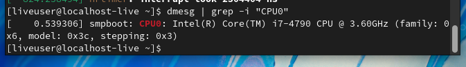
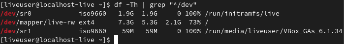
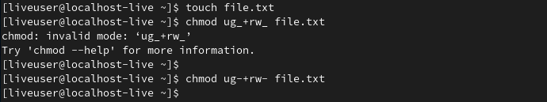

---
## Front matter
title: "Шаблон отчёта по лабораторной работе"
subtitle: "Простейший вариант"
author: "Дмитрий Сергеевич Кулябов"

## Generic otions
lang: ru-RU
toc-title: "Содержание"

## Bibliography
bibliography: bib/cite.bib
csl: pandoc/csl/gost-r-7-0-5-2008-numeric.csl

## Pdf output format
toc: true # Table of contents
toc-depth: 2
lof: true # List of figures
lot: true # List of tables
fontsize: 12pt
linestretch: 1.5
papersize: a4
documentclass: scrreprt
## I18n polyglossia
polyglossia-lang:
  name: russian
  options:
	- spelling=modern
	- babelshorthands=true
polyglossia-otherlangs:
  name: english
## I18n babel
babel-lang: russian
babel-otherlangs: english
## Fonts
mainfont: PT Serif
romanfont: PT Serif
sansfont: PT Sans
monofont: PT Mono
mainfontoptions: Ligatures=TeX
romanfontoptions: Ligatures=TeX
sansfontoptions: Ligatures=TeX,Scale=MatchLowercase
monofontoptions: Scale=MatchLowercase,Scale=0.9
## Biblatex
biblatex: true
biblio-style: "gost-numeric"
biblatexoptions:
  - parentracker=true
  - backend=biber
  - hyperref=auto
  - language=auto
  - autolang=other*
  - citestyle=gost-numeric
## Pandoc-crossref LaTeX customization
figureTitle: "Рис."
tableTitle: "Таблица"
listingTitle: "Листинг"
lofTitle: "Список иллюстраций"
lotTitle: "Список таблиц"
lolTitle: "Листинги"
## Misc options
indent: true
header-includes:
  - \usepackage{indentfirst}
  - \usepackage{float} # keep figures where there are in the text
  - \floatplacement{figure}{H} # keep figures where there are in the text
---

# Цель работы

Целью данной работы является приобретение практических навыков установки операционной системы на виртуальную машину, настройки минимально необходимых для дальнейшей работы сервисов.

# Задание

Лабораторная работа подразумевает установку на виртуальную машину VirtualBox операционной системы Linux (дистрибутив Fedora).

# Выполнение лабораторной работы

## Шаг 1 - Создание виртуальной машины

### Шаг 1.1 - Задание имени и дистрибутива ОС виртуальной машины

### Шаг 1.2 - Указание объема памяти (оперативной)

### Шаг 1.3 - Создание виртуального жесткого диска
Виртуальный жесткий диск является опциональной частью виртуальной машины, но по заданию мы должны его создать.

### Шаг 1.4 - Формат хранения
На этом этапе нужно выбрать между *динамическим* и *статическим* жестким диском. Динамический жесткий диск изначально занимает мало места, но по добавлении данных в постоянную память виртуальной машины занимаемый этим виртуальным диском объем памяти будет расти, без возможности сокращения даже после удаления данных на виртуальной машине. Динамический жесткий диск работает медленнее статического, так как часто приходится совершать реаллокацию. Ститический жесткий диск в некоторых файловых системах создается медленнее динамического, но зато потом он работает быстрее, так как нужный объем памяти уже изначально выделен.

### Шаг 1.5 - имя и размер файла жесткого диска
Указываем имя файла, в котором будет храниться виртуальный жесткий диск. Указываем его объем (80 гигабайт).

## Шаг 2 - работа с виртуальной машиной
### Шаг 2.1 - попытка запуска виртуальной машины
Я запустил виртуальную машину и получил следующий ответ (видимо от виртуального BIOS): "FATAL: No bootable medium found. System halted.

### Шаг 2.2 - исправление ошибки
Это произошло потому, что я не скачал ISO файл - образ операционной системы. После осознания этого факта я перешел на сайт Fedora Linux и скачал нужный ISO файл - Fedora Linux версии 35.

После исправления этой ошибки (указания загрузочного диска) виртуальная машина успешно запустилась.

### Шаг 2.3 - попытка установить дополнения гостевой ОС
Я перешел во вкладку "Устройства" и нажал "Подключить образ диска Дополнений гостевой ОС". Меня встретила ошибка. Она связана с тем, что образа диска дополнений на моем домашнем компьютере нет. Эту проблему решить уже не удалось, так как я просто не нашел нужный файл даже в интернете.

### Шаг 2.4 - имя пользователя и пароль
Имя пользователя - "esstarovoyjtov" - как в дисплейном классе.

# Домашее задание

## Задание
Дождитесь загрузки графического окружения и откройте терминал. В окне терминала проанализируйте последовательность загрузки системы, выполнив команду *dmesg*.
Получите следующую информацию.

1. Версия ядра Linux (Linux version).
2. Частота процессора (Detected Mhz processor).
3. Модель процессора (CPU0).
4. Объем доступной оперативной памяти (Memory available).
5. Тип обнаруженного гипервизора (Hypervisor detected).
6. Тип файловой системы корневого раздела.
7. Последовательность монтирования файловых систем.

## 1. Версия ядра Linux (Linux version)

## 2. Частота процессора (Detected Mhz processor).

## 3. Модель процессора (CPU0).

## 4. Объем доступной оперативной памяти (Memory available).

## 5. Тип обнаруженного гипервизора (Hypervisor detected).
Гипервизор - это монитор (менеджер) виртуальных машин, позволяющий запустить несколько операционных систем на одном компьютере. Его версия: KVM.

## 6. Тип файловой системы корневого раздела.
Я запустил утилиту lsblk с флагом -f и узнал, что используется файловая система ext4.

## 7. Последовательность монтирования файловых систем.
Для этого нужно запустить в терминале команду 'df -Th | grep "^/dev"'
На фото ниже можно видеть, что у меня подмонтированы файловые системы iso9660 и ext4.

# Контрольные вопросы
## 1. Какую информацию содержит учетная запись пользователя?
Учетная запись пользователя содержит его системное имя, а также полное имя и фамилию.

## 2. Укажите команды терминала и приведите примеры:

### 1) Получение справки по команде: утилита man. Например "man tree".

### 2) Перемещение по файловой системе - команда "cd". Например "cd os_intro".

### 3) Чтобы узнать содержимое текущего каталога - нужно ввести команду "ls".

### 4) Размер директории можно узнать с помощью команды "du". На данном скриншоте белым выделен размер текущей директории, остальное - размеры вложенных папок. Размер текущей директории примерно равен размеру суммы вложенных.

### 5) Создание каталога в Linux - команда mkdir. Создание файла - touch. Удаление каталога - rmdir. Удаление файла - rm. Примеры в скриншоте ниже.

### 6) Задание прав на файл или каталог.
Чтение (r) - разрешает получать содержимое файла, но не изменять его. Для каталога чтение разрешает получить список файлов и каталогов, расположенных в нем.
Запись (w) - разрешает ихменять содержимое  файла, для каталога - разрешает удалять или добавлять в нем файлы/каталоги.
Выполнение (x) - право и возможность запустить указанный файл как исполняемую программу. В принципе, только исполняемые программы и обладают этим правом.

Есть в линуксе "субъекты" прав: владелец (тот, кто создал файл или был назначен создателем), группа (множество пользователей, имеющих обычно одинаковые права на данный файл), остальные.

Для установки прав к файлу или каталогу используется команда "cmod <опции> <категория> <действие> <флаг> <файл>".

Пример: Разрешим пользователю и его группе читать и изменять файл file.txt.

### 7) Просмотр истории команд
Для просмотра истории команд используется команда history.

## 3. Что такое файловая система? Пример и краткая характеристика.
Файловая система по определению есть порядок, определяющий способ организации, хранения и именования данных на носителях информации в компьютерах, а также в другом электронном оборудовании.

Пример: ext4. ext4 - журналируемая файловая система, используемая преимущественно в операционных системах с ядром Linux, созданная на базе ext3 в 2007 году. 

Свойства: содержимое папок - связный список или B-дерево, размещение файлов - битовая карта, максимум 4 млрд файлов, максимальный размер файла - 16 тебибайт, максимальная длина имени файла - 255 байт, права доступа - в соответствии со стандартом POSIX.

## 4. Как узнать, какие файловые системы подмонтированы в ОС?
Для этого нужно запустить в терминале команду 'df -Th | grep "^/dev"'
На фото ниже можно видеть, что у меня подмонтированы файловые системы iso9660 и ext4.

## 5. Как удалить зависший процесс?
Использовать, например, команду kill.

# Вывод

Я научился устанавливать дистрибутив Fedora Linux на виртуальную машину в приложении Oracle VM VirtualBox. Узнал что для этого обязательно нужно иметь ISO файл с образом нужной операционной системы. Также я узнал, как при создании виртуальной машины можно указать объем оперативной памяти и памяти виртуального жесткого диска, а также способ его размещения в физической памяти (динамический или статический). Во время решения домашнего задания и ответов на вопросы я получше ознакомился с такими операциями командной оболочки линукса как tree, mkdir, rmdir, touch, rm, chmod, df, history, du, ls, grep, cd, man, dmesg.
