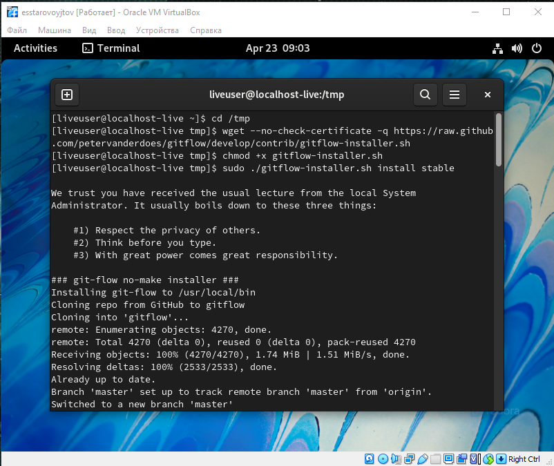
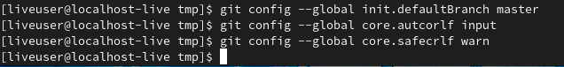

---
## Front matter
lang: ru-RU
title: lab02
author: |
	Egor S. Starovoyjtov\inst{1}
	
institute: |
	\inst{1}RUDN University, Moscow, Russian Federation
date: 21 April, 2022 Moscow, Russia

## Formatting
toc: false
slide_level: 2
theme: metropolis
header-includes: 
 - \metroset{progressbar=frametitle,sectionpage=progressbar,numbering=fraction}
 - '\makeatletter'
 - '\beamer@ignorenonframefalse'
 - '\makeatother'
aspectratio: 43
section-titles: true
---

# Лабораторная работа № 2. Управление версиями.

# Цель работы

- Изучить идеологию и применение средств контроля версий.
- Освоить умения по работе с git.

# Задание

- Создать базовую конфигурацию для работы с git.
- Создать ключ SSH.
- Создать ключ PGP.
- Настроить подписи git.
- Зарегистрироваться на Github.
- Создать локальный каталог для выполнения заданий по предмету.

# Выполнение лабораторной работы

## Шаг 1. Настройка github
Инструкция была следующей:
1. Создайте учётную запись на https://github.com.
2. Заполните основные данные на https://github.com.

На момент выполнения этой лабораторной работы у меня уже был аккаунт на GitHub. 


## Шаг 2. Установка программного обеспечения
### Шаг 2.1. Установка git-flow в Fedora Linux
– Это программное обеспечение удалено из репозитория.
– Необходимо устанавливать его вручную.

Я набрал приведенный в инструкции код и вот что получилось:


### Шаг 2.2. Установка gh в Fedora Linux

Я набрал приведенный в инструкции код и вот что получилось:


## Шаг 3. Базовая настройка git

- Настроим utf-8 и зададим имя и email владельца репозитория:
1. ```git config --global core.quotepath false```
2. ```git config --global user.name "Egor Starovoyjtov"```
3. ```git config --global user.email "prototyperailgun@gmail.com"```


- Настройте верификацию и подписание коммитов git.
- Зададим имя начальной ветки (будем называть её master):


## Шаг 4. Создаем ключи ssh
- По алгоритму rsa с ключём размером 4096 бит: ```ssh-keygen -t rsa -b 4096```
- По алгоритму ed25519: ```ssh-keygen -t ed25519```

Я ввел перечисленные выше команды и получил следующий вывод. Ключи успешно созданы.


## Шаг 5. Создаем ключ PGP
- Генерируем ключ: ```gpg --full-generate-key```
- Из предложенных опций выбираем:
- тип RSA and RSA;
- размер 4096;
- выбираем срок действия; значение по умолчанию— 0 (срок действия не истекает
никогда).
- GPG запросит личную информацию, которая сохранится в ключе:
- Имя (не менее 5 символов).
- Адрес электронной почты.
- При вводе email убедитесь, что он соответствует адресу, используемому на
GitHub.
- Комментарий. Можно ввести что угодно или нажать клавишу ввода, чтобы
оставить это поле пустым.

Я проследовал инструкции и создал PGP ключ.


## Шаг 6. Добавляем PGP ключ в GitHub
Скачиваем утилиту xclip: 


С помощью xclip копируем сгенерированный PGP ключ в буфер обмена:
```gpg --armor --export <PGP Fingerprint> | xclip -sel clip```

Переходим в настройки GitHub (https://github.com/settings/keys), нажимаем на
кнопку New GPG key и вставляем полученный ключ в поле ввода.


## Шаг 7. Настраиваем автоматическую подпись коммитов в git
Используя введеный email указываем git использовать его при подписи коммитов:


## Шаг 8. Настройка gh
1. Для начала авторизируемся: ```gh auto login```.
2. Утилита задает наводящии вопросы, код подтверждения ввожу через браузер


## Шаг 9.
На этом этапе мне осталось только клонировать свой репозиторий, так как он был создан еще до начала выполнения первой лабораторной работы.


# Вывод

Я изучил идеологию и применение средств контроля версий, а также освоил базовые навыки по работе с git и github. А именно: научился создавать ssh и pgp ключи, изучил базовые команды утилит git и gh, такие как: checkout, pull, status, diff, commit, push, config, clone и т.д.