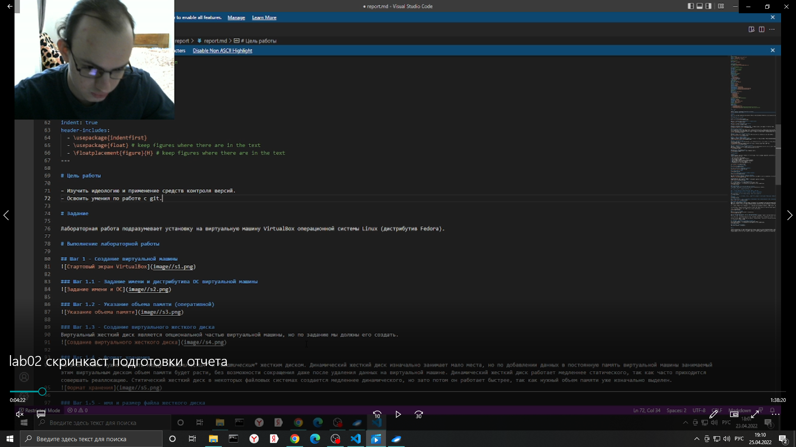
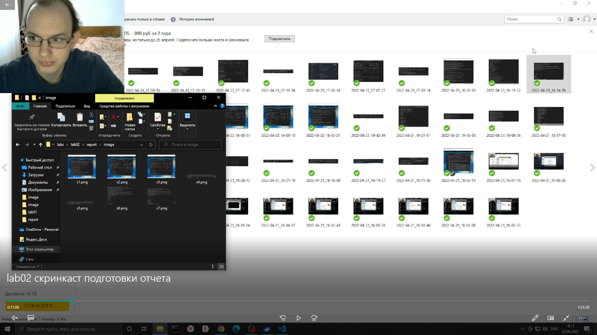
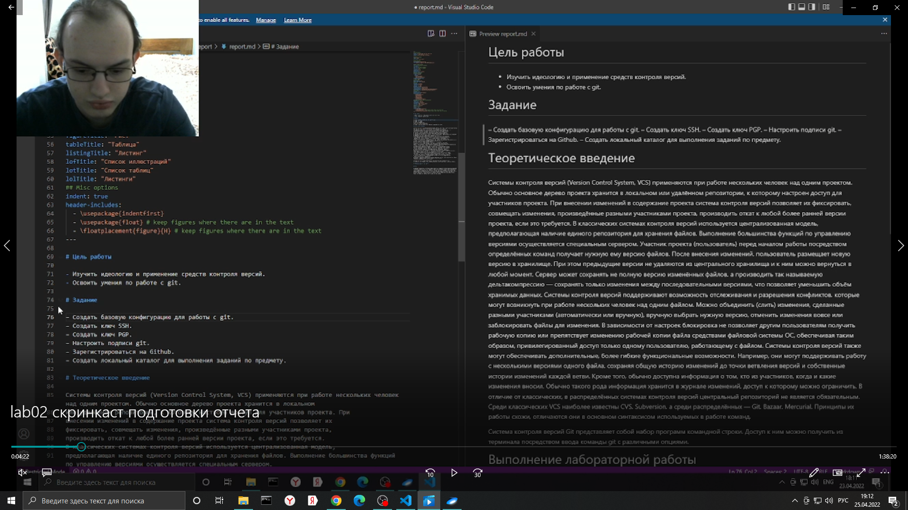
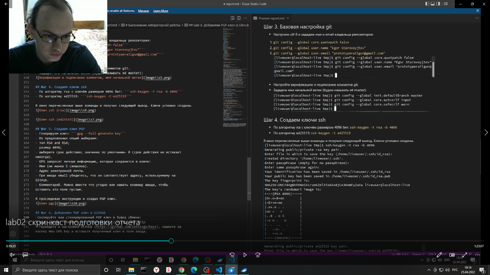
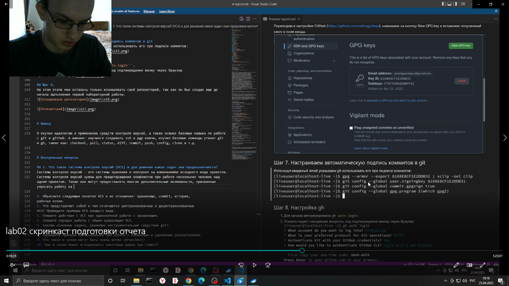
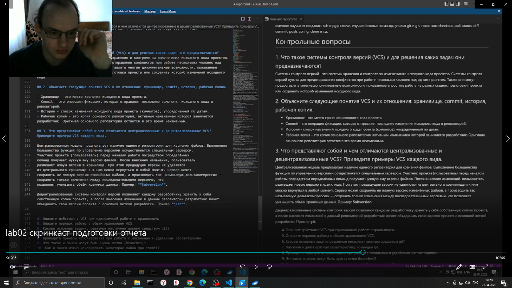

---
## Front matter
lang: ru-RU
title: Лабораторная работа №3. Markdown
author: |
	Egor S. Starovoyjtov\inst{1}
	
institute: |
	\inst{1}RUDN University, Moscow, Russian Federation
date: 25 April, 2022 Moscow, Russia

## Formatting
toc: false
slide_level: 2
theme: metropolis
header-includes: 
 - \metroset{progressbar=frametitle,sectionpage=progressbar,numbering=fraction}
 - '\makeatletter'
 - '\beamer@ignorenonframefalse'
 - '\makeatother'
aspectratio: 43
section-titles: true
---

# Лабораторная работа №3. Markdown

# Цель работы
Научиться оформлять отчёты с помощью легковесного языка разметки Markdown.

# Задача
Сделать отчет по предыдущей лабораторной работе в формате Markdown.

# Выполнение лабораторной работы (создание отчета ко второй лабораторной работе)
## Шаг 1 - Настройка служебной информации

Код ниже настраивает параметры pdf файла, который в дальнейшем будет получен с помощью программы pandoc:
```
## Front matter
title: "Отчет по лабораторной работе №2"
subtitle: "Управление версиями"
author: "Старовойтов Егор Сергеевич"
```

## Шаг 2 - Написание целей и задач
Формулировки целей и задач я взял из pdf файла лабораторной работы.


## Шаг 3 - Подготовка скриншотов
Я перенес все скриншоты в каталог /image рядом с отчетом report.md, дал каждому скриншоту порядковый номер.


## Шаг 4 - Написание теоретического введение
Текст теоретического введения я взял из pdf файла о второй лабораторной работе, после чего слегка его изменил и добавил форматирование.


## Шаг 5 - Оформление повествования о ходе проделанной работы


## Шаг 6 - Написание вывода
Вывод - это слегка развернутая и дополненная переформулировка целей работы.


## Шаг 7 - Ответы на вопросы
Полсе описания хода проделанной работы я ответил на все предложенные в тексте методички вопросы.


# Вывод
Я систематизировал свои знания по написанию документов (в частности отчетов по лабораторным работам) в формате Markdown. Все поставленные цели были достигнуты.