---
## Front matter
lang: ru-RU
title: Лабораторная работа №4. Основы интерфейса взаимодействия пользователя с системой Unix на уровне командной строки
author: |
	Egor S. Starovoyjtov\inst{1}
	
institute: |
	\inst{1}RUDN University, Moscow, Russian Federation
date: 27 April, 2022 Moscow, Russia

## Formatting
toc: false
slide_level: 2
theme: metropolis
header-includes: 
 - \metroset{progressbar=frametitle,sectionpage=progressbar,numbering=fraction}
 - '\makeatletter'
 - '\beamer@ignorenonframefalse'
 - '\makeatother'
aspectratio: 43
section-titles: true
---

# Лабораторная работа №4. Основы интерфейса взаимодействия пользователя с системой Unix на уровне командной строки

# Цель работы
Приобретение практических навыков взаимодействия пользователя с системой посредством командной строки.

# Задача
1. Определите полное имя вашего домашнего каталога. Далее относительно этого каталога будут выполняться последующие упражнения.
2. Выполните следующие действия:
     1. Перейдите в каталог /tmp.
     2. Выведите на экран содержимое каталога /tmp. Для этого используйте команду ls
        с различными опциями. Поясните разницу в выводимой на экран информации.
     3. Определите, есть ли в каталоге /var/spool подкаталог с именем cron?
     4. Перейдите в Ваш домашний каталог и выведите на экран его содержимое. Определите, кто     является владельцем файлов и подкаталогов?
3. Выполните следующие действия:
    1. В домашнем каталоге создайте новый каталог с именем newdir.
    2. В каталоге ~/newdir создайте новый каталог с именем morefun.
    3. В домашнем каталоге создайте одной командой три новых каталога с именами
     letters, memos, misk. Затем удалите эти каталоги одной командой.
    4. Попробуйте удалить ранее созданный каталог ~/newdir командой rm. Проверьте,
    был ли каталог удалён.
    5. Удалите каталог ~/newdir/morefun из домашнего каталога. Проверьте, был ли
    каталог удалён.
4. С помощью команды man определите, какую опцию команды ls нужно использовать для просмотра содержимое не только указанного каталога, но и подкаталогов,
входящих в него.
5. С помощью команды man определите набор опций команды ls, позволяющий отсортировать по времени последнего изменения выводимый список содержимого каталога
с развёрнутым описанием файлов.
6. Используйте команду man для просмотра описания следующих команд: cd, pwd, mkdir,
rmdir, rm. Поясните основные опции этих команд.
7. Используя информацию, полученную при помощи команды history.

## Шаг 1.
Определяем полное имя домашнего каталога. Вводим команду ```cd ~```, чтобы перейти в домашний каталог. Затем вводим команду ```pwd``` чтобы узнать полное имя текущей директории.

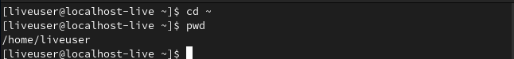

## Шаги 2.1 - 2.2
Переходим в каталог /tmp и выводим его содержимое на экран с помощью команды ls с различными опциями. Добавление флага **a** к команде **ls** позволяет увидеть скрытие файлы (на скриншоте они выделены зеленым).

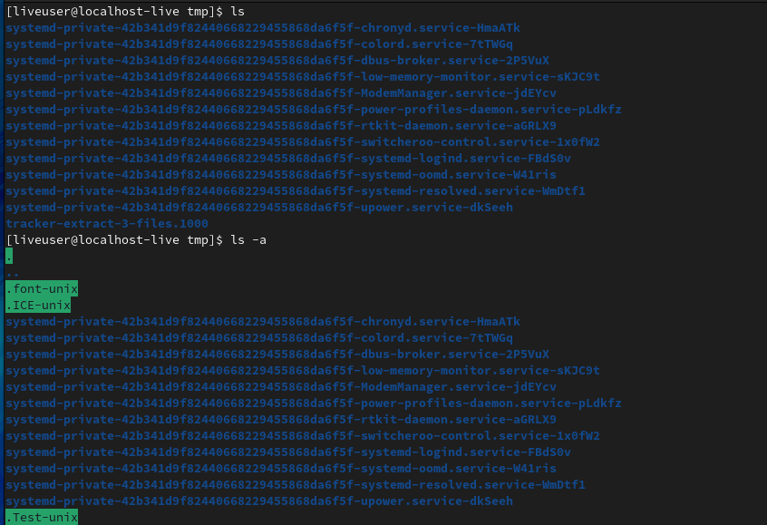

Вызов команды **ls** с опциями **-alF** позволяет увидеть подробную информацию:
- тип файла,
- право доступа,
- число ссылок,
- владелец,
- размер,
- дата последней ревизии,
- имя файла или каталога.

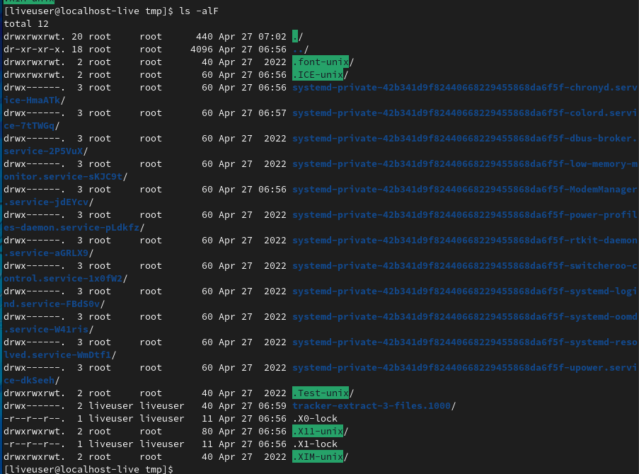

## Шаг 2.3
Определим, есть ли в каталоге **/var/spool** подкаталог с именем **cron**.
Ответ: нет. Я использовал команду **tree**, в дереве каталогов подкаталога **cron** не оказалось,
да и команда **ls** дала такой же результат.

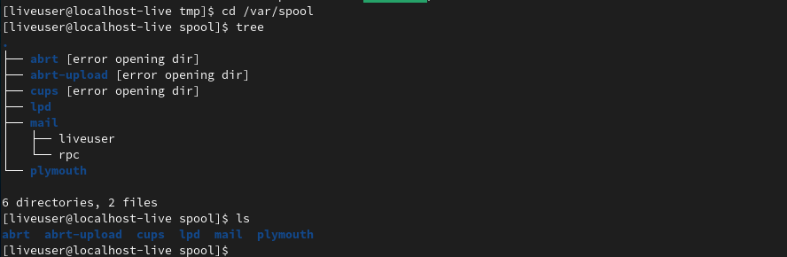

## Шаг 2.4
Перехожу в домашний каталог, выясняю кто является владельцем файлов и подкаталогов в нем с помощью команды ```ls -alF```.

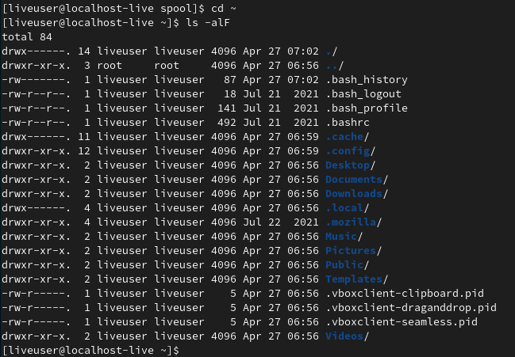

## Шаги 3.1-3.2
В домашнем каталоге я создал новый подкаталог **newdir**.
Затем я перешел в **newdir** и создал там подкаталог **morefun**.
С помощью команды **tree** я убедился в правильности выполнения команд.

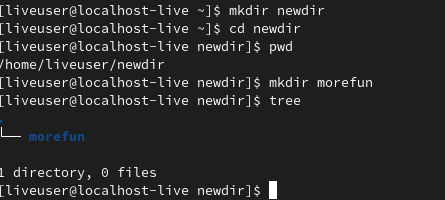

## Шаг 3.3
В домашнем каталоге я одной командой создал три новых директории: letters, memos, misk.
Затем также одной командой их удадлил.

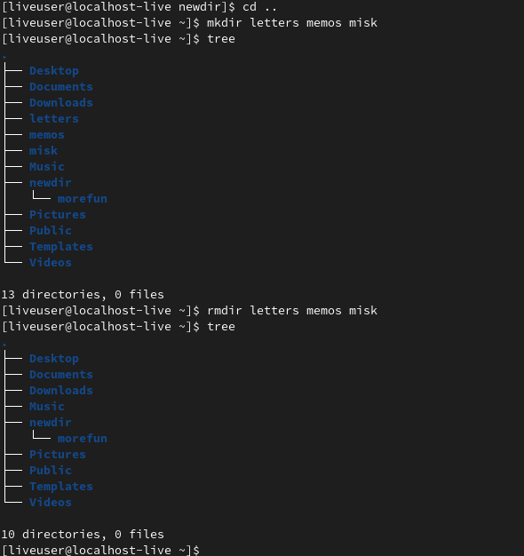

## Шаг 3.4
Я попробовал удалить каталог **~/newdir** командой **rm**.
Каталог удален не был, так как по умолчанию **rm** удаляет только файлы.

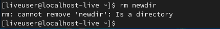

## Шаг 3.5
Я удалил каталог **~/newdir/morefun** и проверил это.

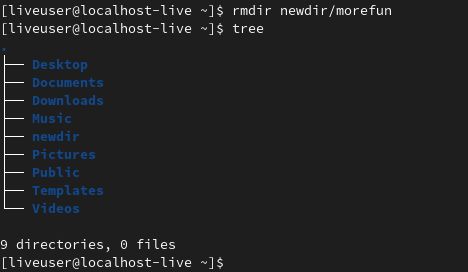

## Шаг 4
С помощью команды **man** я выяснил, какую опцию команды **ls** нужно использовать, чтобы вывести содержимое не только указанного каталога, но и подкаталогов, входящих в него.
Это **-R** или **-recursive**.


Также я запустил команду **ls** с данной опцией для большей уверенности.
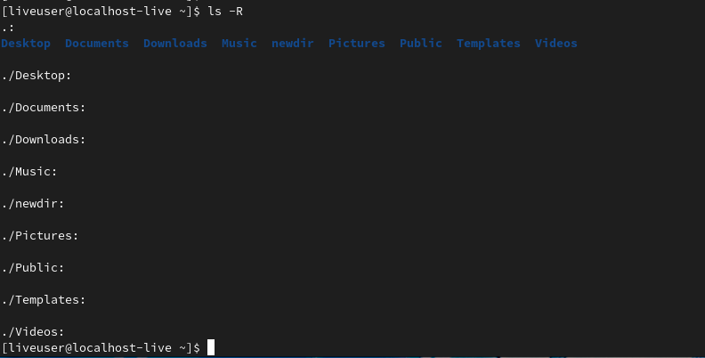

## Шаг 5
С помощью команды **man** я узнал набор опций команды **ls**, позволящий отсортировать по времени последнего изменения список файлов.

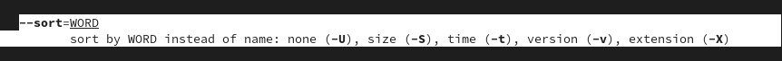

Далее я набрал ```ls --sort -time```

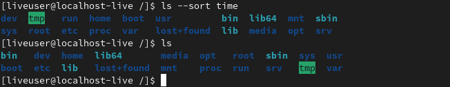

## Шаг 6
Я использовал команду **man** для просмотра основных опций команд **cd, pwd, mkdir, rmdir, rm**.

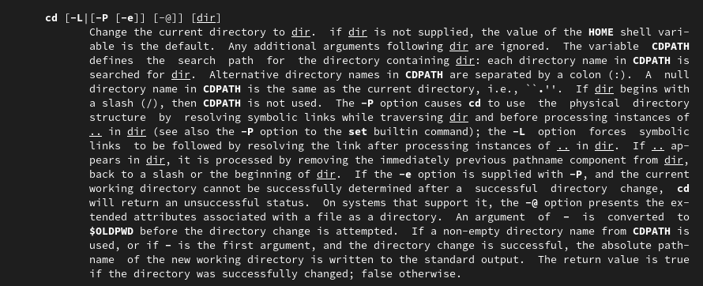

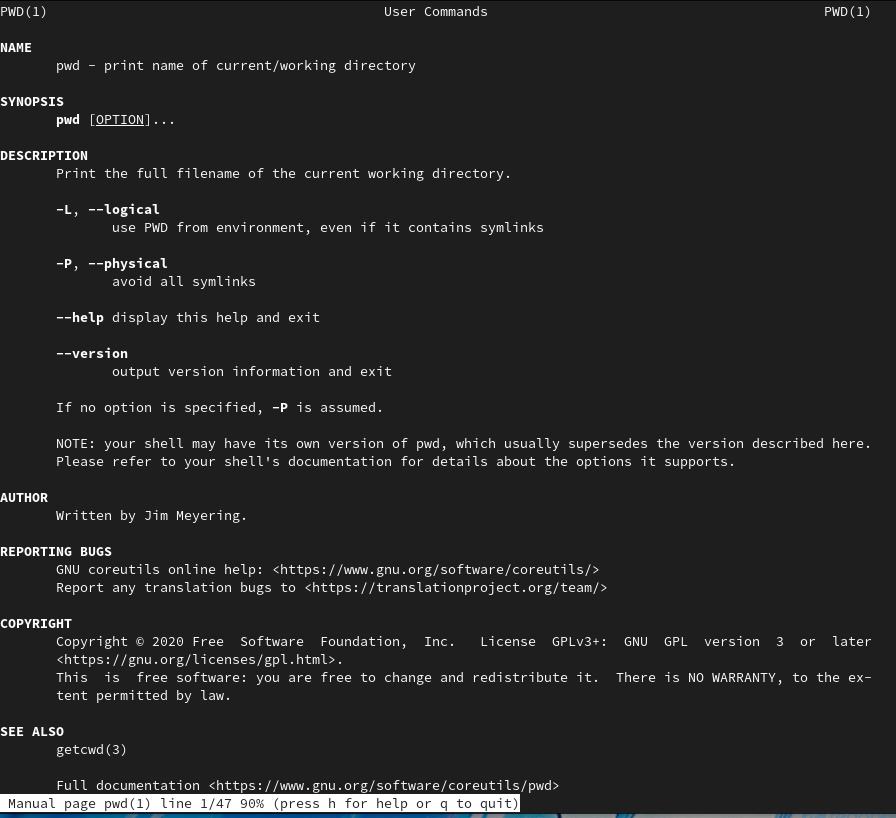

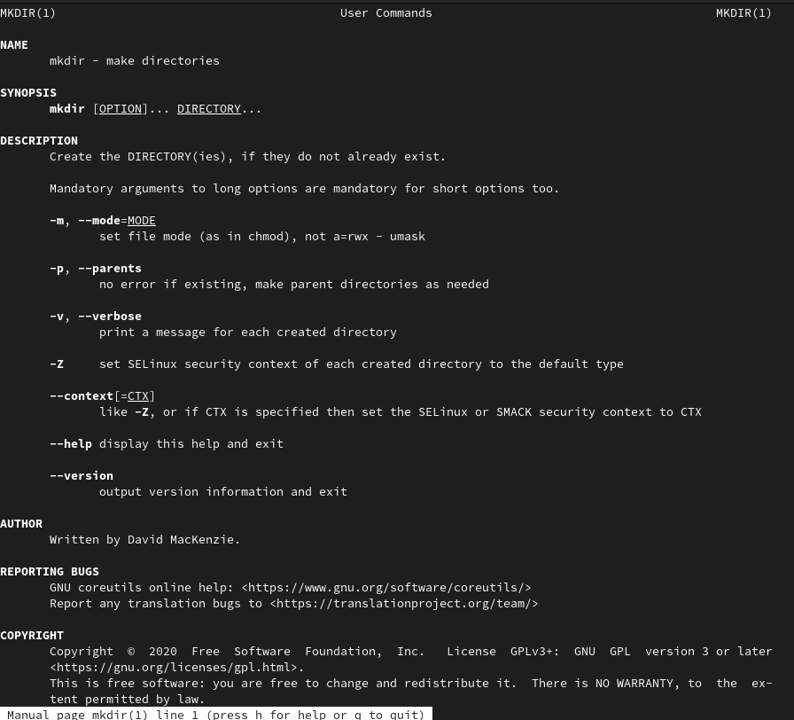

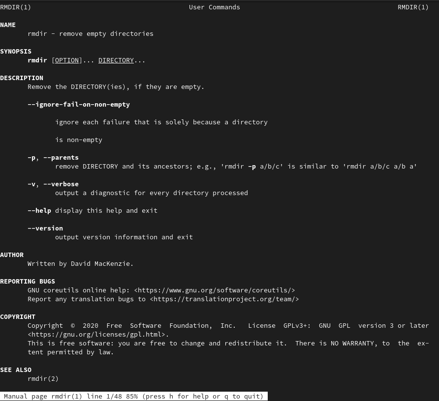

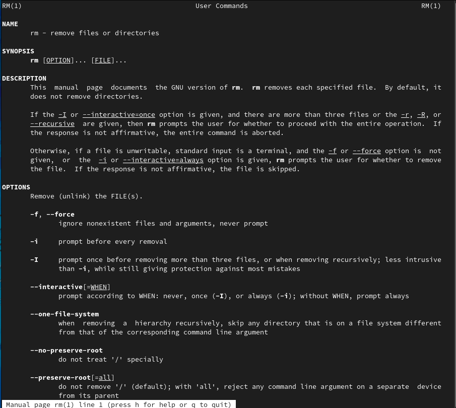

## Шаг 7
Используя информацию, полученную с помощью команды **history**, я выполнил модификацию и исполнение двух команд из буфера команд:
- Изменил вывод команды **ls**.
- Изменил создание директории  **newdir** на **olddir**.

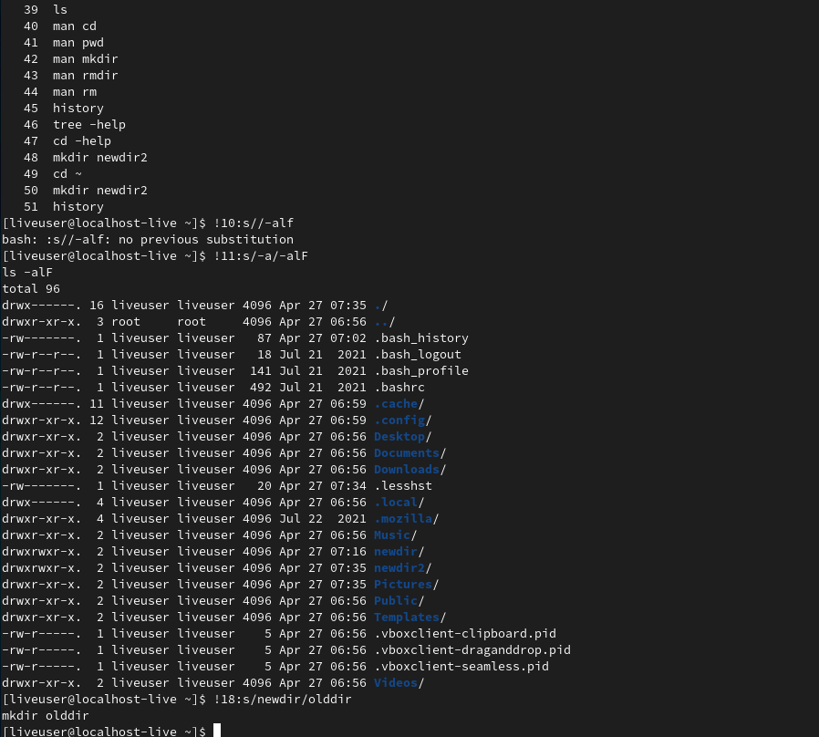

# Вывод

Я получил практические навыки взаимодействия с системой с помощью командной строки, изучил команды для перемещение по директориям, для создания и удаления каталогов, для получения информации по другим командам. Набор опций у всевозможных команд очень велик, но понимая принципы взаимодействия с системой и зная основные команды, всегда можно найти нужную информацию.
