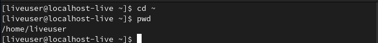

---
## Front matter
title: "Отчет по лабораторной работе №4"
subtitle: "Основы интерфейса взаимодействия пользователя с системой Unix на уровне командной строки"
author: "Старовойтов Егор Сергеевич"

## Generic otions
lang: ru-RU
toc-title: "Содержание"

## Bibliography
bibliography: bib/cite.bib
csl: pandoc/csl/gost-r-7-0-5-2008-numeric.csl

## Pdf output format
toc: true # Table of contents
toc-depth: 2
lof: true # List of figures
lot: true # List of tables
fontsize: 12pt
linestretch: 1.5
papersize: a4
documentclass: scrreprt
## I18n polyglossia
polyglossia-lang:
  name: russian
  options:
	- spelling=modern
	- babelshorthands=true
polyglossia-otherlangs:
  name: english
## I18n babel
babel-lang: russian
babel-otherlangs: english
## Fonts
mainfont: PT Serif
romanfont: PT Serif
sansfont: PT Sans
monofont: PT Mono
mainfontoptions: Ligatures=TeX
romanfontoptions: Ligatures=TeX
sansfontoptions: Ligatures=TeX,Scale=MatchLowercase
monofontoptions: Scale=MatchLowercase,Scale=0.9
## Biblatex
biblatex: true
biblio-style: "gost-numeric"
biblatexoptions:
  - parentracker=true
  - backend=biber
  - hyperref=auto
  - language=auto
  - autolang=other*
  - citestyle=gost-numeric
## Pandoc-crossref LaTeX customization
figureTitle: "Рис."
tableTitle: "Таблица"
listingTitle: "Листинг"
lofTitle: "Список иллюстраций"
lotTitle: "Список таблиц"
lolTitle: "Листинги"
## Misc options
indent: true
header-includes:
  - \usepackage{indentfirst}
  - \usepackage{float} # keep figures where there are in the text
  - \floatplacement{figure}{H} # keep figures where there are in the text
---

# Цель работы

Приобретение практических навыков взаимодействия пользователя с системой посредством командной строки.

# Задание

1. Определите полное имя вашего домашнего каталога. Далее относительно этого каталога будут выполняться последующие упражнения.
2. Выполните следующие действия:
     1. Перейдите в каталог /tmp.
     2. Выведите на экран содержимое каталога /tmp. Для этого используйте команду ls
        с различными опциями. Поясните разницу в выводимой на экран информации.
     3. Определите, есть ли в каталоге /var/spool подкаталог с именем cron?
     4. Перейдите в Ваш домашний каталог и выведите на экран его содержимое. Определите, кто     является владельцем файлов и подкаталогов?
3. Выполните следующие действия:
    1. В домашнем каталоге создайте новый каталог с именем newdir.
    2. В каталоге ~/newdir создайте новый каталог с именем morefun.
    3. В домашнем каталоге создайте одной командой три новых каталога с именами
     letters, memos, misk. Затем удалите эти каталоги одной командой.
    4. Попробуйте удалить ранее созданный каталог ~/newdir командой rm. Проверьте,
    был ли каталог удалён.
    5. Удалите каталог ~/newdir/morefun из домашнего каталога. Проверьте, был ли
    каталог удалён.
4. С помощью команды man определите, какую опцию команды ls нужно использовать для просмотра содержимое не только указанного каталога, но и подкаталогов,
входящих в него.
5. С помощью команды man определите набор опций команды ls, позволяющий отсортировать по времени последнего изменения выводимый список содержимого каталога
с развёрнутым описанием файлов.
6. Используйте команду man для просмотра описания следующих команд: cd, pwd, mkdir,
rmdir, rm. Поясните основные опции этих команд.
7. Используя информацию, полученную при помощи команды history.

# Теоретическое введение

## Формат команды
Командой в операционной системе называется записанный по
специальным правилам текст (возможно с аргументами), представляющий собой указание на выполнение какой-либо функций (или действий) в операционной системе.
Обычно первым словом идёт имя команды, остальной текст — аргументы или опции,
конкретизирующие действие.

Общий формат команд можно представить следующим образом:
```<имя_команды><разделитель><аргументы>```.

## Команда man
Команда ```man``` используется для просмотра (оперативная помощь) в диалоговом режиме руководства (manual) по основным командам операционной системы
типа Linux.
Формат команды: ```man <команда>```

Пример (вывод информации о команде man): ```man man```.

Для управления просмотром результата выполнения команды man можно использовать
следующие клавиши:
- Space — перемещение по документу на одну страницу вперёд;
- Enter — перемещение по документу на одну строку вперёд;
- q — выход из режима просмотра описания.

## Команда cd. 
Команда cd используется для перемещения по файловой системе операционной системы типа Linux.

Замечание 1. Файловая система ОС типа Linux — иерархическая система каталогов,
подкаталогов и файлов, которые обычно организованы и сгруппированы по функциональному признаку. 

Самый верхний каталог в иерархии называется корневым
и обозначается символом /. Корневой каталог содержит системные файлы и другие
каталоги.

Формат команды:
```cd [путь_к_каталогу]```

Для перехода в домашний каталог пользователя следует использовать команду ```cd``` без
параметров или ```cd ~```.

Например, команда
```cd /afs/dk.sci.pfu.edu.ru/home```
позволяет перейти в каталог /afs/dk.sci.pfu.edu.ru/home (если такой существует),
а для того, чтобы подняться выше на одну директорию, следует использовать:
```cd ..```.

Подробнее об опциях команды **cd** смотри в справке с помощью команды man:
```man cd```.

## Команда pwd
Для определения абсолютного пути к текущему каталогу используется
команда pwd (print working directory).

Пример (абсолютное имя текущего каталога пользователя dharma):
```
pwd
результат:
1 /afs/dk.sci.pfu.edu.ru/home/d/h/dharma
```

Сокращения имён файлов. В работе с командами, в качестве аргументов которых
выступает путь к какому-либо каталогу или файлу, можно использовать сокращённую
запись пути. Символы сокращения приведены в табл. 4.1.

Таблица 4.1
- ```~``` Домашний каталог
- ```.``` Текущий каталог
- ```..``` Родительский каталог

Например, в команде cd для перемещения по файловой системе сокращённую запись пути можно использовать следующим образом (команды чередуются с выводом
результата выполнения команды pwd):
```
pwd

/afs/dk.sci.pfu.edu.ru/home/d/h/dharma

cd ..
pwd

/afs/dk.sci.pfu.edu.ru/home/d/h

cd ../..
pwd

/afs/dk.sci.pfu.edu.ru/home

cd ~/work
pwd

/afs/dk.sci.pfu.edu.ru/home/d/h/dharma/work
```
## Команда ls 
Команда ls используется для просмотра содержимого каталога.

Формат команды:
```ls [-опции] [путь]```

Пример:
```
cd
cd ..
pwd

/afs/dk.sci.pfu.edu.ru/home/d/h

ls

dharma
```

Некоторые файлы в операционной системе скрыты от просмотра и обычно используются для настройки рабочей среды. Имена таких файлов начинаются с точки. Для
того, чтобы отобразить имена скрытых файлов, необходимо использовать команду **ls**
с опцией **a**:
```ls -a```.

Можно также получить информацию о типах файлов (каталог, исполняемый файл,
ссылка), для чего используется опция F. При использовании этой опции в поле имени
выводится символ, который определяет тип файла (см. табл. 4.2)
Таблица 4.2
- Каталог ```/```
- Исполняемый файл ```*```
- Ссылка ```@```

Чтобы вывести на экран подробную информацию о файлах и каталогах, необходимо
использовать опцию **l**. При этом о каждом файле и каталоге будет выведена следующая
информация:
- тип файла,
- право доступа,
- число ссылок,
- владелец,
- размер,
- дата последней ревизии,
- имя файла или каталога.

Пример:
```
cd /
ls
```

Результат:
```
bin boot dev etc home lib media mnt
opt proc root sbin sys tmp usr var

```
В этом же каталоге команда
```ls -alF```
даст примерно следующий результат:
```
drwxr-xr-x 21 root root 4096 Jan. 17 09:00 ./
drwxr-xr-x 21 root root 4096 Jan. 17 09:00 ../
drwxr-xr-x 2 root root 4096 Jan. 18 15:57 bin/
drwxr-xr-x 2 root root 4096 Apr. 14 2008 boot/
drwxr-xr-x 20 root root 14120 Feb. 17 10:48 dev/
drwxr-xr-x 170 root root 12288 Feb. 17 09:19 etc/
drwxr-xr-x 6 root root 4096 Aug. 5 2009 home/
lrwxrwxrwx 1 root root 5 Jan. 12 22:01 lib -> lib64/
drwxr-xr-x 8 root root 4096 Jan. 30 21:41 media/
drwxr-xr-x 5 root root 4096 Jan. 17 2010 mnt/
drwxr-xr-x 25 root root 4096 Jan. 16 09:55 opt/
dr-xr-xr-x 163 root root 0 Feb. 17 13:17 proc/
drwxr-xr-x 31 root root 4096 Feb. 15 23:57 root/
drwxr-xr-x 2 root root 12288 Jan. 18 15:57 sbin/
drwxr-xr-x 12 root root 0 Feb. 17 13:17 sys/
drwxrwxrwt 12 root root 500 Feb. 17 16:35 tmp/
drwxr-xr-x 22 root root 4096 Jan. 18 09:26 usr/
drwxr-xr-x 17 root root 4096 Jan. 14 17:38 var/
```

## Команда mkdir 
Команда mkdir используется для создания каталогов.

Формат команды:
```mkdir имя_каталога1 [имя_каталога2...]```

Пример создания каталога в текущем каталоге:
```
cd
pwd

/afs/dk.sci.pfu.edu.ru/home/d/h/dharma

ls

Desktop public tmp
GNUstep public_html work

mkdir abc
ls

abc GNUstep public_html work
Desktop public tmp
```

Замечание 2. Для того чтобы создать каталог в определённом месте файловой системы,
должны быть правильно установлены права доступа.

Можно создать также подкаталог в существующем подкаталоге:
```
mkdir parentdir
mkdir parentdir/dir
```

При задании нескольких аргументов создаётся несколько каталогов:
```
cd parentdir
mkdir dir1 dir2 dir3
```

Можно использовать группировку:
```mkdir parentdir/{dir1,dir2,dir3}```

Если же требуется создать подкаталог в каталоге, отличном от текущего, то путь к нему
требуется указать в явном виде:
```
mkdir ../dir1/dir2
или
mkdir ~/dir1/dir2
```

Интересны следующие опции:
- **--mode** (или **-m**) — установка атрибутов доступа;
- **--parents** (или **-p**)— создание каталога вместе с родительскими по отношению к нему
каталогами.

Атрибуты задаются в численной или символьной нотации:
```mkdir --mode=777 dir```
или
```mkdir -m a+rwx dir```

Опция **--parents** (краткая форма -p) позволяет создавать иерархическую цепочку
подкаталогов, создавая все промежуточные каталоги:
```mkdir -p ~/dir1/dir2/dir3```

## Команда rm
Команда rm используется для удаления файлов и/или каталогов.

Формат команды:
```rm [-опции] [файл]```

Если требуется, чтобы выдавался запрос подтверждения на удаление файла, то необходимо использовать опцию **i**.

Чтобы удалить каталог, содержащий файлы, нужно использовать опцию **r**. Без указания
этой опции команда не будет выполняться.

Пример:
```
cd
mkdir abs
rm abc

rm: abc is a directory

rm -r abc
```

Если каталог пуст, то можно воспользоваться командой **rmdir**. Если удаляемый
каталог содержит файлы, то команда не будет выполнена — нужно использовать 
```rm -r имя_каталога```.

## Команда history 
Для вывода на экран списка ранее выполненных команд используется команда **history**. Выводимые на экран команды в списке нумеруются. К любой
команде из выведенного на экран списка можно обратиться по её номеру в списке,
воспользовавшись конструкцией **!<номер_команды>**.

Пример:

```1 history
2 1 pwd
3 2 ls
4 3 ls -a
5 4 ls -l
6 5 cd /
7 6 history
8
9 !5
10 cd /
```

Можно модифицировать команду из выведенного на экран списка при помощи следующей конструкции:

!<номер_команды>:s/<что_меняем>/<на_что_меняем>

Пример:
```
!3:s/a/F
ls -F
```


# Выполнение лабораторной работы

## Шаг 1.
Определяем полное имя домашнего каталога. Вводим команду ```cd ~```, чтобы перейти в домашний каталог. Затем вводим команду ```pwd``` чтобы узнать полное имя текущей директории.



## Шаги 2.1 - 2.2
Переходим в каталог /tmp и выводим его содержимое на экран с помощью команды ls с различными опциями. Добавление флага **a** к команде **ls** позволяет увидеть скрытие файлы (на скриншоте они выделены зеленым).


Вызов команды **ls** с опциями **-alF** позволяет увидеть подробную информацию:
- тип файла,
- право доступа,
- число ссылок,
- владелец,
- размер,
- дата последней ревизии,
- имя файла или каталога.


## Шаг 2.3
Определим, есть ли в каталоге **/var/spool** подкаталог с именем **cron**.
Ответ: нет. Я использовал команду **tree**, в дереве каталогов подкаталога **cron** не оказалось,
да и команда **ls** дала такой же результат.


## Шаг 2.4
Перехожу в домашний каталог, выясняю кто является владельцем файлов и подкаталогов в нем с помощью команды ```ls -alF```.


## Шаги 3.1-3.2
В домашнем каталоге я создал новый подкаталог **newdir**.
Затем я перешел в **newdir** и создал там подкаталог **morefun**.
С помощью команды **tree** я убедился в правильности выполнения команд.


## Шаг 3.3
В домашнем каталоге я одной командой создал три новых директории: letters, memos, misk.
Затем также одной командой их удадлил.


## Шаг 3.4
Я попробовал удалить каталог **~/newdir** командой **rm**.
Каталог удален не был, так как по умолчанию **rm** удаляет только файлы.


## Шаг 3.5
Я удалил каталог **~/newdir/morefun** и проверил это.


## Шаг 4
С помощью команды **man** я выяснил, какую опцию команды **ls** нужно использовать, чтобы вывести содержимое не только указанного каталога, но и подкаталогов, входящих в него.
Это **-R** или **-recursive**.


Также я запустил команду **ls** с данной опцией для большей уверенности.


## Шаг 5
С помощью команды **man** я узнал набор опций команды **ls**, позволящий отсортировать по времени последнего изменения список файлов.


Далее я набрал ```ls --sort -time```


## Шаг 6
Я использовал команду **man** для просмотра основных опций команд **cd, pwd, mkdir, rmdir, rm**.


## Шаг 7
Используя информацию, полученную с помощью команды **history**, я выполнил модификацию и исполнение двух команд из буфера команд:
- Изменил вывод команды **ls**.
- Изменил создание директории  **newdir** на **olddir**.


# Вывод

Я получил практические навыки взаимодействия с системой с помощью командной строки, изучил команды для перемещение по директориям, для создания и удаления каталогов, для получения информации по другим командам. Набор опций у всевозможных команд очень велик, но понимая принципы взаимодействия с системой и зная основные команды, всегда можно найти нужную информацию.


# Контрольные вопросы

## 1. Что такое командная строка?
Командная строка - это вид текстового интерфейса взаимодействия с системой, в котором инструкции компьютеру даются в виде текстовых строк - команд вместе с их аргументами и опциями.

## 2. При помощи какой команды можно определить абсолютный путь текущего каталога?
Определить абсолютный путь текущего каталога можно с помощью команды **pwd**.


## 3. При помощи какой команды и каких опций можно определить только тип файлов и их имена в текущем каталоге? Приведите примеры.
Ответ: ```ls --file-type```.

Пример:


## 4. Каким образом отобразить информацию о скрытых файлах? Приведите примеры.
Ответ: команда **ls** с опцией **-a**.

Пример:


##  5. При помощи каких команд можно удалить файл и каталог? Можно ли это сделать одной и той же командой? Приведите примеры.

Удалить файл можно с помощью команды **rm**. Удалить каталог можно с помощью команды **rmdir**, либо с помощью команды **rm -r**.

Пример:


## 6. Каким образом можно вывести информацию о последних выполненных пользователем командах?
Ответ: использовать команду **history**.

Пример:


## 7. Как воспользоваться историей команд для их модифицированного выполнения? Приведите примеры.
Можно модифицировать команду из выведенного на экран списка при помощи следующей конструкции:
```!<номер_команды>:s/<что_меняем>/<на_что_меняем>```

Пример:

Используя информацию, полученную с помощью команды **history**, я выполнил модификацию и исполнение двух команд из буфера команд:
- Изменил вывод команды **ls**.
- Изменил создание директории  **newdir** на **olddir**.


## 8. Приведите примеры запуска нескольких команд в одной строке.


## 9. Дайте определение и приведите примера символов экранирования.
Чтобы использовать специальный символ как обычный, мы добалвяем к нему спереди косую черту "\\", это и называется экранированием.

## 10. Охарактеризуйте вывод информации на экран после выполнения команды ls с опцией l.

Вызов команды **ls** с опцией **l** повзоляет увидеть список всех подкаталогов, время их последнего изменения, имя их владельца и права доступа.


## 11. Что такое относительный путь к файлу? Приведите примеры использования относительного и абсолютного пути при выполнении какой-либо команды.
Относительный путь к файлу - путь к файлу, начинающийся не с корневого каталога, а с текущего.

Пример:


## 12. Как получить информацию об интересующей вас команде?

Ответ: набрать ```man <имя команды>```, или, быть может,, ```<имя команды> --help```.

## 13. Какая клавиша или комбинация клавиш служит для автоматического дополнения
вводимых команд?

Такой клавиши нет.
