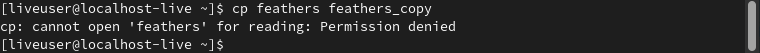

---
## Front matter
lang: ru-RU
title: Лабораторная работа №5. Анализ файловой системы Linux.
author: |
	Egor S. Starovoyjtov\inst{1}
	
institute: |
	\inst{1}RUDN University, Moscow, Russian Federation
date: 2 May, 2022 Moscow, Russia

## Formatting
toc: false
slide_level: 2
theme: metropolis
header-includes: 
 - \metroset{progressbar=frametitle,sectionpage=progressbar,numbering=fraction}
 - '\makeatletter'
 - '\beamer@ignorenonframefalse'
 - '\makeatother'
aspectratio: 43
section-titles: true
---

# Лабораторная работа №5. Анализ файловой системы Linux.

# Цель работы

Ознакомление с файловой системой Linux, её структурой, именами и содержанием
каталогов. Приобретение практических навыков по применению команд для работы
с файлами и каталогами, по управлению процессами (и работами),по проверке исполь-
зования диска и обслуживанию файловой системы.

# Задание

1. Выполните все примеры, приведённые в первойчасти описания лабораторной работы.
2. Выполните следующие действия, зафиксировав в отчёте по лабораторной работе используемые при этом команды и результаты их выполнения:
    1. Скопируйте файл/usr/include/sys/io.hв домашний каталоги назовите его
      equipment.Если файлаio.hнет,то используйтелюбойдругой файл в каталоге
      /usr/include/sys/вместо него.
    2. В домашнем каталоге создайте директорию ```~/ski.plases```.
    3. Переместите файлequipmentв каталог ```~/ski.plases```.
    4. Переименуйте файл  ```~/ski.plases/equipment``` в ```~/ski.plases/equiplist```.
    5. Создайте в домашнем каталоге файлabc1 и скопируйте его в каталог
        ```~/ski.plases```, назовите его ```equiplist2```.
    6. Создайте каталог с именемequipmentв каталоге ```~/ski.plases```.
    7. Переместите файлы ```~/ski.plases/equiplist``` и ```equiplist2``` в каталог
        ```~/ski.plases/equipment```.
    8. Создайте и переместите каталог ```~/newdirв каталог``` в ```~/ski.plases``` и назовите
        его ```plans```.

3. Определите опции команды **chmod**, необходимые для того, чтобы присвоить перечис-ленным ниже файлам выделенные права доступа, считая, что в начале таких прав нет:

    1. drwxr--r-- ... australia
    2. drwx--x--x ... play
    3. -r-xr--r-- ... my_os
    4. -rw-rw-r-- ... feathers

При необходимости создайте нужные файлы.


4. Проделайте приведённые ниже упражнения, записывая в отчёт по лабораторной работе используемые при этом команды:

    1. Просмотрите содержимое файла/etc/password.
    2. Скопируйте файл~/feathersв файл~/file.old.
    3. Переместите файл~/file.oldв каталог~/play.
    4. Скопируйте каталог~/playв каталог~/fun.
    5. Переместите каталог~/funв каталог~/playи назовите егоgames.
    6. Лишите владельца файла~/feathersправа на чтение.
    7.Что произойдёт,если вы попытаетесь просмотреть файл~/feathersкомандой
        cat?
    8. Что произойдёт,если вы попытаетесь скопировать файл~/feathers?
    9. Дайте владельцу файла~/feathersправо на чтение.
    10. Лишите владельца каталога~/playправа на выполнение.
    11. Перейдите в каталог~/play.Что произошло?
    12. Дайте владельцу каталога~/playправо на выполнение.

5. Прочитайте man по командам mount, fsck, mkfs, kill и кратко их охарактеризуйте,
приведя примеры.

# Выполнение лабораторной работы

## Шаг 1 - Выполните все примеры, приведённые в первой части описания лабораторной работы.

### Пример 1
> Копирование файла в текущем каталоге. Скопировать файл ~/abc1 в файл april
и в файл may:


### Пример 2
> Копирование нескольких файлов в каталог. Скопировать файлы april и may в каталог
monthly:


### Пример 3
> Копирование файлов в произвольном каталоге.Скопировать файл monthly/may в файл
с именем june:


### Пример 4
> Копирование каталогов в текущем каталоге. Скопировать каталог monthly в каталог
monthly.00:


### Пример 5
> Копирование каталогов в произвольном каталоге. Скопировать каталог monthly.00
в каталог /tmp


### Пример 6
> ереименование файлов в текущем каталоге. Изменить название файла april на
july в домашнем каталоге:


### Пример 7
> Перемещение файлов в другой каталог. Переместить файл july в каталог monthly.00:


### Пример 8
> Переименование каталогов в текущем каталоге. Переименовать каталог monthly.00
в monthly.01


### Пример 9
> Перемещение каталога в другой каталог. Переместить каталог monthly.01 в каталог
reports:


### Пример 10
> Переименование каталога, не являющегося текущим. Переименовать каталог
reports/monthly.01 в reports/monthly:


### Пример 11
> Требуется создать файл ~/may с правом выполнения для владельца:


### Пример 12
> Требуется лишить владельца файла ~/may права на выполнение:


### Пример 13
> Требуется создать каталог monthly с запретом на чтение для членов группы и всех
остальных пользователей:


### Пример 14
> Требуется создать файл ~/abc1 с правом записи для членов группы:


### Пример 15
> Для просмотра используемых в операционной системе файловых систем можно воспользоваться командой mount без параметров. В результате её применения можно
получить примерно следующее


### Пример 16
> Другой способ определения смонтированных в операционной системе файловых систем — просмотр файла/etc/fstab. Сделать это можно например с помощью команды
cat:


### Пример 17
> Для определения объёма свободного пространства на файловой системе можно воспользоваться командой df, которая выведет на экран список всех файловых систем
в соответствии с именами устройств, с указанием размера и точки монтирования. Например:


### Пример 18
> С помощью команды fsck можно проверить (а в ряде случаев восстановить) целостность файловой системы:


## Шаг 2 - Выполните следующие действия, зафиксировав в отчёте по лабораторной работе используемые при этом команды и результаты их выполнения:

### Шаг 2.1
> Скопируйте файл /usr/include/sys/io.h в домашний каталог и назовите его
equipment. Если файла io.h нет, то используйте любой другой файл в каталоге
/usr/include/sys/ вместо него.

Для копирования файла я воспользовался командой cp, после чего убедился в упешности операции с помощью команд ls и cat.


### Шаг 2.2
> В домашнем каталоге создайте директорию ~/ski.plases.

Я создал нужную директорию с помощью команды mkdir и убедился в результате с помощью команды ls.


### Шаг 2.3
> Переместите файл equipment в каталог ~/ski.plases.

Для перемещения файла я воспользовался командой mv, а затем проверил результат с помощью ls.


### Шаг 2.4
> Переименуйте файл ~/ski.plases/equipment в ~/ski.plases/equiplist.

Для переименования файла я воспользовался командой mv, а затем проверил результат с помощью ls.


### Шаг 2.5
> Создайте в домашнем каталоге файл abc1 и скопируйте его в каталог
~/ski.plases, назовите его equiplist2.

С помощью команды touch я создал файл abc1, затем с помощью команды cp скопировал его в каталог ~/ski.plases под новым именем equiplist2. С помощью команды ls проверил результат.


### Шаг 2.6
> Создайте каталог с именем equipment в каталоге ~/ski.plases.

С помощью комнады cd я перешел в ~/ski.plases, где с помощью makedir создал каталог equipment.


### Шаг 2.7
> Переместите файлы ~/ski.plases/equiplist и equiplist2 в каталог
~/ski.plases/equipment

С данным заданием справляется двухкратный вызов команды mv, а спомощью tree легко увидеть результат.


### Шаг 2.8
> 8. Создайте и переместите каталог ~/newdir в каталог ~/ski.plases и назовите
его plans.

С помощью команды mkdir я создал каталог newdir, после чего переместил его в ~/ski.plases с помощью команды mv. С помощью ls увидел результат.


## Шаг 3 - Определите опции команды chmod, необходимые для того, чтобы присвоить перечисленным ниже файлам выделенные права доступа, считая, что в начале таких прав нет.

На данном этапе я задавал права доступа к файлам в численном виде.

### Шаг 3.1 - drwxr--r-- ... australia


### Шаг 3.2 - drwx--x--x ... play


### Шаг 3.3 - -r-xr--r-- ... my_os


### Шаг 3.4 - -rw-rw-r-- ... feathers


## Шаг 4 - Проделайте приведённые ниже упражнения, записывая в отчёт по лабораторной работе используемые при этом команды:

## Шаг 4.1
> Просмотрите содержимое файла /etc/password.

Я ввел ```cat /etc/password```, но искомого файла не оказалось.


## Шаг 4.2
> Скопируйте файл ~/feathers в файл ~/file.old.

Я использовал команду cp.


## Шаг 4.3
> Скопируйте файл ~/file.old в каталог ~/play.

Я использовал команду cp.


## Шаг 4.4
> Скопируйте каталог ~/play в каталог ~/fun.

Я использовал команду cp с опцией -r.


## Шаг 4.5
> Переместите каталог ~/fun в каталог ~/play и назовите его games.

Я использовал команду mv, результат проверил с помощью команды tree.


## Шаг 4.6
> Лишите владельца файла ~/feathers права на чтение.

Я использовал команду chmod с аргументом u-r.


## Шаг 4.7
> Что произойдёт, если вы попытаетесь просмотреть файл ~/feathers командой cat?

Я получил ошибку "cat: feathers: Permission denied", что означает "отказано в доступе".


## Шаг 4.8
> Что произойдёт, если вы попытаетесь скопировать файл ~/feathers?

Я получил ошибку "cp: cannot open 'feathers' for reading: Permission denied", - программа cp не смогла прочитать файл, так как у пользователя отсутсвует на это право.



## Шаг 4.9
> Дайте владельцу файла ~/feathers право на чтение.

Я использовал команду chmod с аргументом u+r. В изменении прав убедился с помощью ls -l.


## Шаг 4.10 
> Лишите владельца каталога ~/play права на выполнение.

Я использовал команду chmod с аргументом u-x.


## Шаг 4.11
> Перейдите в каталог ~/play. Что произошло?

При попытке перейти в каталог мне было отказано в доступе.


## Шаг 4.12
> Дайте владельцу каталога ~/play право на выполнение.

Я использовал команду chmod с аргументом u+x.


## Шаг 5 - Прочитайте man по командам mount, fsck, mkfs, kill и кратко их охарактеризуйте,приведя примеры.

### mount
Команда **mount** позволяет объединить несколько файловых систем в единое дерево каталогов. Для подмонтирования нового устройства нужно написать ```mount файл_устройства пака_назначения```.


### fsck
**fsck** - это утилита для проверки и восстановления файловых систем Linux. Обычно команда fsck автоматически запускается по возможности в параллельном режиме при загрузке ОС. По этой причине обычно нет необходимости запускать ее через командную строку.


### mkfs
Команда **mkfs** используется для создания файловой системы Linux на некотором устройстве, обычно в разделе жесткого диска. В качестве аргумента может выступать название устройства (например /dev/sda1) или точка монтирования (например /, /home).


### kill
Команда **kill** позволяет отправить сигнал процессу, принимая на вход его PID идентификатор. Например, можно принудительно завершить процесс с PID=2000 набрав ```kill -KILL 2000``` 


# Вывод

Я познакомился с файловой системой Linux, ее структурой, именами и содержанием основных каталогов. Также приобрел практические навыки по применению команд для работы с файлами и каталогами, по управлению процессами и по проверке диска и обслуживанию файловых систем.
