---
## Front matter
lang: ru-RU
title: Лабораторная работа №6. Поиск файлов. Перенаправление ввода-вывода. Просмотр запущенных процессов.
author: |
	Egor S. Starovoyjtov\inst{1}
	
institute: |
	\inst{1}RUDN University, Moscow, Russian Federation
date: 4 May, 2022 Moscow, Russia

## Formatting
toc: false
slide_level: 2
theme: metropolis
header-includes: 
 - \metroset{progressbar=frametitle,sectionpage=progressbar,numbering=fraction}
 - '\makeatletter'
 - '\beamer@ignorenonframefalse'
 - '\makeatother'
aspectratio: 43
section-titles: true
---

# Лабораторная работа №6. Поиск файлов. Перенаправление ввода-вывода. Просмотр запущенных процессов.

# Цель работы

Ознакомление с инструментами поиска файлов и фильтрации текстовых данных.
Приобретение практических навыков: по управлению процессами (и заданиями), по
проверке использования диска и обслуживанию файловых систем.

# Задание

1. Осуществите вход в систему, используя соответствующее имя пользователя.
2. Запишите в файл file.txt названия файлов, содержащихся в каталоге /etc. Допишите в этот же файл названия файлов, содержащихся в вашем домашнем каталоге.
3. Выведите имена всех файлов из file.txt, имеющих расширение .conf, после чего
запишите их в новый текстовой файл conf.txt.
4. Определите, какие файлы в вашем домашнем каталоге имеют имена, начинавшиеся
с символа c? Предложите несколько вариантов, как это сделать.
5. Выведите на экран (по странично) имена файлов из каталога /etc, начинающиеся
с символа h.
6. Запустите в фоновом режиме процесс, который будет записывать в файл ~/logfile
файлы, имена которых начинаются с log.
7. Удалите файл ~/logfile.
8. Запустите из консоли в фоновом режиме редактор gedit.
9. Определите идентификатор процесса gedit, используя команду ps, конвейер и фильтр
grep. Как ещё можно определить идентификатор процесса?
10. Прочтите справку (man) команды kill, после чего используйте её для завершения
процесса gedit.
11. Выполните команды df и du, предварительно получив более подробную информацию
об этих командах, с помощью команды man.
12. Воспользовавшись справкой команды find, выведите имена всех директорий, имеющихся в вашем домашнем каталоге.

# Выполнение лабораторной работы

## Шаг 1 - Вход в систему
Я зашел в систему, используя имя пользователя из дисплейного класса (esstarovoyjtov).

## Шаг 2
Я записал в файл "file.txt" названия файлов, содержащихся в каталоге /etc.
Использовал команду find. Чтобы узнать содержимое каталога только первого уровня вложенности нужно указать опциональный аргумент -maxdepth со значением 1, чтобы искать только файлы, нужно указать опцию -type со значением f. Вывод команды я направил в "file.txt" с помощью оператора ">".
Результат выполнения команды я просмотрел с помощью cat.

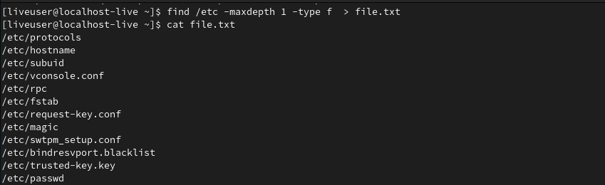

Затем в этот же файл я зписал имена всех файлов, содержащихся в домашнем каталоге. Чтобы при записи в "file.txt" не потерять предыдущие данные, я указал оператор ">>" (дозапись).

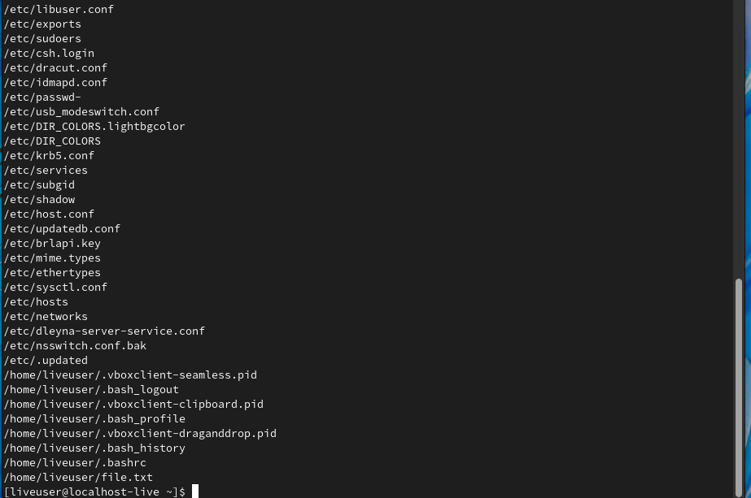

## Шаг 3
С помощью утилиты grep я вывел имена всех файлов из "file.txt", имеющих расщирение .conf. Аргументом я передал подстроку, которую надо найти в именах файлов. grep использует синтаксис регулярных выражений, поэтому я указал после .conf символ $ (конец строки), а перед точкой символ экранирования.

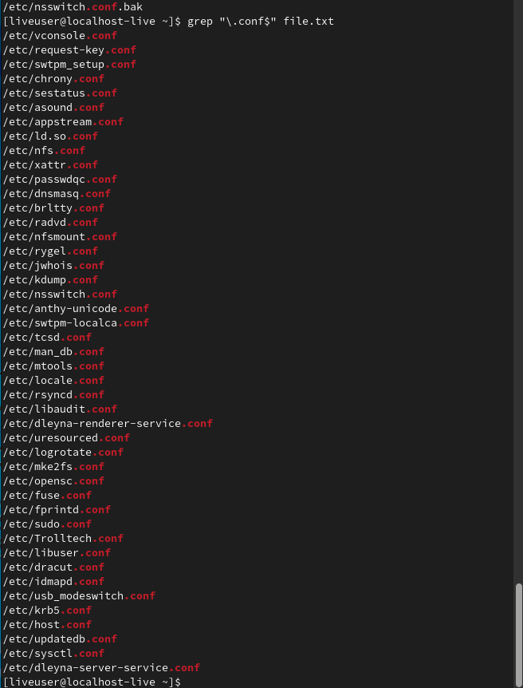

Также я записал все найденные названия файлов в "conf.txt", перенаправив вывод предыдущей команды в файл.

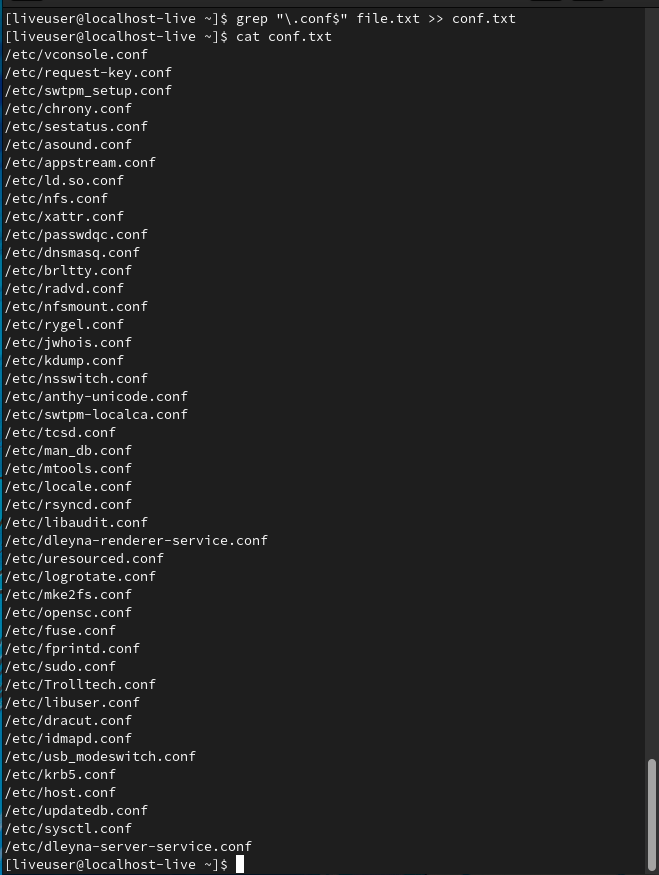

## Шаг 4
Я определил двумя способами (find и grep) имена файлов домашнего котолога, которые начинаются с символа "c". Такой файл всего один - "conf.txt".
Чтобы узнать содержимое каталога только первого уровня вложенности нужно указать опциональный аргумент -maxdepth со значением 1, чтобы искать только файлы, нужно указать опцию -type со значением f.

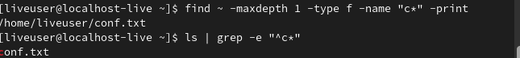

## Шаг 5
Я вывел на экран имена файлов из каталога /etc, начинающихся с символа h.

Чтобы узнать содержимое каталога только первого уровня вложенности нужно указать опциональный аргумент -maxdepth со значением 1, чтобы искать только файлы, нужно указать опцию -type со значением f.

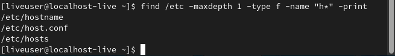

## Шаг 6
Я запустил в фоновом режиме процесс, записывающий в файл ~/logfile имена файлов, название которых начинается с "log". Поиск осуществляется с помощью команды find.

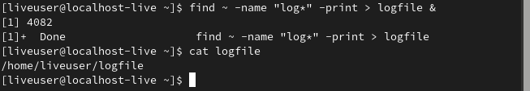

## Шаг 7
Удалил файл ~/logfile.

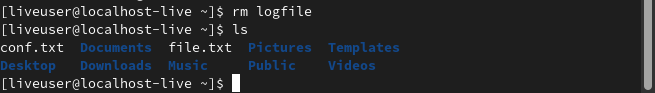

## Шаг 8
Запуск редактора gedit в фоновом режиме. Идентификатор процесса gedit - 4116.

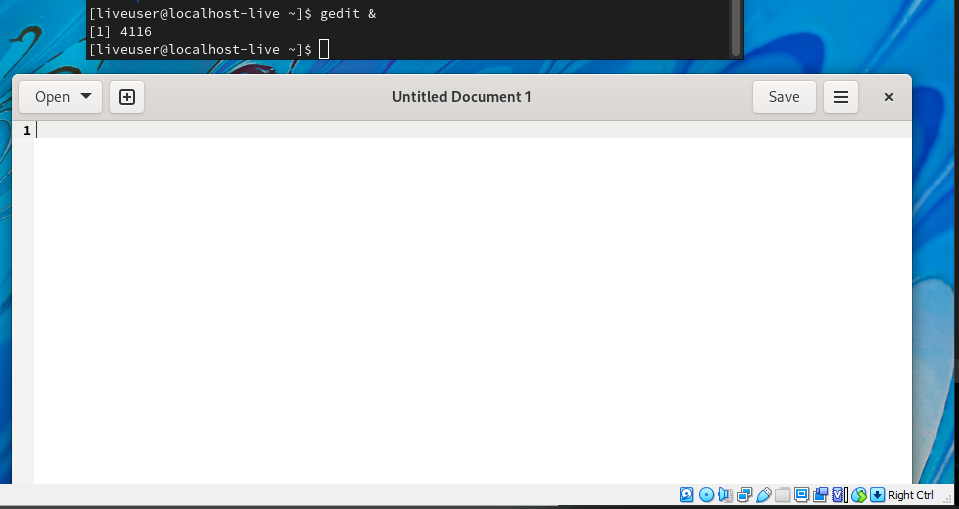

## Шаг 9
Используя команду ps, которая выводит список текущих процессов, конвеера и утилиты grep я узнал идентификатор запущенного процесса gedit. Другой способ узнать PID gedit - посмотреть вывод в консоль предыдущего шага.

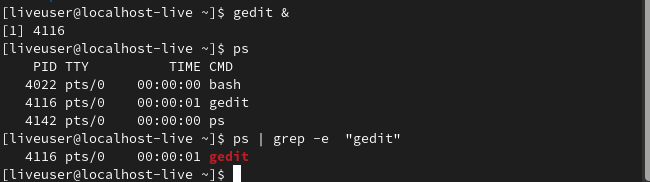

## Шаг 10
Я прочитал справку команды **kill** и узнал, как с ее помощью завершить процессс gedit. Команды kill посылает различные сигналы процессам, для передачи сигнала выклчюения можно использовать опцию -KILL.

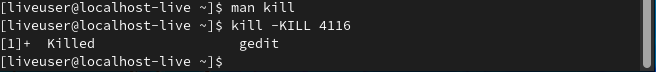

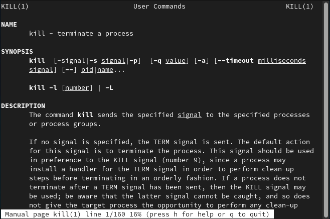

## Шаг 11
Я получил подробную информацию по командам df и du с помощью man.
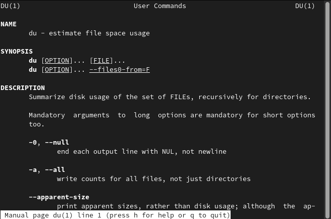

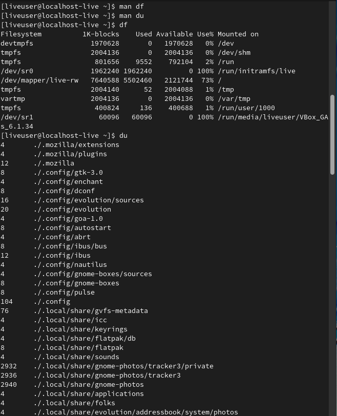

## Шаг 12
С помощью команды find я вывел имена всех директорий, содержащихся в домашнем каталоге.
Для поиска именно директорий нужно указать опцию -type со значением d.

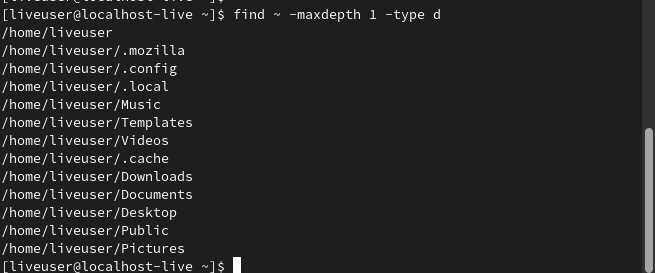

# Вывод
Я изучил инструменты поиска файлов и фильтрации текстовых данных, приобрел практические навыки по управлению процессами и заданиями, а также научился получать информацию про диски и файловые системы с помощью команд du и df.