---
## Front matter
title: "Лабораторная работа №6"
subtitle: "Поиск файлов. Перенаправление ввода-вывода. Просмотр запущенных процессов"
author: "Старовойтов Егор Сергеевич"

## Generic otions
lang: ru-RU
toc-title: "Содержание"

## Bibliography
bibliography: bib/cite.bib
csl: pandoc/csl/gost-r-7-0-5-2008-numeric.csl

## Pdf output format
toc: true # Table of contents
toc-depth: 2
lof: true # List of figures
lot: true # List of tables
fontsize: 12pt
linestretch: 1.5
papersize: a4
documentclass: scrreprt
## I18n polyglossia
polyglossia-lang:
  name: russian
  options:
	- spelling=modern
	- babelshorthands=true
polyglossia-otherlangs:
  name: english
## I18n babel
babel-lang: russian
babel-otherlangs: english
## Fonts
mainfont: PT Serif
romanfont: PT Serif
sansfont: PT Sans
monofont: PT Mono
mainfontoptions: Ligatures=TeX
romanfontoptions: Ligatures=TeX
sansfontoptions: Ligatures=TeX,Scale=MatchLowercase
monofontoptions: Scale=MatchLowercase,Scale=0.9
## Biblatex
biblatex: true
biblio-style: "gost-numeric"
biblatexoptions:
  - parentracker=true
  - backend=biber
  - hyperref=auto
  - language=auto
  - autolang=other*
  - citestyle=gost-numeric
## Pandoc-crossref LaTeX customization
figureTitle: "Рис."
tableTitle: "Таблица"
listingTitle: "Листинг"
lofTitle: "Список иллюстраций"
lotTitle: "Список таблиц"
lolTitle: "Листинги"
## Misc options
indent: true
header-includes:
  - \usepackage{indentfirst}
  - \usepackage{float} # keep figures where there are in the text
  - \floatplacement{figure}{H} # keep figures where there are in the text
---

# Цель работы

Ознакомление с инструментами поиска файлов и фильтрации текстовых данных.
Приобретение практических навыков: по управлению процессами (и заданиями), по
проверке использования диска и обслуживанию файловых систем.

# Задание

1. Осуществите вход в систему, используя соответствующее имя пользователя.
2. Запишите в файл file.txt названия файлов, содержащихся в каталоге /etc. Допишите в этот же файл названия файлов, содержащихся в вашем домашнем каталоге.
3. Выведите имена всех файлов из file.txt, имеющих расширение .conf, после чего
запишите их в новый текстовой файл conf.txt.
4. Определите, какие файлы в вашем домашнем каталоге имеют имена, начинавшиеся
с символа c? Предложите несколько вариантов, как это сделать.
5. Выведите на экран (по странично) имена файлов из каталога /etc, начинающиеся
с символа h.
6. Запустите в фоновом режиме процесс, который будет записывать в файл ~/logfile
файлы, имена которых начинаются с log.
7. Удалите файл ~/logfile.
8. Запустите из консоли в фоновом режиме редактор gedit.
9. Определите идентификатор процесса gedit, используя команду ps, конвейер и фильтр
grep. Как ещё можно определить идентификатор процесса?
10. Прочтите справку (man) команды kill, после чего используйте её для завершения
процесса gedit.
11. Выполните команды df и du, предварительно получив более подробную информацию
об этих командах, с помощью команды man.
12. Воспользовавшись справкой команды find, выведите имена всех директорий, имеющихся в вашем домашнем каталоге.

# Теоретическое введение
## Перенаправление ввода-вывода
В системе по умолчанию открыто три специальных потока:
- stdin — стандартный поток ввода (по умолчанию: клавиатура), файловый дескриптор 0;
- stdout — стандартный поток вывода (по умолчанию: консоль), файловый дескриптор 1;
- stderr — стандартный поток вывод сообщений об ошибках (по умолчанию: консоль), файловый дескриптор 2.

Большинство используемых в консоли команд и программ записывают результаты
своей работы в стандартный поток вывода stdout. Например, команда ls выводит в стандартный поток вывода (консоль) список файлов в текущей директории. Потоки вывода
и ввода можно перенаправлять на другие файлы или устройства. Проще всего это делается
с помощью символов >, >>, <, <<. Рассмотрим пример.

```bash
# Перенаправление stdout (вывода) в файл.
# Если файл отсутствовал, то он создаётся,
# иначе -- перезаписывается.

# Создаёт файл, содержащий список дерева каталогов.
ls -lR > dir-tree.list

1>filename
# Перенаправление вывода (stdout) в файл "filename".
1>>filename
# Перенаправление вывода (stdout) в файл "filename",
# файл открывается в режиме добавления.
2>filename
# Перенаправление stderr в файл "filename".
2>>filename
# Перенаправление stderr в файл "filename",
# файл открывается в режиме добавления.
&>filename
# Перенаправление stdout и stderr в файл "filename".
```

## Конвейер
Конвейер (pipe) служит для объединения простых команд или утилит в цепочки, в которых результат работы предыдущей команды передаётся последующей. Синтаксис
следующий:

```bash
команда 1 | команда 2
# означает, что вывод команды 1 передастся на ввод команде 2
```

Конвейеры можно группировать в цепочки и выводить с помощью перенаправления
в файл, например:

```bash
1 ls -la |sort > sortilg_list
```

вывод команды ls -la передаётся команде сортировки sort\verb, которая пишет результат в файл sorting_list\verb.

Чаще всего скрипты на Bash используются в качестве автоматизации каких-то рутинных операций в консоли, отсюда иногда возникает необходимость в обработке stdout
одной команды и передача на stdin другой команде, при этом результат выполнения
команды должен обработан.

## Поиск файла
Команда **find** используется для поиска и отображения на экран имён файлов, соответствующих заданной строке символов.

Формат команды:
```find путь [-опции]```

Путь определяет каталог, начиная с которого по всем подкаталогам будет вестись
поиск.

Примеры:

1. Вывести на экран имена файлов из вашего домашнего каталога и его подкаталогов,
начинающихся на f:
```bash
find ~ -name "f*" -print
```

Здесь ~ — обозначение вашего домашнего каталога, -name — после этой опции указывается имя файла, который нужно найти, "f*" — строка символов, определяющая имя
файла, -print — опция, задающая вывод результатов поиска на экран.

2. Вывести на экран имена файлов в каталоге /etc, начинающихся с символа p:
```bash
find /etc -name "p*" -print
```
3. Найти в Вашем домашнем каталоге файлы, имена которых заканчиваются символом
~ и удалить их:

```bash
find ~ -name "*~" -exec rm "{}" \;
```

Здесь опция -exec rm "{}" \; задаёт применение команды rm ко всем файлам, имена которых соответствуют указанной после опции -name строке символов.
Для просмотра опций команды find воспользуйтесь командой man.

## Фильтрация текста
Найти в текстовом файле указанную строку символов позволяет команда **grep**.
Формат команды:
```grep строка имя_файла```
Кроме того, команда grep способна обрабатывать стандартный вывод других команд
(любой текст). Для этого следует использовать конвейер, связав вывод команды с вводом
grep.

Примеры:

1. Показать строки во всех файлах в вашем домашнем каталоге с именами, начинающимися на f, в которых есть слово begin:
```bash
grep begin f*
```

2. Найти в текущем каталоге все файлы, содержащих в имени «лаб»:
```bash
ls -l | grep лаб
```

## Проверка использования диска
- Команда **df** показывает размер каждого смонтированного раздела диска.
Формат команды:
```df [-опции] [файловая_система]```

Пример:
```bash
df -vi
```

- Команда **du **показывает число килобайт, используемое каждым файлом или каталогом.
Формат команды:
```du [-опции] [имя_файла...]```

Пример.
```
du -a ~/
```

## Управление задачами
Любую выполняющуюся в консоли команду или внешнюю программу можно запустить
в фоновом режиме. Для этого следует в конце имени команды указать знак амперсанда &. 

Например:
```bash
gedit &
```

Будет запущен текстовой редактор gedit в фоновом режиме. Консоль при этом не будет
заблокирована.

Запущенные фоном программы называются задачами (jobs). Ими можно управлять
с помощью команды jobs, которая выводит список запущенных в данный момент задач.

Для завершения задачи необходимо выполнить команду
```kill %номер задачи```

## Управление процессами
Любой команде, выполняемой в системе, присваивается идентификатор процесса
(process ID). Получить информацию о процессе и управлять им, пользуясь идентификатором процесса, можно из любого окна командного интерпретатора.

## Получение информации о процессах
Команда **ps** используется для получения информации о процессах.
Формат команды:
```ps [-опции]```

Для получения информации о процессах, управляемых вами и запущенных (работающих или остановленных) на вашем терминале, используйте опцию **aux**.

Пример:
```bash
ps aux
```

Для запуска команды в фоновом режиме необходимо в конце командной строки указать знак & (амперсанд).

Пример работы, требующей много машинного времени для выполнения, и которую
целесообразно запустить в фоновом режиме:

```bash
find /var/log -name "*.log" -print > l.log &
```

# Выполнение лабораторной работы

## Шаг 1 - Вход в систему
Я зашел в систему, используя имя пользователя из дисплейного класса (esstarovoyjtov).


## Шаг 2
Я записал в файл "file.txt" названия файлов, содержащихся в каталоге /etc.
Использовал команду find. Чтобы узнать содержимое каталога только первого уровня вложенности нужно указать опциональный аргумент -maxdepth со значением 1, чтобы искать только файлы, нужно указать опцию -type со значением f. Вывод команды я направил в "file.txt" с помощью оператора ">".
Результат выполнения команды я просмотрел с помощью cat.

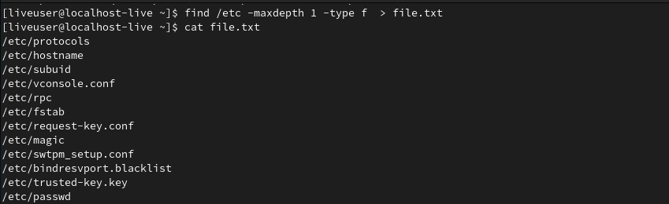

Затем в этот же файл я зписал имена всех файлов, содержащихся в домашнем каталоге. Чтобы при записи в "file.txt" не потерять предыдущие данные, я указал оператор ">>" (дозапись).


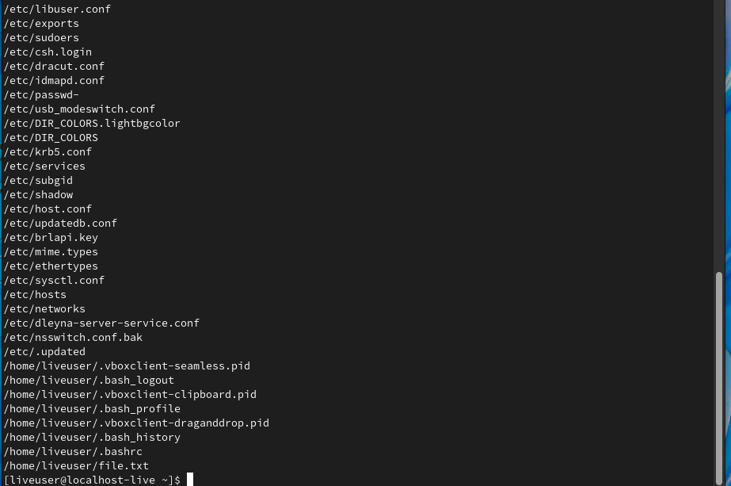

## Шаг 3
С помощью утилиты grep я вывел имена всех файлов из "file.txt", имеющих расщирение .conf. Аргументом я передал подстроку, которую надо найти в именах файлов. grep использует синтаксис регулярных выражений, поэтому я указал после .conf символ $ (конец строки), а перед точкой символ экранирования.

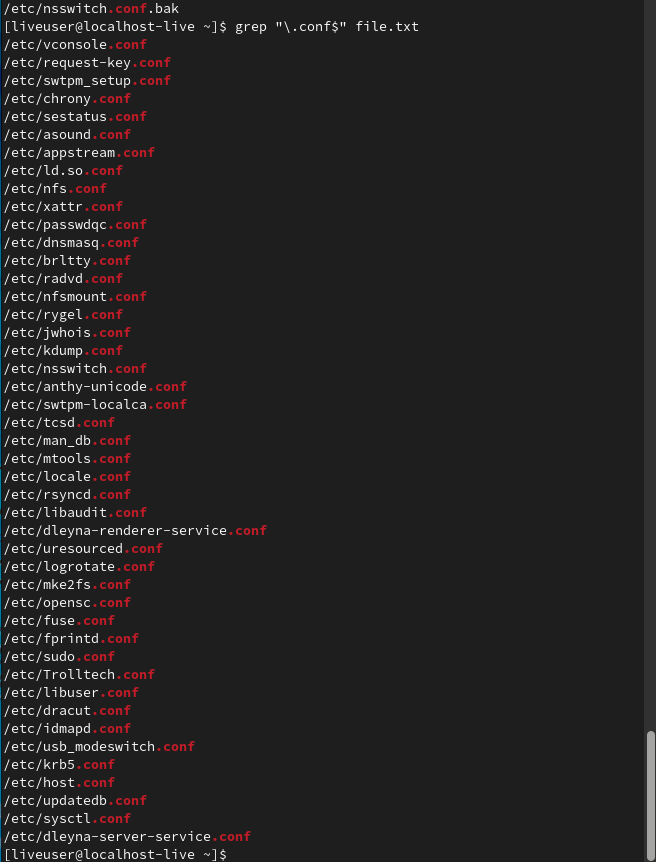

Также я записал все найденные названия файлов в "conf.txt", перенаправив вывод предыдущей команды в файл.

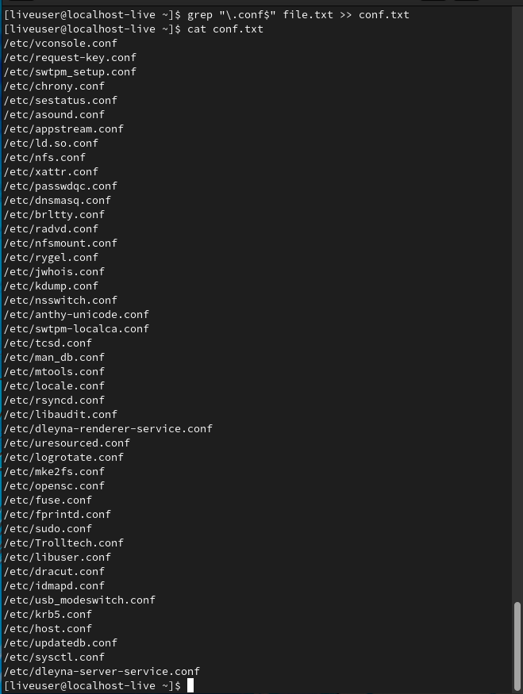

## Шаг 4
Я определил двумя способами (find и grep) имена файлов домашнего котолога, которые начинаются с символа "c". Такой файл всего один - "conf.txt".
Чтобы узнать содержимое каталога только первого уровня вложенности нужно указать опциональный аргумент -maxdepth со значением 1, чтобы искать только файлы, нужно указать опцию -type со значением f.

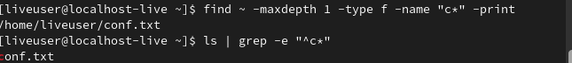

## Шаг 5
Я вывел на экран имена файлов из каталога /etc, начинающихся с символа h.

Чтобы узнать содержимое каталога только первого уровня вложенности нужно указать опциональный аргумент -maxdepth со значением 1, чтобы искать только файлы, нужно указать опцию -type со значением f.

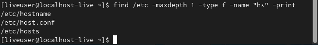

## Шаг 6
Я запустил в фоновом режиме процесс, записывающий в файл ~/logfile имена файлов, название которых начинается с "log". Поиск осуществляется с помощью команды find.

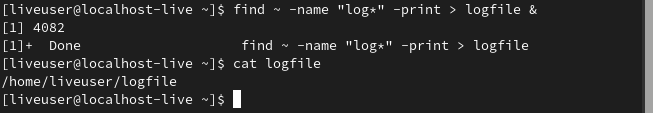

## Шаг 7
Удалил файл ~/logfile.

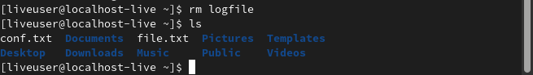

## Шаг 8
Запуск редактора gedit в фоновом режиме. Идентификатор процесса gedit - 4116.

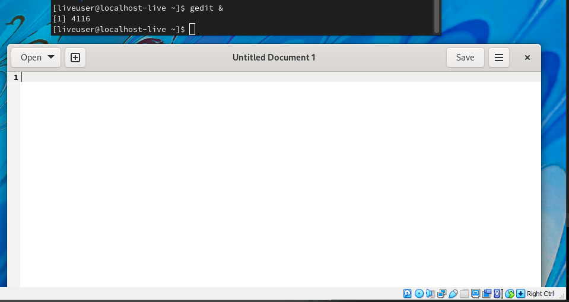

## Шаг 9
Используя команду ps, которая выводит список текущих процессов, конвеера и утилиты grep я узнал идентификатор запущенного процесса gedit. Другой способ узнать PID gedit - посмотреть вывод в консоль предыдущего шага.

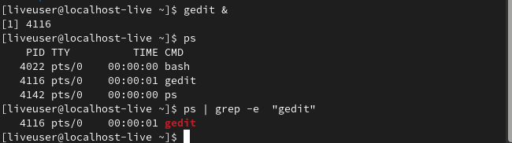

## Шаг 10
Я прочитал справку команды **kill** и узнал, как с ее помощью завершить процессс gedit. Команды kill посылает различные сигналы процессам, для передачи сигнала выклчюения можно использовать опцию -KILL.

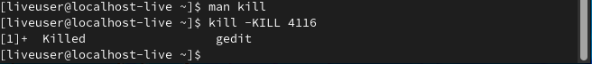

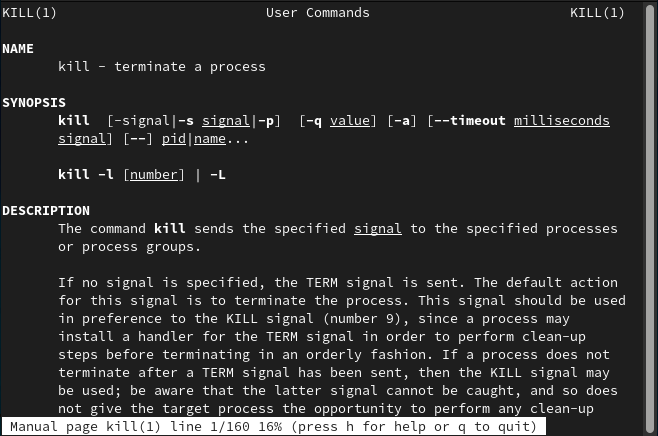

## Шаг 11
Я получил подробную информацию по командам df и du с помощью man.
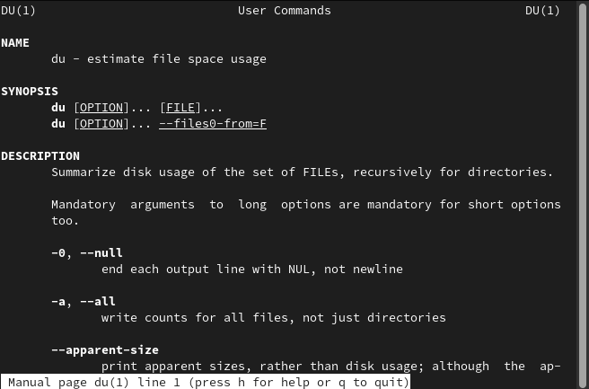

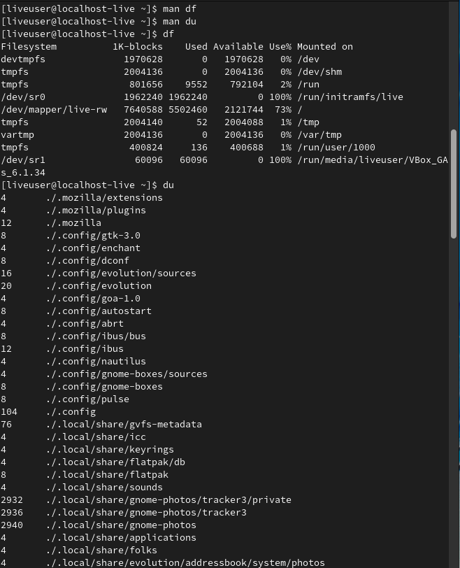

## Шаг 12
С помощью команды find я вывел имена всех директорий, содержащихся в домашнем каталоге.
Для поиска именно директорий нужно указать опцию -type со значением d.

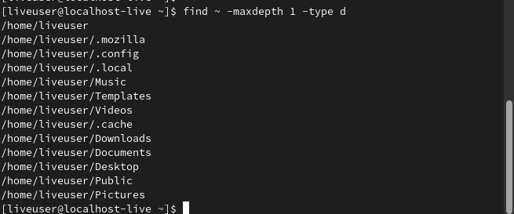

# Вывод
Я изучил инструменты поиска файлов и фильтрации текстовых данных, приобрел практические навыки по управлению процессами и заданиями, а также научился получать информацию про диски и файловые системы с помощью команд du и df.

# Контрольные вопросы
## 1. Какие потоки ввода вывода вы знаете?
- stdin — стандартный поток ввода (по умолчанию: клавиатура), файловый дескриптор 0;
- stdout — стандартный поток вывода (по умолчанию: консоль), файловый дескриптор 1;
- stderr — стандартный поток вывод сообщений об ошибках (по умолчанию: консоль), файловый дескриптор 2.

## 2. Объясните разницу между операцией > и >>.
Операция ">" перезаписывает файл вывода новыми данными, а ">>" осуществаляет дозапись в конец указанного файла.

## 3. Что такое конвейер?
Конвеер - это оператор, объединяющий команды в цепочки, в которой результат работы предыдщуей команды передается следующей.

## 4. Что такое процесс? Чем это понятие отличается от программы?
Программа - это набор инструкций исполнителю, процесс - сущность исполняемой программы. Процесс содержит текст программы, стек ее данных, дескрипторы открытых файлов и другую служебную информацию.

## 5. Что такое PID и GID?
- PID - это идентификатор процесса, его уникальный номер.
- GID - это идентификатор группы пользователя в Linux.

## 6. Что такое задачи и какая команда позволяет ими управлять?
Задачами называются запущенные фоном программы. Узнать список запущенных в данный момент задач можно с помощью команды **jobs**, а посылать им управляющие сигналы можно с помощью команды **kill**.

## 7. Найдите информацию об утилитах top и htop. Каковы их функции?
- top (table of processes) - консольная команда, выводящая список работающих в системе процессов и информацию о них. По умолчанию top сортирует все процессы в реальном времени по их нагрузке на процессор.
- htop - Компьютерная программа, предназначенная для вывода на терминал списка запущенных процессов и информации о них. Создана как альтернатива программы top. Написана на языке Си. Предоставляет пользователю текстовый интерфейс, для вывода на терминал использует библиотеку ncurses.

## 8. Назовите и дайте характеристику команде поиска файлов. Приведите примеры использования этой команды.
Команда **find** используется для поиска и отображения на экран имён файлов, соответствующих заданной строке символов.

Формат команды:
```find путь [-опции]```

Путь определяет каталог, начиная с которого по всем подкаталогам будет вестись
поиск.

Примеры:

1. Вывести на экран имена файлов из вашего домашнего каталога и его подкаталогов,
начинающихся на f:
```bash
find ~ -name "f*" -print
```

Здесь ~ — обозначение вашего домашнего каталога, -name — после этой опции указывается имя файла, который нужно найти, "f*" — строка символов, определяющая имя
файла, -print — опция, задающая вывод результатов поиска на экран.

2. Вывести на экран имена файлов в каталоге /etc, начинающихся с символа p:
```bash
find /etc -name "p*" -print
```
3. Найти в Вашем домашнем каталоге файлы, имена которых заканчиваются символом
~ и удалить их:

```bash
find ~ -name "*~" -exec rm "{}" \;
```

Здесь опция -exec rm "{}" \; задаёт применение команды rm ко всем файлам, имена которых соответствуют указанной после опции -name строке символов.

## 9. Можно ли по контексту (содержанию) найти файл? Если да, то как?
С помощью команды grep можно искать файлы по содержимому. Для этого нужно вызвать команду grep с опциями -lir и искомым текстом, например 
```bash
grep -lir '#include'
```

## 10. Как определить объем свободной памяти на жёстком диске?
Набрав в консоли 
```bash
df -h
```
можно увидеть объем свободной памяти в каждой файовой системе. Просуммировав эти значения можно узнать объем свободной памяти на жёстком диске.

## 11. Как определить объем вашего домашнего каталога?
Объем домашнего каталога в удобочитаемом формате можно узнать набрав в терминале 
```bash
du ~ -h
```

## 12. Как удалить зависший процесс?
Удалить зависший процесс с идентификатором pid можно набрав в терминале ```kill -KILL pid```.