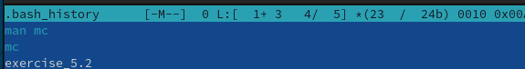

---
## Front matter
lang: ru-RU
title: Лабораторная работа №7. Командная оболочка Midnight Commander.
author: |
	Egor S. Starovoyjtov\inst{1}
	
institute: |
	\inst{1}RUDN University, Moscow, Russian Federation
date: 9 May, 2022 Moscow, Russia

## Formatting
toc: false
slide_level: 2
theme: metropolis
header-includes: 
 - \metroset{progressbar=frametitle,sectionpage=progressbar,numbering=fraction}
 - '\makeatletter'
 - '\beamer@ignorenonframefalse'
 - '\makeatother'
aspectratio: 43
section-titles: true
---

# Лабораторная работа №7.Командная оболочка Midnight Commander.


# Цель работы
Освоение основных возможностей командной оболочки Midnight Commander. Приобретение навыков практической работы по просмотру каталогов и файлов; манипуляций
с ними.

# Задание
# Задание
## Задание по mc
1. Изучите информацию о mc, вызвав в командной строке man mc.
2. Запустите из командной строки mc, изучите его структуру и меню.
3. Выполните несколько операций в mc, используя управляющие клавиши (операции
с панелями; выделение/отмена выделения файлов, копирование/перемещение файлов, получение информации о размере и правах доступа на файлы и/или каталоги
и т.п.)
4. Выполните основные команды меню левой (или правой) панели. Оцените степень
подробности вывода информации о файлах.
5. Используя возможности подменю Файл , выполните:
– просмотр содержимого текстового файла;
– редактирование содержимого текстового файла (без сохранения результатов
редактирования);
– создание каталога;
– копирование в файлов в созданный каталог.
6. С помощью соответствующих средств подменю Команда осуществите:
– поиск в файловой системе файла с заданными условиями (например, файла
с расширением .c или .cpp, содержащего строку main);
– выбор и повторение одной из предыдущих команд;
– переход в домашний каталог;
– анализ файла меню и файла расширений.
7. Вызовите подменю Настройки . Освойте операции, определяющие структуру экрана mc
(Full screen, Double Width, Show Hidden Files и т.д.)

## Задание по встроенному редактору mc
1. Создайте текстовой файл text.txt.
2. Откройте этот файл с помощью встроенного в mc редактора.
3. Вставьте в открытый файл небольшой фрагмент текста, скопированный из любого
другого файла или Интернета.
4. Проделайте с текстом следующие манипуляции, используя горячие клавиши:
4.1. Удалите строку текста.
4.2. Выделите фрагмент текста и скопируйте его на новую строку.
Кулябов Д. С. и др. Операционные системы 69
4.3. Выделите фрагмент текста и перенесите его на новую строку.
4.4. Сохраните файл.
4.5. Отмените последнее действие.
4.6. Перейдите в конец файла (нажав комбинацию клавиш) и напишите некоторый
текст.
4.7. Перейдите в начало файла (нажав комбинацию клавиш) и напишите некоторый
текст.
4.8. Сохраните и закройте файл.
5. Откройте файл с исходным текстом на некотором языке программирования (например C или Java)
6. Используя меню редактора, включите подсветку синтаксиса, если она не включена,
или выключите, если она включена.

# Выполнение лабораторной работы

## Задание по mc

### Шаг 0 - установка mc
Введя в консоль ```man mc``` и ```mc``` я получил сообщение, что команда mc не найдена.
Это значит, что mc на виртуальной машине нет. Пришлось устанавливать с помощью менеджера пакетов.


### Шаг 1
Я изучил информацию о mc, вызвав в командной строке ```man mc```.


### Шаг 2
Далее я запустил mc из командной строки и изучил его структуру и меню.


### Шаг 3
Далее я выполнил несколько действий с mc - "погулял" по дереву каталогов, копировал и перемещал файлы, смотрел их содержимое...

### Шаг 4
Я выполнил команды info и tree.

Команда info вывела подробную информацию про текущий каталог - права доступа, размер, тип  файловой системы и тд.


Команда tree выводит на экран дерево каталогов, с возможностью навигации. Изначально в дереве отображаются только директории первого уровня, однако остальные папки можно увидеть после двойных щелчков мышью по их родительским директориям.


### Шаг 5
Используя возможности подменю "Файл" ("File"), я выполнил:

1. Просмотр содержимого текстового файла ~/.bash_history


2. Отредактировал этот файл (без сохранения изменений), дописав в конец строку текста.


3. Создал каталог Hard в директории ~/Music


4. Скопировал файл applet_dirlist в созданный на преыдщуем этапе каталог Hard


### Шаг 6
С помощью подменю "Команда" ("Command") я осуществил:

1. Поиск файла с расширением .cpp, содержащего строку main.


2. Выбрал из истории предыдущую команду и повторил ее

3. Перешел в домашний каталог

### Шаг 7
Я вызвал подменю "Настройки" ("Options") и изучил операции, изменяющие структуру экрана.


## Задание по встроенному редактору mc

### Шаг 1
Я создал текстовый файл text.txt в домашнем каталоге.


### Шаг 2
Я открыл файл text.txt с помощью встроенного в mc редактора.


### Шаг 3
Я вставил в файл фрагмент текста из случайной статьи в википедии.


### Шаг 4
Используя горячие клавиши я проделал с текстом следующие манипуляции:

1. Удалил строку текста


2. Выделил фрагмент текста и скопировал его на новую строку


3. Выделил фрагмент текста и перенес его на новую строку


4. Сохранил файл


5. Отменил последнее действие (перенос фрагмента текста)


6. Перешел в конец файла, нажав ctrl+End, и ввел строку текста "some text".


7. Перешел в конец файла нажав, ctrl+Home, и ввел строку текста "some text 2".


8. Сохранил файл и вышел из редактора. На фото ниже я проверил, что все изменения действительно сохранились в файле.


## Шаг 5
Открыл случайный файл на языке С++.


## Шаг 6
Отключил подсветку синтаксиса.


# Вывод
Я освоил основные возможности оболочки Midnight Commander и приобрел навыки практической работы по просмотру каталогов и файлов, а также других манипуляций с ними, включая редактирование текста.