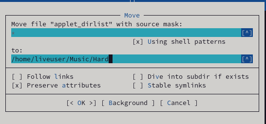

---
## Front matter
title: "Лабораторная работа №7"
subtitle: "Командная оболочка Midnight Commander"
author: "Старовойтов Егор Сергеевич"

## Generic otions
lang: ru-RU
toc-title: "Содержание"

## Bibliography
bibliography: bib/cite.bib
csl: pandoc/csl/gost-r-7-0-5-2008-numeric.csl

## Pdf output format
toc: true # Table of contents
toc-depth: 2
lof: true # List of figures
lot: true # List of tables
fontsize: 12pt
linestretch: 1.5
papersize: a4
documentclass: scrreprt
## I18n polyglossia
polyglossia-lang:
  name: russian
  options:
	- spelling=modern
	- babelshorthands=true
polyglossia-otherlangs:
  name: english
## I18n babel
babel-lang: russian
babel-otherlangs: english
## Fonts
mainfont: PT Serif
romanfont: PT Serif
sansfont: PT Sans
monofont: PT Mono
mainfontoptions: Ligatures=TeX
romanfontoptions: Ligatures=TeX
sansfontoptions: Ligatures=TeX,Scale=MatchLowercase
monofontoptions: Scale=MatchLowercase,Scale=0.9
## Biblatex
biblatex: true
biblio-style: "gost-numeric"
biblatexoptions:
  - parentracker=true
  - backend=biber
  - hyperref=auto
  - language=auto
  - autolang=other*
  - citestyle=gost-numeric
## Pandoc-crossref LaTeX customization
figureTitle: "Рис."
tableTitle: "Таблица"
listingTitle: "Листинг"
lofTitle: "Список иллюстраций"
lotTitle: "Список таблиц"
lolTitle: "Листинги"
## Misc options
indent: true
header-includes:
  - \usepackage{indentfirst}
  - \usepackage{float} # keep figures where there are in the text
  - \floatplacement{figure}{H} # keep figures where there are in the text
---

# Цель работы

Освоение основных возможностей командной оболочки Midnight Commander. Приобретение навыков практической работы по просмотру каталогов и файлов; манипуляций
с ними.

# Задание
## Задание по mc
1. Изучите информацию о mc, вызвав в командной строке man mc.
2. Запустите из командной строки mc, изучите его структуру и меню.
3. Выполните несколько операций в mc, используя управляющие клавиши (операции
с панелями; выделение/отмена выделения файлов, копирование/перемещение файлов, получение информации о размере и правах доступа на файлы и/или каталоги
и т.п.)
4. Выполните основные команды меню левой (или правой) панели. Оцените степень
подробности вывода информации о файлах.
5. Используя возможности подменю Файл , выполните:
– просмотр содержимого текстового файла;
– редактирование содержимого текстового файла (без сохранения результатов
редактирования);
– создание каталога;
– копирование в файлов в созданный каталог.
6. С помощью соответствующих средств подменю Команда осуществите:
– поиск в файловой системе файла с заданными условиями (например, файла
с расширением .c или .cpp, содержащего строку main);
– выбор и повторение одной из предыдущих команд;
– переход в домашний каталог;
– анализ файла меню и файла расширений.
7. Вызовите подменю Настройки . Освойте операции, определяющие структуру экрана mc
(Full screen, Double Width, Show Hidden Files и т.д.)

## Задание по встроенному редактору mc
1. Создайте текстовой файл text.txt.
2. Откройте этот файл с помощью встроенного в mc редактора.
3. Вставьте в открытый файл небольшой фрагмент текста, скопированный из любого
другого файла или Интернета.
4. Проделайте с текстом следующие манипуляции, используя горячие клавиши:
4.1. Удалите строку текста.
4.2. Выделите фрагмент текста и скопируйте его на новую строку.
Кулябов Д. С. и др. Операционные системы 69
4.3. Выделите фрагмент текста и перенесите его на новую строку.
4.4. Сохраните файл.
4.5. Отмените последнее действие.
4.6. Перейдите в конец файла (нажав комбинацию клавиш) и напишите некоторый
текст.
4.7. Перейдите в начало файла (нажав комбинацию клавиш) и напишите некоторый
текст.
4.8. Сохраните и закройте файл.
5. Откройте файл с исходным текстом на некотором языке программирования (например C или Java)
6. Используя меню редактора, включите подсветку синтаксиса, если она не включена,
или выключите, если она включена.


# Теоретическое введение

## Общие сведения
Командная оболочка — интерфейс взаимодействия пользователя с операционной системой и программным обеспечением посредством команд.

Midnight Commander (или mc) — псевдографическая командная оболочка для UNIX/Linux
систем. Для запуска mc необходимо в командной строке набрать mc и нажать Enter.

Рабочее пространство mc имеет две панели, отображающие по умолчанию списки
файлов двух каталогов.

Функциональные клавиши mc:
- F1 Вызов контекстно-зависимой подсказки
- F2 Вызов пользовательского меню с возможностью создания и/или дополнения дополнительных функций
- F3 Просмотр содержимого файла, на который указывает подсветка в активной панели (без возможности редактирования)
- F4 Вызов встроенного в mc редактора для изменения содержания файла,
на который указывает подсветка в активной панели
- F5 Копирование одного или нескольких файлов, отмеченных в первой
(активной) панели, в каталог, отображаемый на второй панели
- F6 Перенос одного или нескольких файлов, отмеченных в первой (активной) панели, в каталог, отображаемый на второй панели
- F7 Создание подкаталога в каталоге, отображаемом в активной панели
- F8 Удаление одного или нескольких файлов (каталогов), отмеченных в первой (активной) панели файлов
- F9 Вызов меню mc
- F10 Выход из mc

## Редактор mc

Встроенный в mc редактор вызывается с помощью функциональной клавиши F4 . В нём
удобно использовать различные комбинации клавиш при редактировании содержимого
(как правило текстового) файла (табл. 7.2).


# Выполнение лабораторной работы

## Задание по mc

### Шаг 0 - установка mc
Введя в консоль ```man mc``` и ```mc``` я получил сообщение, что команда mc не найдена.
Это значит, что mc на виртуальной машине нет. Пришлось устанавливать с помощью менеджера пакетов.


### Шаг 1
Я изучил информацию о mc, вызвав в командной строке ```man mc```.


### Шаг 2
Далее я запустил mc из командной строки и изучил его структуру и меню.


### Шаг 3
Далее я выполнил несколько действий с mc - "погулял" по дереву каталогов, копировал и перемещал файлы, смотрел их содержимое...

### Шаг 4
Я выполнил команды info и tree.

Команда info вывела подробную информацию про текущий каталог - права доступа, размер, тип  файловой системы и тд.


Команда tree выводит на экран дерево каталогов, с возможностью навигации. Изначально в дереве отображаются только директории первого уровня, однако остальные папки можно увидеть после двойных щелчков мышью по их родительским директориям.


### Шаг 5
Используя возможности подменю "Файл" ("File"), я выполнил:

1. Просмотр содержимого текстового файла ~/.bash_history


2. Отредактировал этот файл (без сохранения изменений), дописав в конец строку текста.


3. Создал каталог Hard в директории ~/Music


4. Скопировал файл applet_dirlist в созданный на преыдщуем этапе каталог Hard



### Шаг 6
С помощью подменю "Команда" ("Command") я осуществил:

1. Поиск файла с расширением .cpp, содержащего строку main.


2. Выбрал из истории предыдущую команду и повторил ее

3. Перешел в домашний каталог

### Шаг 7
Я вызвал подменю "Настройки" ("Options") и изучил операции, изменяющие структуру экрана.


## Задание по встроенному редактору mc

### Шаг 1
Я создал текстовый файл text.txt в домашнем каталоге.


### Шаг 2
Я открыл файл text.txt с помощью встроенного в mc редактора.


### Шаг 3
Я вставил в файл фрагмент текста из случайной статьи в википедии.


### Шаг 4
Используя горячие клавиши я проделал с текстом следующие манипуляции:

1. Удалил строку текста


2. Выделил фрагмент текста и скопировал его на новую строку


3. Выделил фрагмент текста и перенес его на новую строку


4. Сохранил файл


5. Отменил последнее действие (перенос фрагмента текста)


6. Перешел в конец файла, нажав ctrl+End, и ввел строку текста "some text".


7. Перешел в конец файла нажав, ctrl+Home, и ввел строку текста "some text 2".


8. Сохранил файл и вышел из редактора. На фото ниже я проверил, что все изменения действительно сохранились в файле.


## Шаг 5
Открыл случайный файл на языке С++.


## Шаг 6
Отключил подсветку синтаксиса.


# Вывод
Я освоил основные возможности оболочки Midnight Commander и приобрел навыки практической работы по просмотру каталогов и файлов, а также других манипуляций с ними, включая редактирование текста.

# Контрольные вопросы
## 1. Какие режимы работы есть в mc. Охарактеризуйте их.
1. Обычный режим
2. Режим быстрого просмотра файлов и каталогов

## 2. Какие операции с файлами можно выполнить как с помощью команд shell, так и с помощью меню (комбинаций клавиш) mc? 
Вывод дерева каталогов (tree), поиск файлов по названию и/или содержимому, Создание, удаление и копирование и перемещение файлов и/или директорий, просмотр прав доступа и т.д.

## 3. Опишите структуру меню левой (или правой) панели mc, дайте характеристику командам.
1. File listing (Список файлов) - список файлов и директорий в текущем каталоге.
2. Quick View (Быстрый просмотр) - быстрый просмотр содержимого панели.
3. Info (Информация) - просмотр информации о файле или каталоге.
4. Tree (Дерево) - выводит в панели интерактивное дерево файлов и каталогов.
5. Listing format (Формат списка) - позволяет изменить отображаемую информацию о файлахи каталогах.
6. Sort order (Порядок сортировки) - позволяет задать порядок сортировки списка выводимых файлов и каталогов.
7. Filter (Фильтр) - позволяет фильтровать отображаемые файлы по имени или расширению.
8. Encoding (Кодировка) - позволяет выбрать использемую при отображении файлов и каталогов кодировку.
9. FTP link - подключение к удаленному серверу через протокол FTP.
10. Shell link - подключение к удаленному компьютеру.
11. SMB link - подключение к сетям Windows.
12. Panelize - управление структурой размещения отображаемых данных.
13. Rescan - обновление отображаемой информации.


## 4. Опишите структуру меню Файл mc, дайте характеристику командам.
Меню Файл содержит перечень команд, которые могут быть применены к одному
или нескольким файлам или каталогам.

Просмотр - позволяет посмотреть содержимое текущего (или выделенного)
файла без возможности редактирования.
1. Просмотр вывода команды - функция запроса команды с параметрами
(аргумент к текущему выбранному файлу).
2. Правка - открывает текущий (или выделенный) файл для его редактирования.
3. Копирование - осуществляет копирование одного или нескольких файлов или
каталогов в указанное пользователем во всплывающем окне место.
4. Права доступа - позволяет указать (изменить) права доступа к одному
или нескольким файлам или каталогам.
5. Жёсткая ссылка - позволяет создать жёсткую ссылку к текущему (или
выделенному) файлу.
6. Символическая ссылка - позволяет создать символическую ссылку к текущему (или выделенному) файлу.
7. Владелец/группа  - позволяет задать (изменить) владельца и имя группы
для одного или нескольких файлов или каталогов.
8. Права (расширенные) - позволяет изменить права доступа и владения для одного
или нескольких файлов или каталогов.
9. Переименование - позволяет переименовать (или переместить) один или
несколько файлов или каталогов.
10. Создание каталога - позволяет создать каталог.
11. Удалить - позволяет удалить один или несколько файлов или каталогов.
12. Выход - завершает работу mc.

## 5. Опишите структуру меню Команда mc, дайте характеристику командам.
В меню Команда содержатся более общие команды для работы с mc.

Команды меню Команда:

1. Дерево каталогов - отображает структуру каталогов системы.
2. Поиск файла - выполняет поиск файлов по заданным параметрам.
3. Переставить панели - меняет местами левую и правую панели.
4. Сравнить каталоги - сравнивает содержимое двух каталогов.
5. Размеры каталогов - отображает размер и время изменения каталога (по умолчанию
в mc размер каталога корректно не отображается).
6. История командной строки - выводит на экран список ранее выполненных в оболочке
команд.
7. Каталоги быстрого доступа - пр вызове выполняется быстрая смена текущего
каталога на один из заданного списка.
8. Восстановление файлов - позволяет восстановить файлы на файловых системах ext2
и ext3.
9. Редактировать файл расширений - позволяет задать с помощью определённого синтаксиса действия при запуске файлов с определённым расширением (например, какое
программного обеспечение запускать для открытия или редактирования файлов с расширением doc или docx).
10. Редактировать файл меню - позволяет отредактировать контекстное меню пользователя, вызываемое по клавише F2 .
11. Редактировать файл расцветки имён - позволяет подобрать оптимальную для пользователя расцветку имён файлов в зависимости от их типа.


## 6. Опишите структуру меню Настройки mc, дайте характеристику командам.
Меню Настройки содержит ряд дополнительных опций по внешнему виду и функциональности mc.

Меню Настройки содержит:

1. Конфигурация - позволяет скорректировать настройки работы с панелями.
2. Внешний вид и Настройки панелей - определяет элементы (строка меню, командная строка, подсказки и прочее), отображаемые при вызове mc, а также геометрию
расположения панелей и цветовыделение.
3. Биты символов - задаёт формат обработки информации локальным терминалом.
4. Подтверждение - позволяет установить или убрать вывод окна с запросом подтверждения действий при операциях удаления и перезаписи файлов, а также при выходе
из программы.
5. Распознание клавиш - диалоговое окно используется для тестирования функциональных клавиш, клавиш управления курсором и прочее.
6. Виртуальные ФС – настройки виртуальной файловой системы: тайм-аут, пароль
и прочее.

## 7. Назовите и дайте характеристику встроенным командам mc.
### Общее
- Ctrl+x,j — Показ фоновых задач
- Сtrl-X+A — текущие VFS (ftp и пр.)
- ESC+цифра — тоже что и F{цифра} (ESC+5 = F5)

### F1-F12
- F1 — Помощь
- F2 — Сохранить изменения в файл при редактировании
- F3 — Просмотр файла
- F3 — (Во время редактирования) Начать выделение текста. Повторное нажатие F3 закончит выделение
- F4 — Редактирование файла
- F5 — Скопировать выделенное
- F6 — Переместить выделенное
- F8 — Удалить выделенное  
- Shift+F1 — вызывается меню быстрого перехода между точками монтирования на левой панели
- Shift+F2 — вызывается меню быстрого перехода между точками монтирования на правой панели
- Shift+F5 — скопировать файл в этот же каталог
- Shift+F6 — переместить/переименовать файл в этот же каталог

### Поиск
- ctrl-s — Быстрый поиск файла или каталога
- alt-shift-? — Вызывается меню расширенного поиска файлов

### Командная строка
- ctrl-a — курсор в начало
- ctrl-e — курсор в конец
- esc-! — выполнить команду с параметрами
- ctrl-x, p или alt+a — вставить имя каталога
- esc, enter; ctrl-enter — послать текущий объект в командную строку
- ctrl-x,t — Вставка всех выделенных объектов в командную строку
- esc, tab — дополнение команды
- alt-a — вставить текущий каталог в командную строку
- Alt-TAB (ESC+TAB) — Крутейшая комбинация для поиска загружаемых файлов (например, вы забыли как правильно пишется: netcfg или netconfig. Достаточно набрать в командной строке net и нажать  - Alt-TAB — вам сразу покажут что можно запустить, которое начинается со слова net) нажимать два раза!
- alt-shift-! — вывод результата команды
- ctrl-shift-v — вставка из буфера обмена
Операции над файлами
- Shift+F4 — Создает новый файл
- shift-f6 — переименовать файл
-  Ctrl+x,i — Быстрый просмотр информации о текущем объекте на второй панели
- Ctrl+x,q — Быстрый просмотр содержимого файла на второй панели
- alt-. — показать скрытые файлы
- ctrl-x, c — права на файл
- ctrl-x, o — владелец файла
- Shift-F3 — просмотр файла (raw/ без учета расширения)
- Ctrl-X+L — создать ссылку на файл
- Ctrl-X+S — создать символическую ссылку на файл
- Ctrl + x v — создать относительную символическую ссылку  
- trl+x,Ctrl+s — Редактировать символическую ссылку
- F12 — Save as
- ctrl-t — отметить файл либо снять отметку
- + — выбрать (отметить) группу файлов по регулярному выражению
- \ — снять отметку с группы файлов
- ctrl-x, ctrl-d — сравнить файлы
- ctrl-t или Insert — Выделение текущего объекта
- Работа с каталогами
- alt-o — открыть каталог под курсором в соседней панели
- alt-i — открыть текущий каталог в соседней панели
- сtrl-\ — показать «Справочник каталогов»
- ctrl-x, h — добавить ссылку на текущий каталог в меню быстрого доступа
- alt-shift-h — Отобразить историю каталогов
- Ctrl+l — Перерисовать экран
- Ctrl+r — перечитать содержимое каталога
- Ctrl+Space — Показать размер текущего каталога
- Ctrl-X+D — сравнить каталоги
- ESC+C — быстро сменить каталог
- alt-c -окно «Быстрая смена каталога»

### Работа с панелями
- Ctrl-O — погасить панели и посмотреть что под ними (работает ТОЛЬКО в linux!) здесь же можно поработать в shell’e.
- alt-, — Переключить режим отображения панелей (вертикально/горизонтально)
- alt-t переключение подробного режима отображения панели
- Meta+c — Вызывается меню быстрой смены текущего каталога на активной панели
- ctrl-u — поменять панели местами
- alt-g — отмечает первый файл или каталог в отображаемом списке на панели (по сути как клавиша Home, поднимает курсор вверх)
- alt-e — поменять кодировку панели
- Ctrl + x i — переводит пассивную панель в режим «Информация»
- Ctrl + x q — переводит пассивную панель в режим быстрого просмотра
- ctrl-x ! — меню → «Критерий панелизации» (git)

### История
- alt+h; esc, h — история командной строки
- lt-p, alt-n — вернуть предыдущую (следущую) командную строку (строки)
- alt-y. Перемещение к предыдущему каталогу из истории перемещения по каталогам; эквивалентно нажатию мышкой на символ ‘<‘ в верхнем углу панели.
- alt-u. Перемещение к следующему каталогу из истории перемещения по каталогам; эквивалентно нажатию мышкой на символ ‘>’.

### 8. Назовите и дайте характеристику командам встроенного редактора mc.
- F4 (в редакторе) — поиск с заменой
- F6 (в редакторе) — поиск с помощью регулярного выражения
- Shift-Del (в редакторе) — удалить блок (и положить его в clipboard)
- Shift-Ins (в редакторе) — вставить блок из буфера (работает даже в другой консоли!!!) Можно редактировать два и более файлов на разных консолях и гонять блоки между ними
- Shift+F3 — Начать выделение блока текста. Повторное нажатие F3 закончит выделение
- Shift+F5 — Вставка текста из внутреннего буфера обмена mc (прочитать внешний файл)
- Meta+i — Переключение режима «Автовыравнивание возвратом каретки», удобно при вставке отформатированного текста из буфера обмена
- Meta+l — Переход к строке по её номеру
- Meta+q — Вставка литерала (непечатного символа).См. таблицу ниже
- Meta+t — Сортировка строк выделенного текста
- Meta+u — Выполнить внешнюю команду и вставить в позицию под курсором её вывод
- Ctrl+f — Занести выделенный фрагмент во внутренний буфер обмена mc (записать во внешний файл)
- Ctrl+k — Удалить часть строки до конца строки
- Ctrl+n — Создать новый файл
- Ctrl+s — Включить или выключить подсветку синтаксиса
- Ctrl+t — Выбрать кодировку текста
- Ctrl+u — Отменить действия
- Ctrl+x — Перейти в конец следующего
- Ctrl+y — Удалить строку
- Ctrl+z — Перейти на начало предыдущего слова
- Meta+Enter — Диалог перехода к определению функции
- Meta+- — Возврат после перехода к определению функции
- Meta++ — Переход вперед к определению функции
- Meta+n — Включение/отключение отображения номеров строк
tab Отодвигает вправо выделенный текст, если выключена опция «Постоянные блоки»
- Meta-tab Отодвигает влево выделенный текст, если выключена опция «Постоянные блоки»
- Shift+Стрелки Выделение текста
- Meta+Стрелки Выделение вертикального блока
-Meta+Shift+- Переключение режима отображения табуляций и пробелов
- Meta+Shift++ Переключение режима «Автовыравнивание возвратом каретки»
