---
## Front matter
lang: ru-RU
title: Лабораторная работа №8. Текстовой редактор vi.
author: |
	Egor S. Starovoyjtov\inst{1}
	
institute: |
	\inst{1}RUDN University, Moscow, Russian Federation
date: 12 May, 2022 Moscow, Russia

## Formatting
toc: false
slide_level: 2
theme: metropolis
header-includes: 
 - \metroset{progressbar=frametitle,sectionpage=progressbar,numbering=fraction}
 - '\makeatletter'
 - '\beamer@ignorenonframefalse'
 - '\makeatother'
aspectratio: 43
section-titles: true
---

# Лабораторная работа №8. Текстовой редактор vi.


# Цель работы
Получить практические навыки работы с редактором vi, установленным по умолчанию практически во всех дистрибутивах.

# Задание
## Задание 1. Создание нового файла с использованием vi
1. Создайте каталог с именем ~/work/os/lab06.
2. Перейдите во вновь созданный каталог.
3. Вызовите vi и создайте файл hello.sh
    ```bash
    vi hello.sh
    ```
4. Нажмите клавишу i и вводите следующий текст.
    ```sh
    #!/bin/bash
    HELL=Hello
    function hello {
    LOCAL HELLO=World
    echo $HELLO
    }
    echo $HELLO
    hello
    ```
5. Нажмите клавишу Esc для перехода в командный режим после завершения ввода
текста.
6. Нажмите ```:``` для перехода в режим последней строки и внизу вашего экрана появится
приглашение в виде двоеточия.
7. Нажмите w (записать) и q (выйти), а затем нажмите клавишу Enter для сохранения
вашего текста и завершения работы.
8. Сделайте файл исполняемым
    ```bash
    chmod +x hello.sh
    ```

## Задание 2. Редактирование существующего файла
1. Вызовите vi на редактирование файла
    ```bash
    vi ~/work/os/lab06/hello.sh
    ```
2. Установите курсор в конец слова HELL второй строки.
3. Перейдите в режим вставки и замените на HELLO. Нажмите Esc для возврата в командный режим.
4. Установите курсор на четвертую строку и сотрите слово LOCAL.
5. Перейдите в режим вставки и наберите следующий текст: local, нажмите Esc для
возврата в командный режим.
6. Установите курсор на последней строке файла. Вставьте после неё строку, содержащую
следующий текст: echo $HELLO.
7. Нажмите Esc для перехода в командный режим.
8. Удалите последнюю строку.
9. Введите команду отмены изменений u для отмены последней команды.
10. Введите символ ```:``` для перехода в режим последней строки. Запишите произведённые
изменения и выйдите из vi.


# Выполнение лабораторной работы
## Задание 1
1. Создан каталог с именем ~/work/os/lab06.

    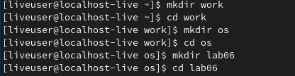

2. Перешел во вновь созданный каталог.

3. Вызвал vi и создал файл hello.sh набрав
    ```bash
    vi hello.sh
    ```

4. Нажал клавишу i и ввел следующий текст.
    ```sh
    #!/bin/bash
    HELL=Hello
    function hello {
    LOCAL HELLO=World
    echo $HELLO
    }
    echo $HELLO
    hello
    ```

    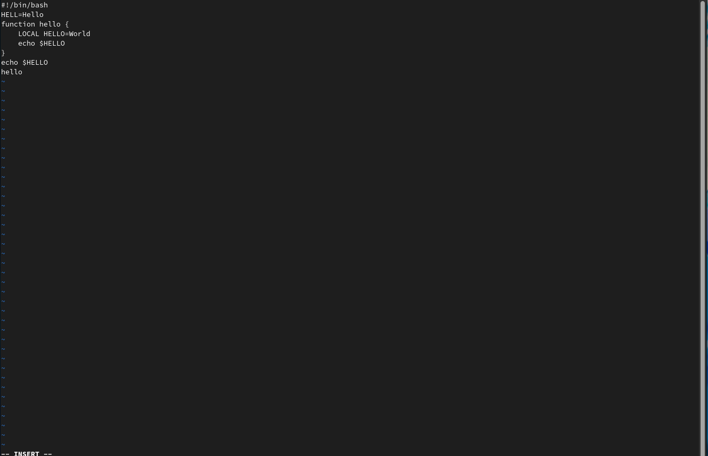

5. Нажал клавишу Esc для перехода в командный режим после завершения ввода
текста.
    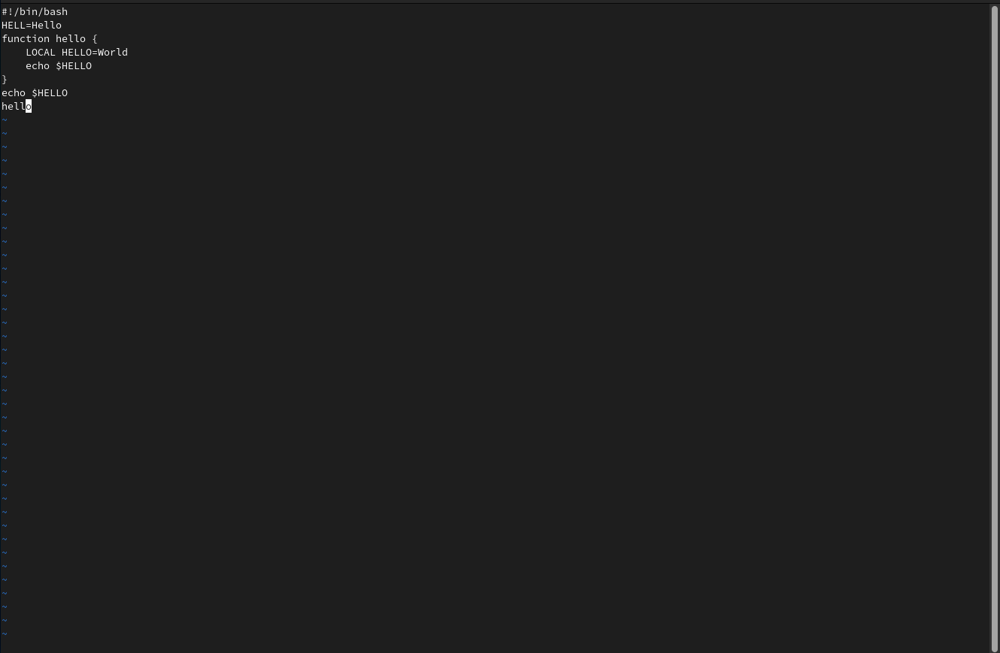

6. Нажал ```:``` для перехода в режим последней строки и внизу моего экрана появилось
приглашение в виде двоеточия.
    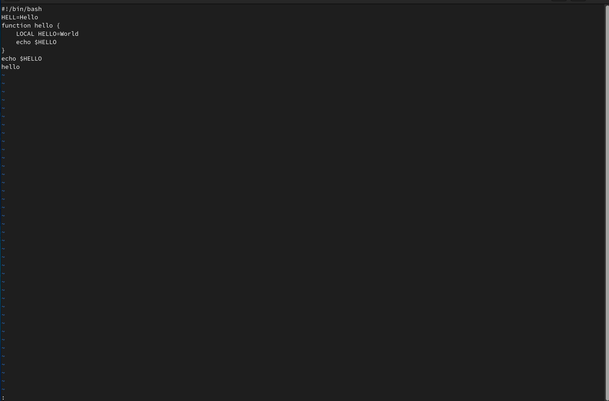

7. Нажал w (записать) и q (выйти), а затем клавишу Enter для сохранения текста и завершения работы.

8. Сделал файл исполняемым

    

## Задание 2
1. Вызвал vi на редактирование файла набрав
    ```bash
    vi ~/work/os/lab06/hello.sh
    ```
    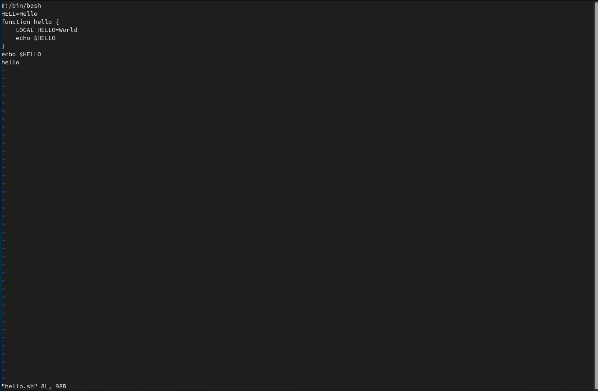

2. Установил курсор в конец слова HELL второй строки.

    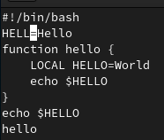

3. Перешел в режим вставки и заменил HELL на HELLO. Потом нажал Esc для возврата в командный режим.

    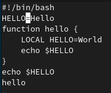

4. Установил курсор на четвертую строку и стер слово LOCAL.

    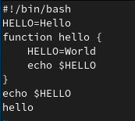

5. Перешел в режим вставки и набрал "local", нажал Esc для возврата в командный режим.

    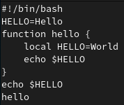

6. Установил курсор на последней строке файла. Вставил после неё строку, содержащую текст: "echo $HELLO."
    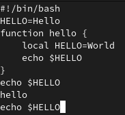

7. Нажал Esc для перехода в командный режим.

8. Удалил последнюю строку. 

    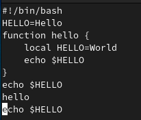
    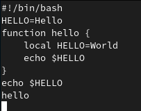

9. Ввел команду отмены изменений ```u``` для отмены последней команды.

    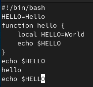

10. Ввел символ ```:``` для перехода в режим последней строки. Записал произведённые
изменения и выйдите из vi.
    
    

## Запуск файла hello.sh
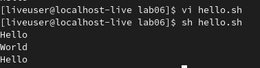

# Вывод
Я получил практические навыки работы с редактором vi, изучил его основные команды и опции. Также познакомился с файлами формата .sh.
