---
## Front matter
title: "Лабораторная работа №8"
subtitle: "Текстовой редактор vi"
author: "Старовойтов Егор Сергеевич"

## Generic otions
lang: ru-RU
toc-title: "Содержание"

## Bibliography
bibliography: bib/cite.bib
csl: pandoc/csl/gost-r-7-0-5-2008-numeric.csl

## Pdf output format
toc: true # Table of contents
toc-depth: 2
lof: true # List of figures
lot: true # List of tables
fontsize: 12pt
linestretch: 1.5
papersize: a4
documentclass: scrreprt
## I18n polyglossia
polyglossia-lang:
  name: russian
  options:
	- spelling=modern
	- babelshorthands=true
polyglossia-otherlangs:
  name: english
## I18n babel
babel-lang: russian
babel-otherlangs: english
## Fonts
mainfont: PT Serif
romanfont: PT Serif
sansfont: PT Sans
monofont: PT Mono
mainfontoptions: Ligatures=TeX
romanfontoptions: Ligatures=TeX
sansfontoptions: Ligatures=TeX,Scale=MatchLowercase
monofontoptions: Scale=MatchLowercase,Scale=0.9
## Biblatex
biblatex: true
biblio-style: "gost-numeric"
biblatexoptions:
  - parentracker=true
  - backend=biber
  - hyperref=auto
  - language=auto
  - autolang=other*
  - citestyle=gost-numeric
## Pandoc-crossref LaTeX customization
figureTitle: "Рис."
tableTitle: "Таблица"
listingTitle: "Листинг"
lofTitle: "Список иллюстраций"
lotTitle: "Список таблиц"
lolTitle: "Листинги"
## Misc options
indent: true
header-includes:
  - \usepackage{indentfirst}
  - \usepackage{float} # keep figures where there are in the text
  - \floatplacement{figure}{H} # keep figures where there are in the text
---

# Цель работы
Получить практические навыки работы с редактором vi, установленным по умолчанию практически во всех дистрибутивах.

# Задание
## Задание 1. Создание нового файла с использованием vi
1. Создайте каталог с именем ~/work/os/lab06.
2. Перейдите во вновь созданный каталог.
3. Вызовите vi и создайте файл hello.sh
    ```bash
    vi hello.sh
    ```
4. Нажмите клавишу i и вводите следующий текст.
    ```sh
    #!/bin/bash
    HELL=Hello
    function hello {
    LOCAL HELLO=World
    echo $HELLO
    }
    echo $HELLO
    hello
    ```
5. Нажмите клавишу Esc для перехода в командный режим после завершения ввода
текста.
6. Нажмите ```:``` для перехода в режим последней строки и внизу вашего экрана появится
приглашение в виде двоеточия.
7. Нажмите w (записать) и q (выйти), а затем нажмите клавишу Enter для сохранения
вашего текста и завершения работы.
8. Сделайте файл исполняемым
    ```bash
    chmod +x hello.sh
    ```

## Задание 2. Редактирование существующего файла
1. Вызовите vi на редактирование файла
    ```bash
    vi ~/work/os/lab06/hello.sh
    ```
2. Установите курсор в конец слова HELL второй строки.
3. Перейдите в режим вставки и замените на HELLO. Нажмите Esc для возврата в командный режим.
4. Установите курсор на четвертую строку и сотрите слово LOCAL.
5. Перейдите в режим вставки и наберите следующий текст: local, нажмите Esc для
возврата в командный режим.
6. Установите курсор на последней строке файла. Вставьте после неё строку, содержащую
следующий текст: echo $HELLO.
7. Нажмите Esc для перехода в командный режим.
8. Удалите последнюю строку.
9. Введите команду отмены изменений u для отмены последней команды.
10. Введите символ ```:``` для перехода в режим последней строки. Запишите произведённые
изменения и выйдите из vi.


# Теоретическое введение
В большинстве дистрибутивов Linux в качестве текстового редактора по умолчанию
устанавливается интерактивный экранный редактор vi (Visual display editor).

Редактор vi имеет три режима работы:
- командный режим — предназначен для ввода команд редактирования и навигации по
редактируемому файлу;
- режим вставки — предназначен для ввода содержания редактируемого файла;
- режим последней (или командной) строки — используется для записи изменений в файл
и выхода из редактора.
Для вызова редактора vi необходимо указать команду vi и имя редактируемого файла:
vi <имя_файла>. При этом в случае отсутствия файла с указанным именем будет создан такой файл.

Переход в командный режим осуществляется нажатием клавиши Esc. Для выхода из
редактора vi необходимо перейти в режим последней строки: находясь в командном
режиме, нажать Shift-; (по сути символ : — двоеточие), затем:
- набрать символы wq, если перед выходом из редактора требуется записать изменения
в файл;
- набрать символ q (или q!), если требуется выйти из редактора без сохранения.

Замечание. Следует помнить, что vi различает прописные и строчные буквы при наборе
(восприятии) команд.

## Основные группы команд редактора
### Команды управления курсором
- Курсор влево - backspace, h, стрелка влево
- Курсор вправо - пробел, l, стрелка вправо
- Курсор вверх - k, стрелка вверх
- Курсор вниз - j, стрелка вниз

### Команды позиционирования
- 0 (ноль) — переход в начало строки;
- $ — переход в конец строки;
- G — переход в конец файла;
- 𝑛 G — переход на строку с номером 𝑛.

### Команды перемещения по файлу
- Ctrl-d — перейти на пол-экрана вперёд;
- Ctrl-u — перейти на пол-экрана назад;
- Ctrl-f — перейти на страницу вперёд;
- Ctrl-b — перейти на страницу назад.

### Команды перемещения по словам
- W или w — перейти на слово вперёд;
- 𝑛 W или 𝑛 w — перейти на 𝑛 слов вперёд;
- b или B — перейти на слово назад;
- 𝑛 b или 𝑛 B — перейти на 𝑛 слов назад.

## Команды редактирования
### Вставка текста
- а — вставить текст после курсора;
- А — вставить текст в конец строки;
- i — вставить текст перед курсором;
- 𝑛 i — вставить текст 𝑛 раз;
- I — вставить текст в начало строки.

### Вставка строки
- о — вставить строку под курсором;
- О — вставить строку над курсором.

### Удаление текста
- x — удалить один символ в буфер;
- d w — удалить одно слово в буфер;
- d $ — удалить в буфер текст от курсора до конца строки;
- d 0 — удалить в буфер текст от начала строки до позиции курсора;
- d d — удалить в буфер одну строку;
- 𝑛 d d — удалить в буфер 𝑛 строк.

### Отмена и повтор произведённых изменений
- u — отменить последнее изменение;
- . — повторить последнее изменение.

### Копирование текста в буфер
- Y — скопировать строку в буфер;
- 𝑛 Y — скопировать 𝑛 строк в буфер;
- y w — скопировать слово в буфер.

### Вставка текста из буфера
- p — вставить текст из буфера после курсора;
- P — вставить текст из буфера перед курсором.

### Замена текста
- c w — заменить слово;
- 𝑛 c w — заменить 𝑛 слов;
- c $ — заменить текст от курсора до конца строки;
- r — заменить слово;
- R — заменить текст.

### Поиск текста
- / текст — произвести поиск вперёд по тексту указанной строки символов текст;
- ? текст — произвести поиск назад по тексту указанной строки символов текст.

## Команды редактирования в режиме командной строки
### Копирование и перемещение текста
- : 𝑛,𝑚 d — удалить строки с 𝑛 по 𝑚;
- : 𝑖,𝑗 m 𝑘 — переместить строки с 𝑖 по 𝑗, начиная со строки 𝑘;
- : 𝑖,𝑗 t 𝑘 — копировать строки с 𝑖 по 𝑗 в строку 𝑘;
- : 𝑖,𝑗 w имя-файла — записать строки с 𝑖 по 𝑗 в файл с именем имя-файла.

### Запись в файл и выход из редактора
- : w — записать изменённый текст в файл, не выходя из vi;
- : w имя-файла — записать изменённый текст в новый файл с именем имя-файла;
- : w ! имя-файла — записать изменённый текст в файл с именем имя-файла;
- : w q — записать изменения в файл и выйти из vi;
- : q — выйти из редактора vi;
- : q ! — выйти из редактора без записи;
- : e ! — вернуться в командный режим, отменив все изменения, произведённые со времени последней записи.

## Опции
Опции редактора vi позволяют настроить рабочую среду. Для задания опций используется команда set (в режиме последней строки):
- : set all — вывести полный список опций;
- : set nu — вывести номера строк;
- : set list — вывести невидимые символы;
- : set ic — не учитывать при поиске, является ли символ прописным или строчным.
Если вы хотите отказаться от использования опции, то в команде set перед именем
опции надо поставить no.

# Выполнение лабораторной работы
## Задание 1
1. Создан каталог с именем ~/work/os/lab06.

    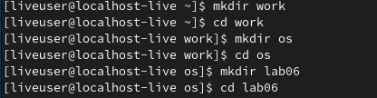

2. Перешел во вновь созданный каталог.

3. Вызвал vi и создал файл hello.sh набрав
    ```bash
    vi hello.sh
    ```

4. Нажал клавишу i и ввел следующий текст.
    ```sh
    #!/bin/bash
    HELL=Hello
    function hello {
    LOCAL HELLO=World
    echo $HELLO
    }
    echo $HELLO
    hello
    ```

    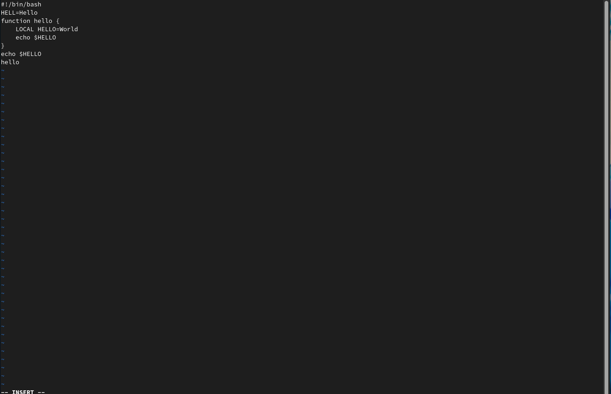

5. Нажал клавишу Esc для перехода в командный режим после завершения ввода
текста.
    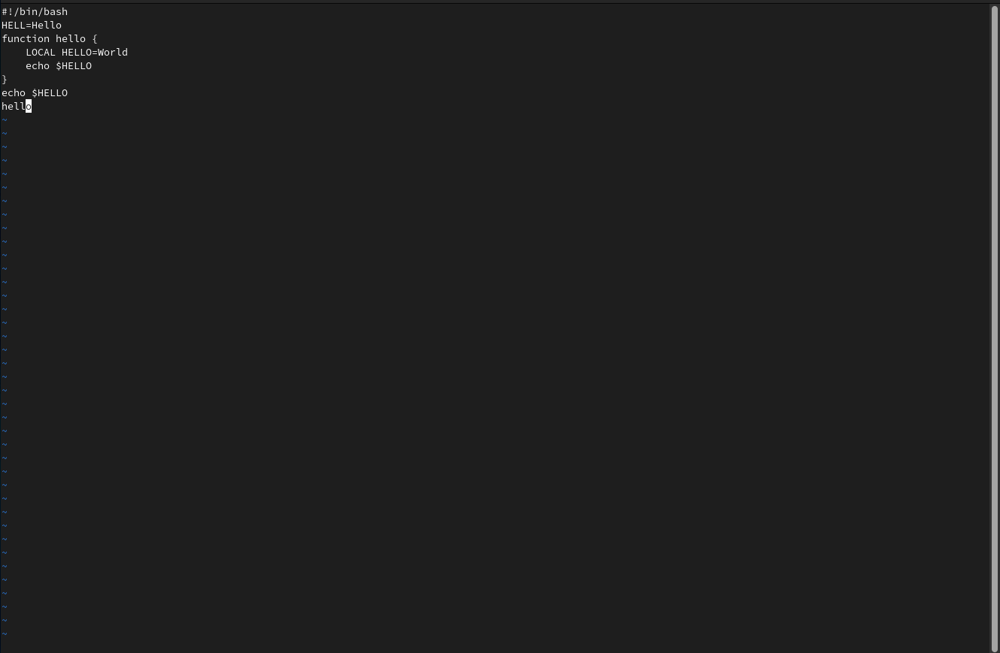

6. Нажал ```:``` для перехода в режим последней строки и внизу моего экрана появилось
приглашение в виде двоеточия.
    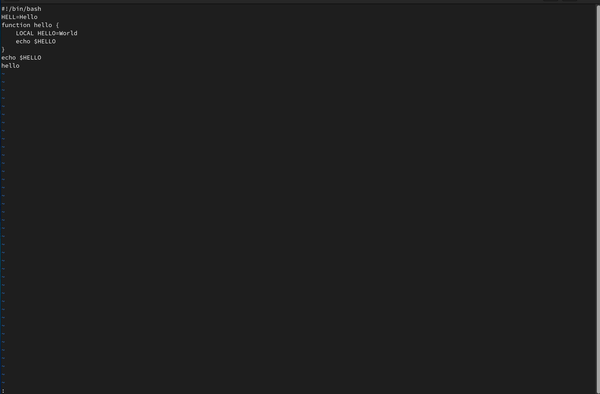

7. Нажал w (записать) и q (выйти), а затем клавишу Enter для сохранения текста и завершения работы.

8. Сделал файл исполняемым

    

## Задание 2
1. Вызвал vi на редактирование файла набрав
    ```bash
    vi ~/work/os/lab06/hello.sh
    ```
    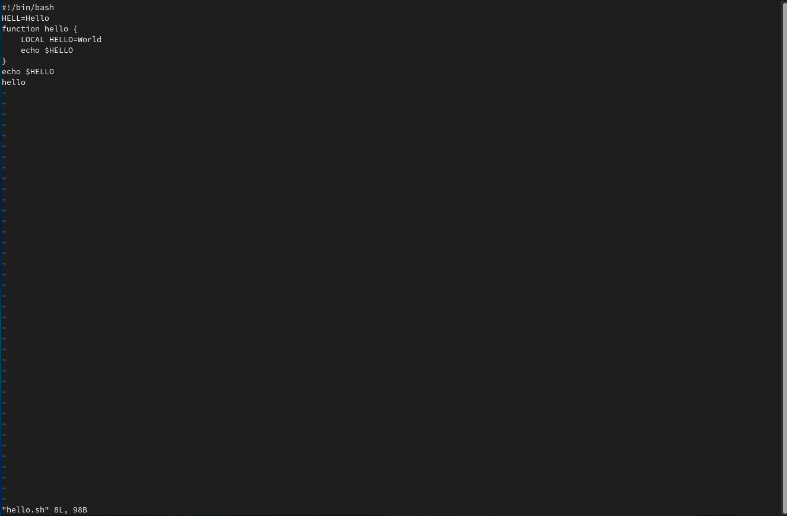

2. Установил курсор в конец слова HELL второй строки.

    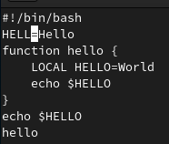

3. Перешел в режим вставки и заменил HELL на HELLO. Потом нажал Esc для возврата в командный режим.
    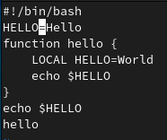

4. Установил курсор на четвертую строку и стер слово LOCAL.

    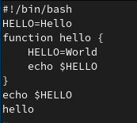

5. Перешел в режим вставки и набрал "local", нажал Esc для возврата в командный режим.

    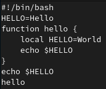

6. Установил курсор на последней строке файла. Вставил после неё строку, содержащую текст: "echo $HELLO."
    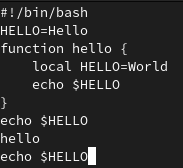

7. Нажал Esc для перехода в командный режим.

8. Удалил последнюю строку. 

    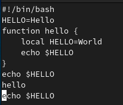
    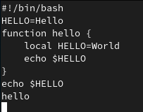

9. Ввел команду отмены изменений ```u``` для отмены последней команды.

    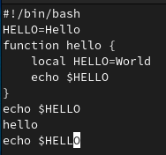

10. Ввел символ ```:``` для перехода в режим последней строки. Записал произведённые
изменения и выйдите из vi.
    
    

## Запуск файла hello.sh
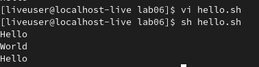

# Вывод
Я получил практические навыки работы с редактором vi, изучил его основные команды и опции. Также познакомился с файлами формата .sh.

# Контрольные вопросы
## 1. Дайте краткую характеристику режимам работы редактора vi.
- командный режим — предназначен для ввода команд редактирования и навигации по
редактируемому файлу;
- режим вставки — предназначен для ввода содержания редактируемого файла;
- режим последней (или командной) строки — используется для записи изменений в файл
и выхода из редактора.

## 2. Как выйти из редактора, не сохраняя произведённые изменения?
Перейти в режим последней строки, набрать ```q```, нажать Enter.

## 3. Назовите и дайте краткую характеристику командам позиционирования.
- 0 (ноль) — переход в начало строки;
- $ — переход в конец строки;
- G — переход в конец файла;
- 𝑛 G — переход на строку с номером 𝑛.

## 4. Что для редактора vi является словом?
Словом является любой набор символов между двумя разделителями. Смотря какие опции указаны при вызове команды, разделителями будут либо только пробел, табуляция и возврат каретки, либо вообще все пробельные символы и знаки пунктуации.

## 5. Каким образом из любого места редактируемого файла перейти в начало (конец) файла?
Использовать следующие команды позиционирования:
- G — переход в конец файла;
- 1G - переход в начало файла;

## 6. Назовите и дайте краткую характеристику основным группам команд редактирования.
- Вставка текста - вставить текст в указанное место указанное число раз
- Вставка строки - вставить строку под или над курсором
- Удаление текста - удалить указанный фрагмент текста и записать его в буфер
- Отмена и повтор предыдущих операций
- Копирование текста в буфер - скопировать слово, строку, несколько строк
- Вставка текста из буфера - вставить текст до или после курсора
- Замена текста - заменить указанный фрагмент текста содержимым буфера
- Поиск текста - поиск нужной подстроки с начала или с конца указанной строки текста

## 7. Необходимо заполнить строку символами $. Каковы ваши действия?
Использовать команду ```cc``` для замены всех символов в строке.

## 8. Как отменить некорректное действие, связанное с процессом редактирования?
Использовать команду ```u```.

## 9. Назовите и дайте характеристику основным группам команд режима последней строки.
- Копирование, удаление и перемещение текста (с указанием интервала строк и целевого файла)
- Запись в файл и выход из редактора (выход без или с сохранием изменений, запись текста в новый файл)

## 10. Как определить, не перемещая курсора, позицию, в которой заканчивается строка?
Произвести поиск символа "\n" с помощью команды ```/```.

## 11. Выполните анализ опций редактора vi (сколько их, как узнать их назначение и т.д.).
Опции редактора vi позволяют настроить рабочую среду. Для задания опций используется команда set (в режиме последней строки):
- : set all — вывести полный список опций;
- : set nu — вывести номера строк;
- : set list — вывести невидимые символы;
- : set ic — не учитывать при поиске, является ли символ прописным или строчным.
Если вы хотите отказаться от использования опции, то в команде set перед именем
опции надо поставить no.

## 12. Как определить режим работы редактора vi?
Взглянуть на последнюю строку редактора.
- : - режим последней строки
- Слово INSERT - режим вставки
- Ничего - командный режим
