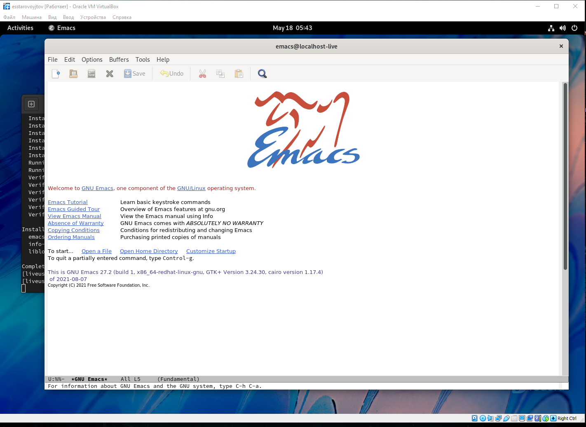
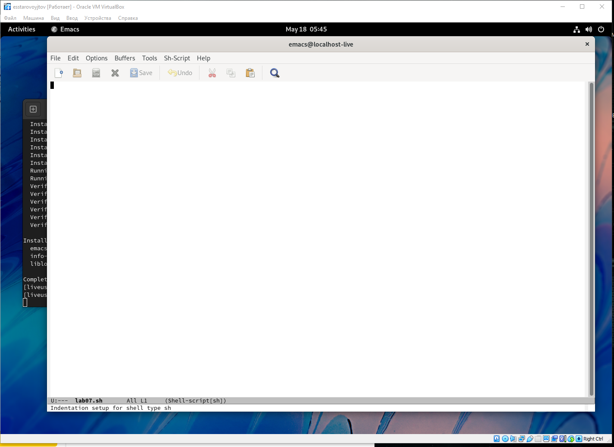
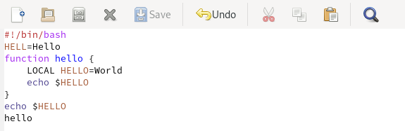
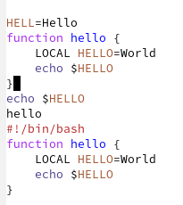
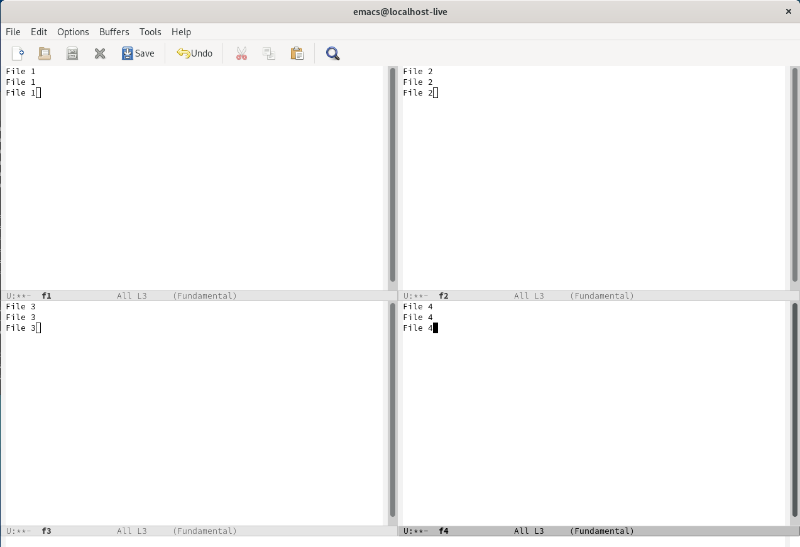

---
## Front matter
lang: ru-RU
title: Лабораторная работа №9. Текстовой редактор emacs.
author: |
	Egor S. Starovoyjtov\inst{1}
	
institute: |
	\inst{1}RUDN University, Moscow, Russian Federation
date: 18 May, 2022 Moscow, Russia

## Formatting
toc: false
slide_level: 2
theme: metropolis
header-includes: 
 - \metroset{progressbar=frametitle,sectionpage=progressbar,numbering=fraction}
 - '\makeatletter'
 - '\beamer@ignorenonframefalse'
 - '\makeatother'
aspectratio: 43
section-titles: true
---

# Лабораторная работа №9. Текстовой редактор emacs

# Цель работы
Получить практические навыки работы с редактором emacs.

# Задание
1. Ознакомиться с теоретическим материалом.
2. Ознакомиться с редактором emacs.
3. Выполнить упражнения.
4. Ответить на контрольные вопросы

# Выполнение лабораторной работы
## Шаг 1
Я запустил редактор emacs набрав в терминале ```emacs```.


## Шаг 2
Я создал файл lab07.sh с помощью комбинаций клавиш C-x и C-f


## Шаг 3
В файле lab07.sh я набрал следующий текст:


## Шаг 4
Сохранил файл с помощью комбинации C-x C-s

## Шаг 5
Проделал с текстом стандартные процедуры редактирования, каждое действие осуществляя комбинацией клавиш.

1. Вырезал одной командой первую строку (С-k).
2. Вставил эту строку в конец файла (C-y).
3. Выделил область текста функции hello (C-space).
4. Скопировал область в буфер обмена (M-w).
5. Вставил область в конец файла.
6. Вновь выделил эту область и на этот раз вырезал её (C-w).
7. Отменил последнее действие (C-/).

Результат всех выполненных команд:



## Шаг 6
Научился использовать команды по перемещению курсора.

1. Переместил курсор в начало строки (C-a).
2. Переместил курсор в конец строки (C-e).
3. Переместил курсор в начало буфера (M-<).
4. Переместил курсор в конец буфера (M->).

## Шаг 7
Научился управлять буферами.

1. Вывел список активных буферов на экран (C-x C-b).
2. Переместил во вновь открытое окно (C-x) со списком открытых буферов
и переключитесь на другой буфер.
3. Закрыл это окно (C-x 0).
4. Вновь переключился между буферами, но уже без вывода их списка на
экран (C-x b).


## Шаг 8
Освоил управление окнами.

1. Поделил фрейм на 4 части: разделил фрейм на два окна по вертикали (C-x 3),
а затем каждое из этих окон на две части по горизонтали (C-x 2).

2. В каждом из четырёх созданных окон открыл новый буфер (файл) и ввел
несколько строк текста.



## Шаг 9
Научился использовать возможности режимов поиска

# Вывод
Я получил практические навыки работы в редакторе emacs.
