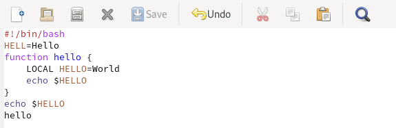

---
## Front matter
title: "Лабораторная работа №9"
subtitle: "Текстовой редактор emacs"
author: "Старовойтов Егор Сергеевич"

## Generic otions
lang: ru-RU
toc-title: "Содержание"

## Bibliography
bibliography: bib/cite.bib
csl: pandoc/csl/gost-r-7-0-5-2008-numeric.csl

## Pdf output format
toc: true # Table of contents
toc-depth: 2
lof: true # List of figures
lot: true # List of tables
fontsize: 12pt
linestretch: 1.5
papersize: a4
documentclass: scrreprt
## I18n polyglossia
polyglossia-lang:
  name: russian
  options:
	- spelling=modern
	- babelshorthands=true
polyglossia-otherlangs:
  name: english
## I18n babel
babel-lang: russian
babel-otherlangs: english
## Fonts
mainfont: PT Serif
romanfont: PT Serif
sansfont: PT Sans
monofont: PT Mono
mainfontoptions: Ligatures=TeX
romanfontoptions: Ligatures=TeX
sansfontoptions: Ligatures=TeX,Scale=MatchLowercase
monofontoptions: Scale=MatchLowercase,Scale=0.9
## Biblatex
biblatex: true
biblio-style: "gost-numeric"
biblatexoptions:
  - parentracker=true
  - backend=biber
  - hyperref=auto
  - language=auto
  - autolang=other*
  - citestyle=gost-numeric
## Pandoc-crossref LaTeX customization
figureTitle: "Рис."
tableTitle: "Таблица"
listingTitle: "Листинг"
lofTitle: "Список иллюстраций"
lotTitle: "Список таблиц"
lolTitle: "Листинги"
## Misc options
indent: true
header-includes:
  - \usepackage{indentfirst}
  - \usepackage{float} # keep figures where there are in the text
  - \floatplacement{figure}{H} # keep figures where there are in the text
---

# Цель работы
Получить практические навыки работы с редактором emacs.

# Задание
1. Ознакомиться с теоретическим материалом.
2. Ознакомиться с редактором emacs.
3. Выполнить упражнения.
4. Ответить на контрольные вопросы


# Теоретическое введение
Emacs представляет собой мощный экранный редактор текста, написанный на языке
высокого уровня Elisp.

## Основные термины Emacs
- Определение 1. Буфер — объект, представляющий какой-либо текст.
Буфер может содержать что угодно, например, результаты компиляции программы
или встроенные подсказки. Практически всё взаимодействие с пользователем, в том
числе интерактивное, происходит посредством буферов.

- Определение 2. Фрейм соответствует окну в обычном понимании этого слова. Каждый
фрейм содержит область вывода и одно или несколько окон Emacs.

- Определение 3. Окно — прямоугольная область фрейма, отображающая один из буферов.
Каждое окно имеет свою строку состояния, в которой выводится следующая информация: название буфера, его основной режим, изменялся ли текст буфера и как далеко вниз
по буферу расположен курсор. Каждый буфер находится только в одном из возможных
основных режимов. Существующие основные режимы включают режим Fundamental
(наименее специализированный), режим Text, режим Lisp, режим С, режим Texinfo
и другие. Под второстепенными режимами понимается список режимов, которые включены в данный момент в буфере выбранного окна.

- Определение 4. Область вывода — одна или несколько строк внизу фрейма, в которой
Emacs выводит различные сообщения, а также запрашивает подтверждения и дополнительную информацию от пользователя.

- Определение 5. Минибуфер используется для ввода дополнительной информации и всегда отображается в области вывода.

- Определение 6. Точка вставки — место вставки (удаления) данных в буфере.

## Основы работы в Emacs
Для запуска Emacs необходимо в командной строке набрать emacs (или emacs & для
работы в фоновом режиме относительно консоли).
Для работы с Emacs можно использовать как элементы меню, так и различные сочетания клавиш. Например, для выхода из Emacs можно воспользоваться меню File
и выбрать пункт Quit , а можно нажать последовательно Ctrl-x Ctrl-c (в обозначениях
Emacs: C-x C-c).


Многие рутинные операции в Emacs удобнее производить с помощью клавиатуры, а не
графического меню. Наиболее часто в командах Emacs используются сочетания c клавишами Ctrl и Meta (в обозначениях Emacs: C- и M-; клавиша Shift в Emasc обозначается
как S-). Так как на клавиатуре для IBM PC совместимых ПК клавиши Meta нет, то вместо
неё можно использовать Alt или Esc . Для доступа к системе меню используйте клавишу
F10 .
Клавиши Ctrl , Meta и Shift принято называть префиксными. Например, запись M-x
означает, что надо удерживая клавишу Meta (или Alt ), нажать на клавишу x.Для открытия
файла следует использовать команду C-x C-f (надо, удерживая клавишу Ctrl , нажать на
клавишу x , затем отпустить обе клавиши и снова, удерживая клавишу Ctrl , нажать на
клавишу f ).
По назначению префиксные сочетания клавиш различаются следующим образом:
– C-x — префикс ввода основных команд редактора (например, открытия, закрытии,
сохранения файла и т.д.);
– C-c — префикс вызова функций, зависящих от используемого режима.
Определение 7. Режим — пакет расширений, изменяющий поведение буфера Emacs при
редактировании и просмотре текста (например, для редактирования исходного текста
программ на языках С или Perl).
В табл. 9.1 приведены основные комбинации клавиш, используемые для перемещения
курсора в буфере Emacs (также работают и обычные навигационные клавиши, например,
стрелки).

Основные комбинации клавиш для перемещения курсора в буфере Emacs:
- C-p переместиться вверх на одну строку
- C-n переместиться вниз на одну строку
- C-f переместиться вперёд на один символ
- C-b переместиться назад на один символ
- C-a переместиться в начало строки
- C-e переместиться в конец строки
- C-v переместиться вниз на одну страницу
- M-v переместиться вверх на одну страницу
- M-f переместиться вперёд на одно слово
- M-b переместиться назад на одно слово
- M-< переместиться в начало буфера
- M-> переместиться в конец буфера
- C-g закончить текущую операцию

Основные комбинации клавиш для работы с текстом в Emacs:
- C-d Удалить символ перед текущим положением курсора
- M-d Удалить следующее за текущим положением курсора слово
- C-k Удалить текст от текущего положения курсора до конца строки
- M-k Удалить текст от текущего положения курсора до конца предложения
- M-\ Удалить все пробелы и знаки табуляции вокруг текущего положения курсора
- C-q Вставить символ, соответствующий нажатой клавише или сочетанию
- M-q Выровнять текст в текущем параграфе буфера

Основные комбинации клавиш для работы с выделенной областью текста в Emacs:
- C-space Начать выделение текста с текущего положения курсора
- C-w Удалить выделенную область текста в список удалений
- M-w Скопировать выделенную область текста в список удалений
- C-y Вставить текст из списка удалений в текущую позицию курсора
- M-y Последовательно вставить текст из списка удалений
- M-\ Выровнять строки выделенной области текста

Основные комбинации клавиш для поиска и замены в Emacs
- C-s текст поиска Поиск текста в прямом направлении
- C-r текст поиска Поиск текста в обратном направлении
- M-% Поиск текста и его замена с запросом (что на что заменить)

Основные комбинации клавиш для работы с файлами, буферами и окнами в Emacs
- C-x C-f Открыть файл
- C-x C-s Сохранить текст в буфер
- C-x C-b Отобразить список открытых буферов в новом окне
- C-x b Переключиться в другой буфер в текущем окне
- C-x i Вставить содержимое файла в буфер в текущую позицию курсора
- C-x 0 Закрыть текущее окно (при этом буфер не удаляется)
- C-x 1 Закрыть все окна кроме текущего
- C-x 2 Разделить окно по горизонтали
- C-x o Перейти в другое окно

## Регулярные выражения
При работе с командами Emacs можно использовать регулярные выражения (табл. 9.8).
Основные отличия от PCRE (Perl Compatible Regular Expressions — библиотека регулярных
выражений в стиле Perl):
- \s не задаёт пробел;
- \t не задаёт табуляцию;
- операция «или» и скобки группировки экранируются.

# Ход работы
## Шаг 1
Я запустил редактор emacs набрав в терминале ```emacs```.


## Шаг 2
Я создал файл lab07.sh с помощью комбинаций клавиш C-x и C-f


## Шаг 3
В файле lab07.sh я набрал следующий текст:


## Шаг 4
Сохранил файл с помощью комбинации C-x C-s

## Шаг 5
Проделал с текстом стандартные процедуры редактирования, каждое действие осуществляя комбинацией клавиш.

1. Вырезал одной командой первую строку (С-k).
2. Вставил эту строку в конец файла (C-y).
3. Выделил область текста функции hello (C-space).
4. Скопировал область в буфер обмена (M-w).
5. Вставил область в конец файла.
6. Вновь выделил эту область и на этот раз вырезал её (C-w).
7. Отменил последнее действие (C-/).

Результат всех выполненных команд:


## Шаг 6
Научился использовать команды по перемещению курсора.

1. Переместил курсор в начало строки (C-a).
2. Переместил курсор в конец строки (C-e).
3. Переместил курсор в начало буфера (M-<).
4. Переместил курсор в конец буфера (M->).

## Шаг 7
Научился управлять буферами.

1. Вывел список активных буферов на экран (C-x C-b).
2. Переместил во вновь открытое окно (C-x) со списком открытых буферов
и переключитесь на другой буфер.
3. Закрыл это окно (C-x 0).
4. Вновь переключился между буферами, но уже без вывода их списка на
экран (C-x b).


## Шаг 8
Освоил управление окнами.

1. Поделил фрейм на 4 части: разделил фрейм на два окна по вертикали (C-x 3),
а затем каждое из этих окон на две части по горизонтали (C-x 2).

2. В каждом из четырёх созданных окон открыл новый буфер (файл) и ввел
несколько строк текста.


## Шаг 9
Научился использовать возможности режимов поиска

# Вывод
Я получил практические навыки работы в редакторе emacs.

## Контрольные вопросы
## 1. Кратко охарактеризуйте редактор emacs.
Emacs представляет собой оконный экранный редактор текста, написаный на языке высокого уровня Elisp и позволяющий редактировать сразу несколько файлов, поддерживающий множество функциональных комбинаций клавиш, имеющий множество режимов работы в зависимости от редактируемых файлов и поставленных задач.

## 2. Какие особенности данного редактора могут сделать его сложным для освоения новичком?
Слишком большое число полезных комбинаций клавиш, которые надо запомнить.

## 3. Своими словами опишите, что такое буфер и окно в терминологии emacs’а.
Буфер - это виртуальный файл, представляющий собой произвольный текст.
Окно - графическая область редактора, отображающая один из буферов.

## 4. Можно ли открыть больше 10 буферов в одном окне?
Да, можно, если под окном имеется в виду основной фрейм приложения. Если же под окном имеется ввиду термин из предыдущего вопроса, то нет.


## 5. Какие буферы создаются по умолчанию при запуске emacs?
- GNU Emacs
- scratch
- Messages

## 6. Какие клавиши вы нажмёте, чтобы ввести следующую комбинацию C-c | и C-c C-|?
## 7. Как поделить текущее окно на две части?
Нажать комбинацию C-x 3 (по вертикали) или C-x 2 (по горизонтали).

## 8. В каком файле хранятся настройки редактора emacs?
В файле ".emacs".

## 9. Какую функцию выполняет клавиша backspace и можно ли её переназначить?
Клавиша backspace служит для сдвига каретки - стирания набранных ранее символов.
Переназначить backspace можно.

## 10. Какой редактор вам показался удобнее в работе vi или emacs? Поясните почему
Emacs, так как Emacs позволяет разбить фрейм на несколько окон и одновременно редактировать сразу несколько файлов.

