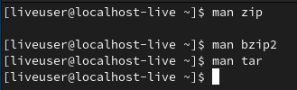
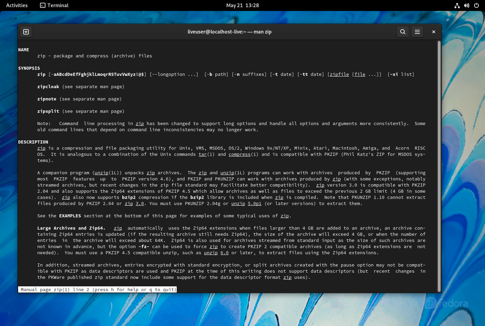
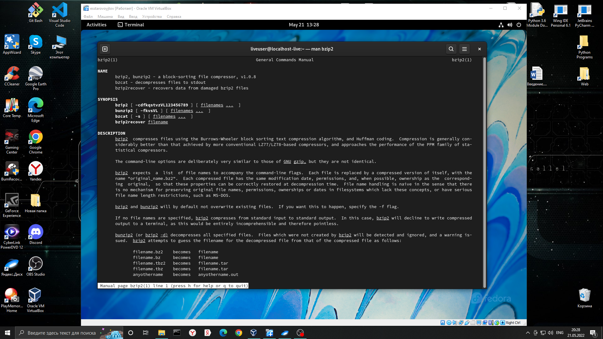
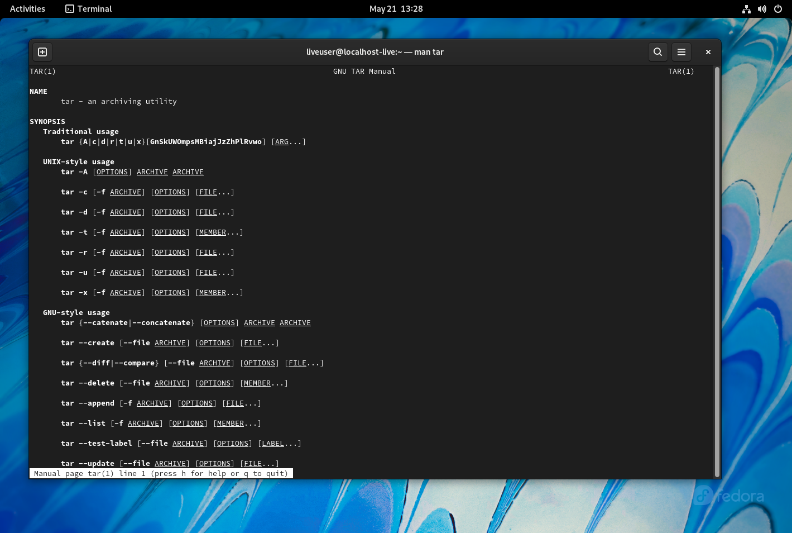
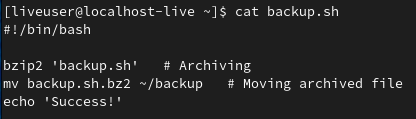
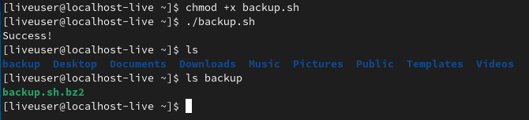
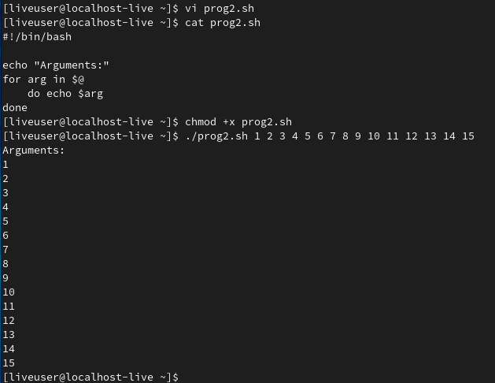
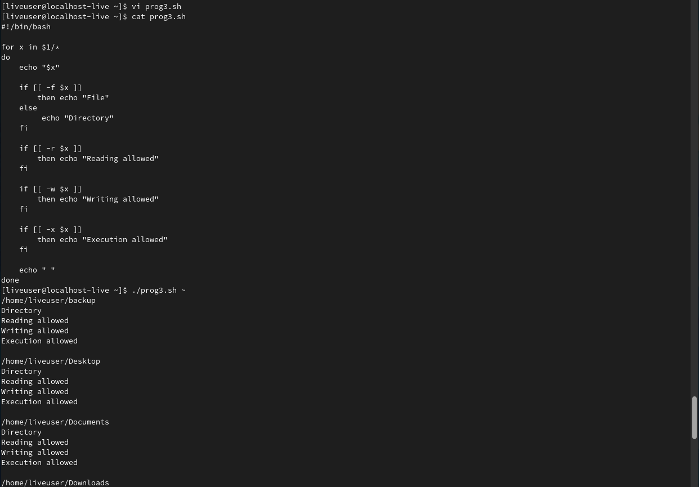
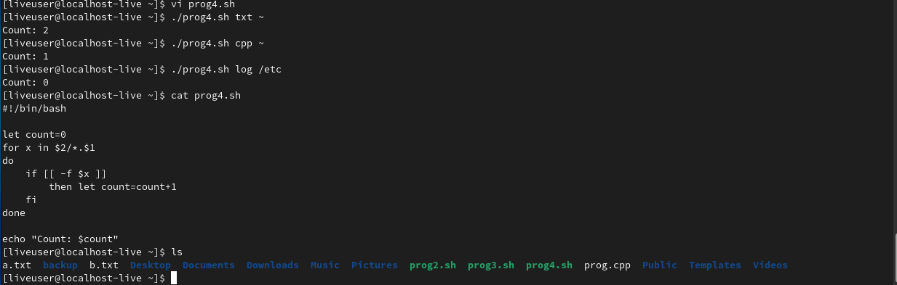

---
## Front matter
lang: ru-RU
title: Лабораторная работа №10. Программирование в командном процессоре ОС UNIX. Командные файлы.
author: |
	Egor S. Starovoyjtov\inst{1}
	
institute: |
	\inst{1}RUDN University, Moscow, Russian Federation
date: 21 May, 2022 Moscow, Russia

## Formatting
toc: false
slide_level: 2
theme: metropolis
header-includes: 
 - \metroset{progressbar=frametitle,sectionpage=progressbar,numbering=fraction}
 - '\makeatletter'
 - '\beamer@ignorenonframefalse'
 - '\makeatother'
aspectratio: 43
section-titles: true
---

# Лабораторная работа №10. Программирование в командном процессоре ОС UNIX. Командные файлы

# Цель работы
Изучить основы программирования в оболочке ОС UNIX/Linux. Научиться писать
небольшие командные файлы.

# Задание
1. Написать скрипт, который при запуске будет делать резервную копию самого себя (то
есть файла, в котором содержится его исходный код) в другую директорию backup
в вашем домашнем каталоге. При этом файл должен архивироваться одним из архиваторов на выбор zip, bzip2 или tar. Способ использования команд архивации
необходимо узнать, изучив справку.
2. Написать пример командного файла, обрабатывающего любое произвольное число
аргументов командной строки, в том числе превышающее десять. Например, скрипт
может последовательно распечатывать значения всех переданных аргументов.
3. Написать командный файл — аналог команды ls (без использования самой этой команды и команды dir). Требуется, чтобы он выдавал информацию о нужном каталоге
и выводил информацию о возможностях доступа к файлам этого каталога.
4. Написать командный файл, который получает в качестве аргумента командной строки
формат файла (.txt, .doc, .jpg, .pdf и т.д.) и вычисляет количество таких файлов
в указанной директории. Путь к директории также передаётся в виде аргумента командной строки.

# Выполнение лабораторной работы
## Задание 1
Я получил информацию про команды архивации zip, bzip2, tar.

Далее используя текстовый редактор vi я написал скрипт выполняющий первое задание:

## Задание 2
Я написал скрипт, выполняющий второе задание. Использовал текстовый редактор vi.
Исходный код показан на скриншоте после вызова команды cat, там же продемонстрирована его работа.

## Задание 3
Я написал скрипт, выполняющий третье задание. Использовал текстовый редактор vi.
Исходный код показан на скриншоте после вызова команды cat, там же продемонстрирована его работа.

## Задание 4
Я написал скрипт, выполняющий четвертое задание. Использовал текстовый редактор vi.
Исходный код показан на скриншоте после вызова команды cat, там же продемонстрирована его работа.

# Вывод
Я изучил основы программирования в оболочке ОС UNIX/Linux, научился писать небольшие командные файлы.
