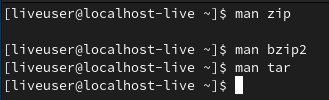
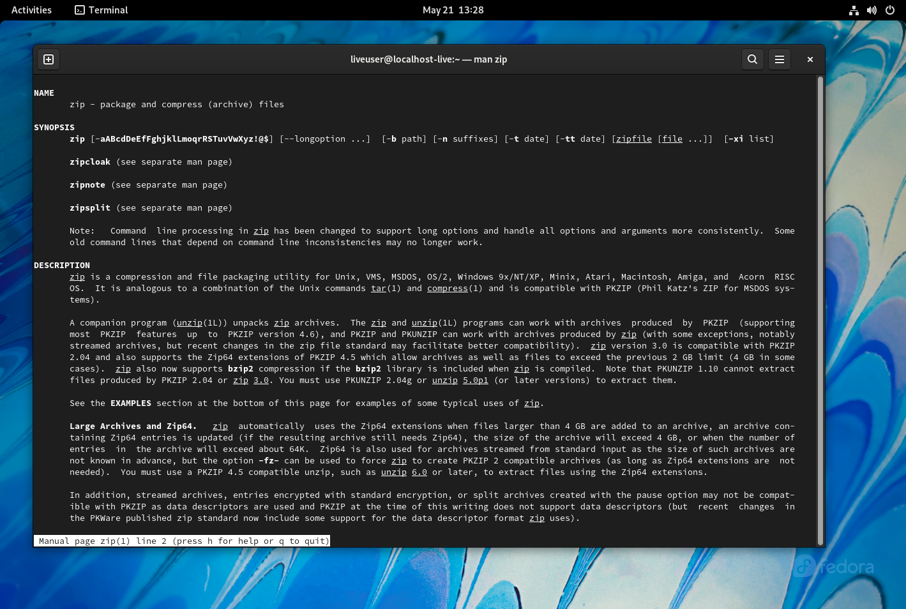
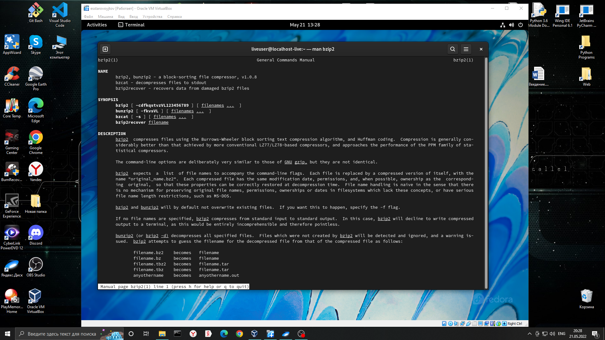
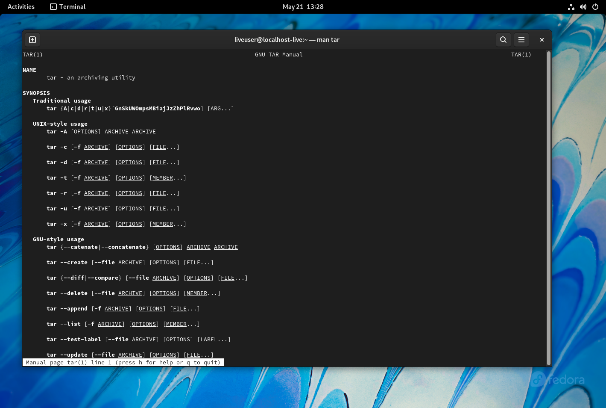
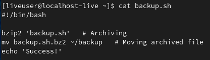
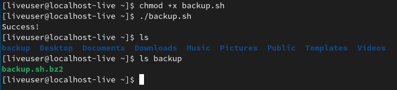
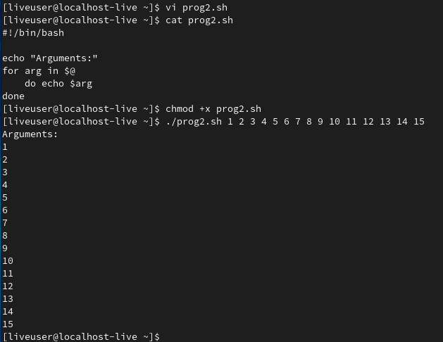
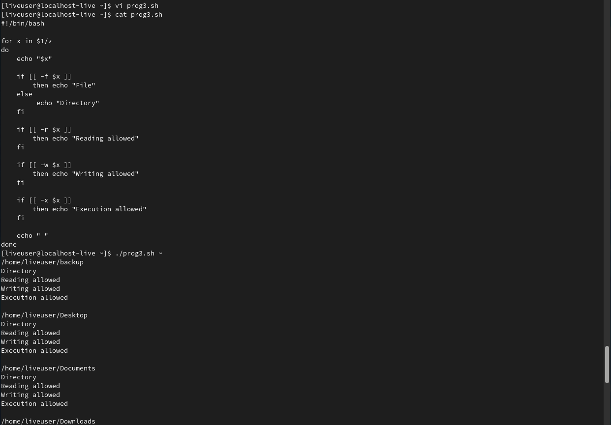

---
## Front matter
title: "Лабораторная работа №10"
subtitle: "Программирование в командном процессоре ОС UNIX. Командные файлы"
author: "Старовойтов Егор Сергеевич"

## Generic otions
lang: ru-RU
toc-title: "Содержание"

## Bibliography
bibliography: bib/cite.bib
csl: pandoc/csl/gost-r-7-0-5-2008-numeric.csl

## Pdf output format
toc: true # Table of contents
toc-depth: 2
lof: true # List of figures
lot: true # List of tables
fontsize: 12pt
linestretch: 1.5
papersize: a4
documentclass: scrreprt
## I18n polyglossia
polyglossia-lang:
  name: russian
  options:
	- spelling=modern
	- babelshorthands=true
polyglossia-otherlangs:
  name: english
## I18n babel
babel-lang: russian
babel-otherlangs: english
## Fonts
mainfont: PT Serif
romanfont: PT Serif
sansfont: PT Sans
monofont: PT Mono
mainfontoptions: Ligatures=TeX
romanfontoptions: Ligatures=TeX
sansfontoptions: Ligatures=TeX,Scale=MatchLowercase
monofontoptions: Scale=MatchLowercase,Scale=0.9
## Biblatex
biblatex: true
biblio-style: "gost-numeric"
biblatexoptions:
  - parentracker=true
  - backend=biber
  - hyperref=auto
  - language=auto
  - autolang=other*
  - citestyle=gost-numeric
## Pandoc-crossref LaTeX customization
figureTitle: "Рис."
tableTitle: "Таблица"
listingTitle: "Листинг"
lofTitle: "Список иллюстраций"
lotTitle: "Список таблиц"
lolTitle: "Листинги"
## Misc options
indent: true
header-includes:
  - \usepackage{indentfirst}
  - \usepackage{float} # keep figures where there are in the text
  - \floatplacement{figure}{H} # keep figures where there are in the text
---

# Цель работы
Изучить основы программирования в оболочке ОС UNIX/Linux. Научиться писать
небольшие командные файлы.

# Задание
1. Написать скрипт, который при запуске будет делать резервную копию самого себя (то
есть файла, в котором содержится его исходный код) в другую директорию backup
в вашем домашнем каталоге. При этом файл должен архивироваться одним из архиваторов на выбор zip, bzip2 или tar. Способ использования команд архивации
необходимо узнать, изучив справку.
2. Написать пример командного файла, обрабатывающего любое произвольное число
аргументов командной строки, в том числе превышающее десять. Например, скрипт
может последовательно распечатывать значения всех переданных аргументов.
3. Написать командный файл — аналог команды ls (без использования самой этой команды и команды dir). Требуется, чтобы он выдавал информацию о нужном каталоге
и выводил информацию о возможностях доступа к файлам этого каталога.
4. Написать командный файл, который получает в качестве аргумента командной строки
формат файла (.txt, .doc, .jpg, .pdf и т.д.) и вычисляет количество таких файлов
в указанной директории. Путь к директории также передаётся в виде аргумента командной строки.


# Теоретическое введение
Командный процессор (командная оболочка, интерпретатор команд shell) — это программа, позволяющая пользователю взаимодействовать с операционной системой
компьютера. В операционных системах типа UNIX/Linux наиболее часто используются
следующие реализации командных оболочек:

- оболочка Борна (Bourne shell или sh) — стандартная командная оболочка UNIX/Linux,
содержащая базовый, но при этом полный набор функций;
- С-оболочка (или csh) — надстройка на оболочкой Борна, использующая С-подобный
синтаксис команд с возможностью сохранения истории выполнения команд;
- оболочка Корна (или ksh) — напоминает оболочку С, но операторы управления программой совместимы с операторами оболочки Борна;
- BASH — сокращение от Bourne Again Shell (опять оболочка Борна), в основе своей совмещает свойства оболочек С и Корна (разработка компании Free Software Foundation).
POSIX (Portable Operating System Interface for Computer Environments) — набор стандартов
описания интерфейсов взаимодействия операционной системы и прикладных программ.
Стандарты POSIX разработаны комитетом IEEE (Institute of Electrical and Electronics
Engineers) для обеспечения совместимости различных UNIX/Linux-подобных операционных систем и переносимости прикладных программ на уровне исходного кода.
POSIX-совместимые оболочки разработаны на базе оболочки Корна.
Рассмотрим основные элементы программирования в оболочке bash. В других оболочках большинство команд будет совпадать с описанными ниже.


# Ход работы
## Задание 1
Я получил информацию про команды архивации zip, bzip2, tar.









Далее используя текстовый редактор vi я написал скрипт выполняющий первое задание:





## Задание 2
Я написал скрипт, выполняющий второе задание. Использовал текстовый редактор vi.
Исходный код показан на скриншоте после вызова команды cat, там же продемонстрирована его работа.


## Задание 3
Я написал скрипт, выполняющий третье задание. Использовал текстовый редактор vi.
Исходный код показан на скриншоте после вызова команды cat, там же продемонстрирована его работа.


## Задание 4
Я написал скрипт, выполняющий четвертое задание. Использовал текстовый редактор vi.
Исходный код показан на скриншоте после вызова команды cat, там же продемонстрирована его работа.


# Вывод
Я изучил основы программирования в оболочке ОС UNIX/Linux, научился писать небольшие командные файлы.

# Контрольные вопросы
## 1. Объясните понятие командной оболочки. Приведите примеры командных оболочек. Чем они отличаются?
Командная оболочка - это программа, позволяющая пользователю взаимодействовать с операционной системой компьютера. 

В операционных системах типа UNIX/Linux наиболее часто используются
следующие реализации командных оболочек:
- оболочка Борна (Bourne shell или sh) — стандартная командная оболочка UNIX/Linux,
содержащая базовый, но при этом полный набор функций;
- С-оболочка (или csh) — надстройка на оболочкой Борна, использующая С-подобный
синтаксис команд с возможностью сохранения истории выполнения команд;
- оболочка Корна (или ksh) — напоминает оболочку С, но операторы управления программой совместимы с операторами оболочки Борна;
- BASH — сокращение от Bourne Again Shell (опять оболочка Борна), в основе своей совмещает свойства оболочек С и Корна (разработка компании Free Software Foundation).

## 2. Что такое POSIX?
POSIX (Portable Operating System Interface for Computer Environments) — набор стандартов
описания интерфейсов взаимодействия операционной системы и прикладных программ.

## 3. Как определяются переменные и массивы в языке программирования bash?
Пользователь имеет возможность присвоить переменной значение некоторой строки символов.
Например, команда
```bash
mark=/usr/andy/bin
```
присваивает значение строки символов /usr/andy/bin переменной mark типа строка
символов.

Оболочка bash позволяет работать с массивами. Для создания массива используется
команда set с флагом -A. За флагом следует имя переменной, а затем список значений,
разделённых пробелами. 
Например,
```bash
set -A states Delaware Michigan "New Jersey"
```
Далее можно сделать добавление в массив, например,states[49]=Alaska. Индексация
массивов начинается с нулевого элемента.

## 4. Каково назначение операторов let и read?
Оператор **let** является показателем того, что последующие аргументы представляют собой выражение, подлежащее вычислению.

Оператор **read** позволяет читать значения переменных со стандартного ввода.

## 5. Какие арифметические операции можно применять в языке программирования bash?
- "!" !ехр Если ехр равно 0, то возвращает 1; иначе 0
- "!=" ехр1 !=ехр2 Если ехр1 не равно ехр2, то возвращает 1; иначе 0
- "%" ехр1%ехр2 Возвращает остаток от деления ехр1 на ехр2
- "%=" var=%exp Присваивает остаток от деления var на ехр переменной var
- "&" ехр1&ехр2 Возвращает побитовое AND выражений ехр1 и ехр2
- "&&" ехр1&&ехр2 Если и ехр1 и ехр2 не равны нулю, то возвращает 1; иначе 0
- "&=" var &= ехр Присваивает переменной var побитовое AND var и ехр
- "*" ехр1 * ехр2 Умножает ехр1 на ехр2
- "*=" var *= ехр Умножает ехр на значение переменной var и присваивает
результат переменной var
- "+" ехр1 + ехр2 Складывает ехр1 и ехр2
- "+=" var += ехр Складывает ехр со значением переменной var и результат
присваивает переменной var
- "-" -exp Операция отрицания exp (унарный минус)
- "-" expl - exp2 Вычитает exp2 из exp1
- "-=" var -= exp Вычитает exp из значения переменной var и присваивает
результат переменной var
- "/" exp / exp2 Делит exp1 на exp2
- "/=" var /= exp Делит значение переменной var на exp и присваивает результат переменной var
- "<" expl < exp2 Если exp1 меньше, чем exp2, то возвращает 1, иначе возвращает 0
- "<<" exp1 << exp2 Сдвигает exp1 влево на exp2 бит
- "<<=" var <<= exp Побитовый сдвиг влево значения переменной var на exp
- "<=" expl <= exp2 Если exp1 меньше или равно exp2, то возвращает 1; иначе
возвращает 0
- "=" var = exp Присваивает значение exp переменной var
- "==" exp1==exp2 Если exp1 равно exp2, то возвращает 1; иначе возвращает 0
- ">" exp1 > exp2 1, если exp1 больше, чем exp2; иначе 0
- ">=" exp1 >= exp2 1, если exp1 больше или равно exp2; иначе 0
- ">>" exp >> exp2 Сдвигает exp1 вправо на exp2 бит
- ">>"= var >>=exp Побитовый сдвиг вправо значения переменной var на exp
- "^" exp1 ^ exp2 Исключающее OR выражений exp1 и exp2
- "^=" var ^= exp Присваивает переменной var побитовое XOR var и exp
- "|" exp1 | exp2 Побитовое OR выражений exp1 и exp2
- "|=" var |= exp Присваивает переменной var результат операции XOR var
и exp
- "||" exp1 || exp2 1, если или exp1 или exp2 являются ненулевыми значениями;
иначе 0
- "~" ~exp Побитовое дополнение до exp

## 6. Что означает операция (( ))?
(( )) используются для записи логических условий, а также внутри можно вычислять арифметические выражения и возвращать результат.

## 7. Какие стандартные имена переменных Вам известны?
PATH, HOME, PS1, PS2, IFS, MAIL, TERM, LOGNAME.

## 8. Что такое метасимволы?
Метасимволы - символы, имеющие особое значение (смысл) для командного процессора.

## 9. Как экранировать метасимволы?
Для экранирования группы метасимволов нужно заключить её в одинарные кавычки. Строка, заключённая в двойные кавычки, экранирует все метасимволы, кроме
\$, ' , \, ".

## 10. Как создавать и запускать командные файлы?
Последовательность команд может быть помещена в текстовый файл. Такой файл
называется командным. Далее этот файл можно выполнить по команде:
```bash
bash командный_файл [аргументы]
```

Чтобы не вводить каждый раз последовательности символов bash, необходимо изменить код защиты этого командного файла, обеспечив доступ к этому файлу по
выполнению. Это может быть сделано с помощью команды
```bash
chmod +x имя_файла
```
Теперь можно вызывать свой командный файл на выполнение, просто вводя его имя
с терминала так, как-будто он является выполняемой программой. Командный процессор
распознает, что в Вашем файле на самом деле хранится не выполняемая программа,
а программа, написанная на языке программирования оболочки, и осуществит её интерпретацию.

## 11. Как определяются функции в языке программирования bash?
Группу команд можно объединить в функцию. Для этого существует ключевое слово
function, после которого следует имя функции и список команд, заключённых в фигурные скобки. Удалить функцию можно с помощью команды unset c флагом -f.

## 12. Каким образом можно выяснить, является файл каталогом или обычным файлом?
Использовать команды ```test -f [путь]``` или ```test -d [путь]``` которые проверяют соответственно является ли объект с указанным путем файлом (-f) или каталогом (-d).

13. Каково назначение команд set, typeset и unset?
- **set** используется для вывода списка переменных окружения.
- **typeset** позволяет наложить ограничения на переменные.
- **unset** позволяет удалить переменную из окружения командной оболочки.

## 14. Как передаются параметры в командные файлы?
При вызове командного файла на выполнение параметры ему могут быть переданы
точно таким же образом, как и выполняемой программе. С точки зрения командного
файла эти параметры являются позиционными. Символ $ является метасимволом командного процессора. Он используется, в частности, для ссылки на параметры, точнее,
для получения их значений в командном файле. В командный файл можно передать
до девяти параметров. При использовании где-либо в командном файле комбинации
символов $i, где 0 < 𝑖 < 10, вместо неё будет осуществлена подстановка значения
параметра с порядковым номером i, т.е. аргумента командного файла с порядковым
номером i. Использование комбинации символов $0 приводит к подстановке вместо неё
имени данного командного файла.

## 15. Назовите специальные переменные языка bash и их назначение
- \$* — отображается вся командная строка или параметры оболочки;
- \$? — код завершения последней выполненной команды;
- \$$ — уникальный идентификатор процесса, в рамках которого выполняется командный процессор;
- \$! — номер процесса, в рамках которого выполняется последняя вызванная на выполнение в командном режиме команда;
- \$- — значение флагов командного процессора;
- \${#*} — возвращает целое число — количество слов, которые были результатом $*;
- \${#name} — возвращает целое значение длины строки в переменной name;
- \${name[n]} — обращение к n-му элементу массива;
- \${name[*]} — перечисляет все элементы массива, разделённые пробелом;
- \${name[@]} — то же самое, но позволяет учитывать символы пробелы в самих переменных;
- \${name:-value} — если значение переменной name не определено, то оно будет заменено на указанное value;
- \${name:value} — проверяется факт существования переменной;
- \${name=value} — если name не определено, то ему присваивается значение value;
- \${name?value} — останавливает выполнение, если имя переменной не определено,
и выводит value как сообщение об ошибке;
- \${name+value} — это выражение работает противоположно ${name-value}. Если переменная определена, то подставляется value;
- \${name#pattern} — представляет значение переменной name с удалённым самым
коротким левым образцом (pattern);
- \${#name[*]} и \${#name[@]} — эти выражения возвращают количество элементов
в массиве name.