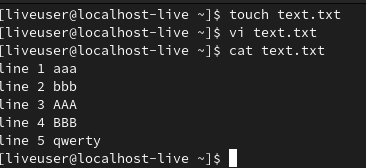
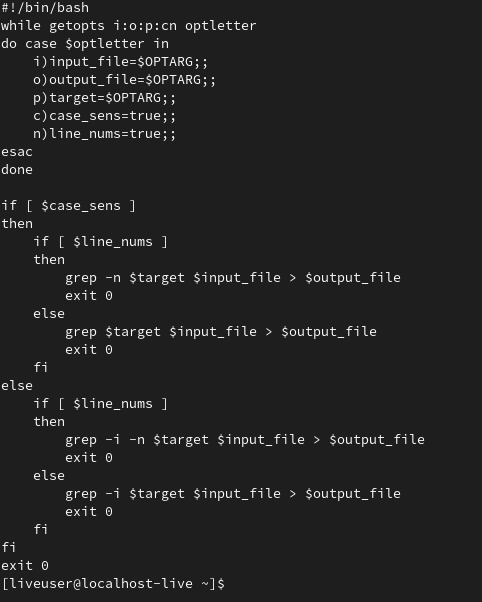
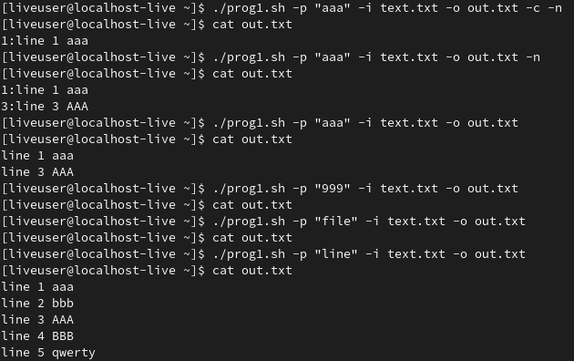
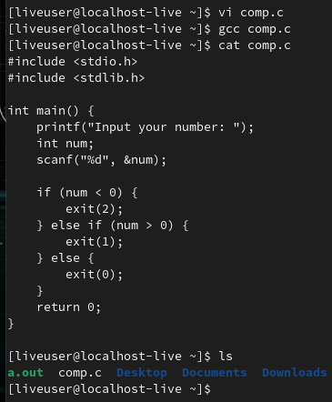
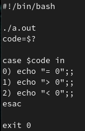
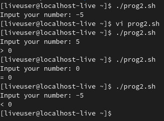
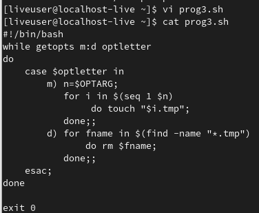
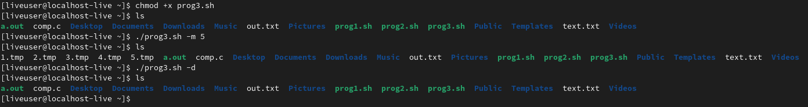
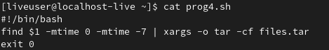
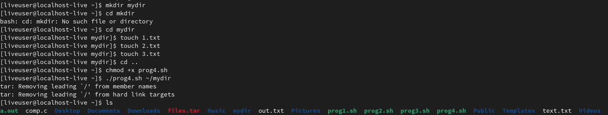

---
## Front matter
lang: ru-RU
title: Лабораторная работа №10. Программирование в командном процессоре ОС UNIX. Ветвления и циклы.
author: |
	Egor S. Starovoyjtov\inst{1}
	
institute: |
	\inst{1}RUDN University, Moscow, Russian Federation
date: 21 May, 2022 Moscow, Russia

## Formatting
toc: false
slide_level: 2
theme: metropolis
header-includes: 
 - \metroset{progressbar=frametitle,sectionpage=progressbar,numbering=fraction}
 - '\makeatletter'
 - '\beamer@ignorenonframefalse'
 - '\makeatother'
aspectratio: 43
section-titles: true
---

# Лабораторная работа №10. Программирование в командном процессоре ОС UNIX. Ветвления и циклы.

# Цель работы
Изучить основы программирования в оболочке ОС UNIX. Научится писать более
сложные командные файлы с использованием логических управляющих конструкций
и циклов.

# Задание
1. Используя команды getopts grep, написать командный файл, который анализирует
командную строку с ключами:
- -iinputfile — прочитать данные из указанного файла;
- -ooutputfile — вывести данные в указанный файл;
- -pшаблон — указать шаблон для поиска;
- -C — различать большие и малые буквы;
- -n — выдавать номера строк.
а затем ищет в указанном файле нужные строки, определяемые ключом -p.

2. Написать на языке Си программу, которая вводит число и определяет, является ли оно
больше нуля, меньше нуля или равно нулю. Затем программа завершается с помощью
функции exit(n), передавая информацию в о коде завершения в оболочку. Командный файл должен вызывать эту программу и, проанализировав с помощью команды $?, выдать сообщение о том, какое число было введено.

3. Написать командный файл, создающий указанное число файлов, пронумерованных
последовательно от 1 до 𝑁 (например 1.tmp, 2.tmp, 3.tmp,4.tmp и т.д.). Число файлов,
которые необходимо создать, передаётся в аргументы командной строки. Этот же командный файл должен уметь удалять все созданные им файлы (если они существуют).

4. Написать командный файл, который с помощью команды tar запаковывает в архив
все файлы в указанной директории. Модифицировать его так, чтобы запаковывались
только те файлы, которые были изменены менее недели тому назад (использовать
команду find).

# Ход работы
## Задание 1
Я написал скрипт, выполняющий первое задание. Использовал текстовый редактор vi.
Написанный скрипт содержится в командном файле "prog1.sh". Для тестирования программы был создан файл text.txt со следующим содержимым:

Код командного файла:

Работа программы:

## Задание 2
Я написал скрипт, выполняющий второе задание, а также требуемую программу на языке Си. Использовал текстовый редактор vi. Компилировал программу на языке Си с помощью gcc, имя испольняемого файла - a.out. 

Коды:
- 0 - число равно 0
- 1 - число больше 0
- 2 - число меньше 0

Листинг командного файла:

Работа командного файла

## Задание 3
Я написал скрипт, выполняющий третье задание. Использовал текстовый редактор vi.
Программа анализирует строку аргументов с двумя ключами и параметром n.

Ключи:
- m - создать n .tmp файлов
- d - удалить все .tmp файлы

Код программы:

Работа программы:

## Задание 4
Я написал скрипт, выполняющий четвертое задание. Использовал текстовый редактор vi.

Код программы:

Работа программы:

# Вывод
Я изучил основы программирования в оболочке ОС UNIX. Научился писать более
сложные командные файлы с использованием логических управляющих конструкций
и циклов.