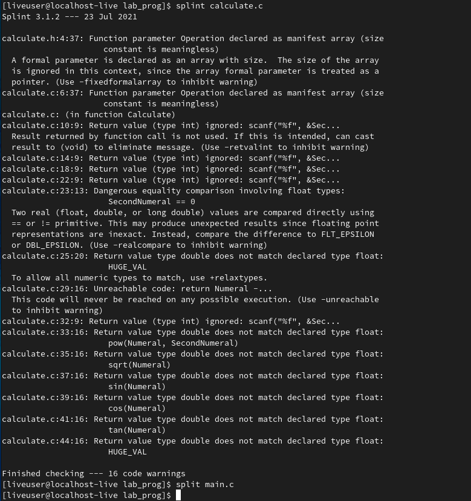

---
## Front matter
lang: ru-RU
title: Лабораторная работа №13. Средства, применяемые при разработке программного обеспечения в ОС типа UNIX/Linux
author: |
	Egor S. Starovoyjtov\inst{1}
	
institute: |
	\inst{1}RUDN University, Moscow, Russian Federation
date: 26 May, 2022 Moscow, Russia

## Formatting
toc: false
slide_level: 2
theme: metropolis
header-includes: 
 - \metroset{progressbar=frametitle,sectionpage=progressbar,numbering=fraction}
 - '\makeatletter'
 - '\beamer@ignorenonframefalse'
 - '\makeatother'
aspectratio: 43
section-titles: true
---

# Лабораторная работа №13. Средства, применяемые при разработке программного обеспечения в ОС типа UNIX/Linux

# Цель работы
Приобрести простейшие навыки разработки, анализа, тестирования и отладки приложений в ОС типа UNIX/Linux на примере создания на языке программирования
С калькулятора с простейшими функциями.

# Задание
1. В домашнем каталоге создайте подкаталог ~/work/os/lab_prog.
2. Создайте в нём файлы: calculate.h, calculate.c, main.c.
Это будет примитивнейший калькулятор, способный складывать, вычитать, умножать
и делить, возводить число в степень, брать квадратный корень, вычислять sin, cos, tan.
При запуске он будет запрашивать первое число, операцию, второе число. После этого
программа выведет результат и остановится.
3. Выполните компиляцию программы посредством gcc:
```bash
gcc -c calculate.c
gcc -c main.c
gcc calculate.o main.o -o calcul -lm
```
4. При необходимости исправьте синтаксические ошибки.
5. Создайте Makefile со следующим содержанием:
```makefile
CC = gcc
CFLAGS =
LIBS = -lm

calcul: calculate.o main.o
gcc calculate.o main.o -o calcul $(LIBS)

calculate.o: calculate.c calculate.h
gcc -c calculate.c $(CFLAGS)

main.o: main.c calculate.h
gcc -c main.c $(CFLAGS)

clean:
-rm calcul *.o *~
```
Поясните в отчёте его содержание.
6. С помощью gdb выполните отладку программы calcul (перед использованием gdb
исправьте Makefile)
7. С помощью утилиты splint попробуйте проанализировать коды файлов calculate.c
и main.c.


# Ход работы
## Шаг 1
В домашнем каталоге создан подкаталог ~/work/os/lab_prog


## Шаг 2
В каталоге  ~/work/os/lab_prog созданы файлы calculate.h, calculate.c, main.c.


## Шаг 3
Я выполнил компиляцию программы.


## Шаг 4 
Исправил синтаксические ошибки (опечатки)

## Шаг 5
Создал Makefile


## Шаг 6 
С помощью gdb выполнил отладку.


## Шаг 7
С помощью утилиты splint проанализировал исходный код файлов calculate.c и main.c, увидел 16 предупреждений связанных с преобразованием типов в calculate.c.



# Вывод
Я приобрел простейшие навыки разработки, анализа, тестирования и отладки приложений в ОС типа UNIX/Linux на примере создания наязыке программирования C калькулятора с простейшими функциями.