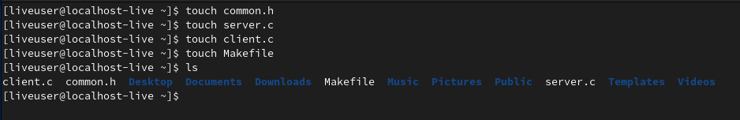
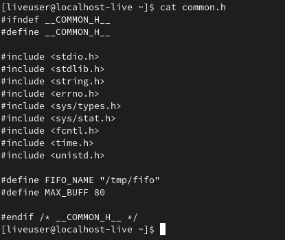
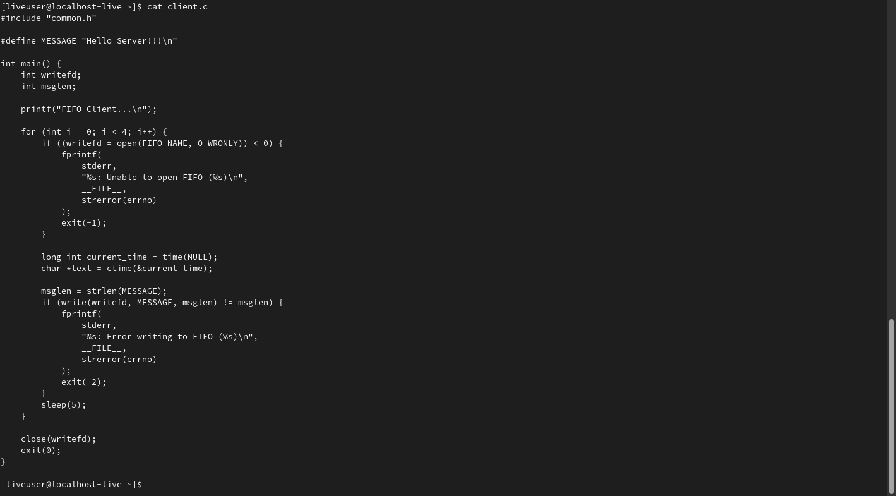
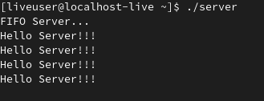
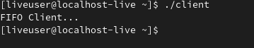
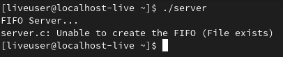

---
## Front matter
lang: ru-RU
title: Лабораторная работа №14. Именованные каналы
author: |
	Egor S. Starovoyjtov\inst{1}
	
institute: |
	\inst{1}RUDN University, Moscow, Russian Federation
date: 26 May, 2022 Moscow, Russia

## Formatting
toc: false
slide_level: 2
theme: metropolis
header-includes: 
 - \metroset{progressbar=frametitle,sectionpage=progressbar,numbering=fraction}
 - '\makeatletter'
 - '\beamer@ignorenonframefalse'
 - '\makeatother'
aspectratio: 43
section-titles: true
---

# Лабораторная работа №14. Именованные каналы
# Цель работы
Приобретение практических навыков работы с именованными каналами.

# Задание
Изучите приведённые в тексте программы server.c и client.c. Взяв данные примеры
за образец, напишите аналогичные программы, внеся следующие изменения:
1. Работает не 1 клиент, а несколько (например, два).
2. Клиенты передают текущее время с некоторой периодичностью (например, раз в пять
секунд). Используйте функцию sleep() для приостановки работы клиента.
3. Сервер работает не бесконечно, а прекращает работу через некоторое время (например, 30 сек). Используйте функцию clock() для определения времени работы сервера.
Что будет в случае, если сервер завершит работу, не закрыв канал?

# Теоретическое введение
Одним из видов взаимодействия между процессами в операционных системах является обмен сообщениями. Под сообщением понимается последовательность байтов,
передаваемая от одного процесса другому.
В операционных системах типа UNIX есть 3 вида межпроцессорных взаимодействий:
общеюниксные (именованные каналы, сигналы), System V Interface Definition (SVID —
разделяемая память, очередь сообщений, семафоры) и BSD (сокеты).
Для передачи данных между неродственными процессами можно использовать механизм именованных каналов (named pipes). Данные передаются по принципу FIFO (First
In First Out) (первым записан — первым прочитан), поэтому они называются также FIFO
pipes или просто FIFO. Именованные каналы отличаются от неименованных наличием
идентификатора канала, который представлен как специальный файл (соответственно
имя именованного канала — это имя файла). Поскольку файл находится на локальной
файловой системе, данное IPC используется внутри одной системы.

# Ход работы
## Шаг 1
Я создал необходимые файлы с помощью touch.

## Шаг 2
Изменил исходный код файлов:
- В common.h добавил заголовочные файлы time.h и unistd.h.
- В client.c добавил цикл, регулирующий кол-во сообщений и команду sleep(5), для приостановки выполнения программы на 5 секунд.
- В server.c добавил цикл while для контроля времени работы сервера.

## Шаг 3
Запустил программы сервера и клиента.

Если сервер завершит работу, не закрыв канал, то при повторном запуске программы сервера возникнет ошибка при создании файла канала, так как он все ещще будет существовать с прошлого раза.

# Вывод
Я приобрел практические навыки работы с именованными каналами.