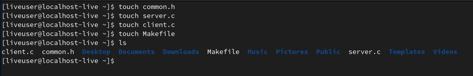
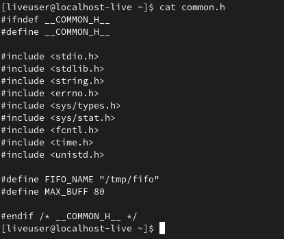
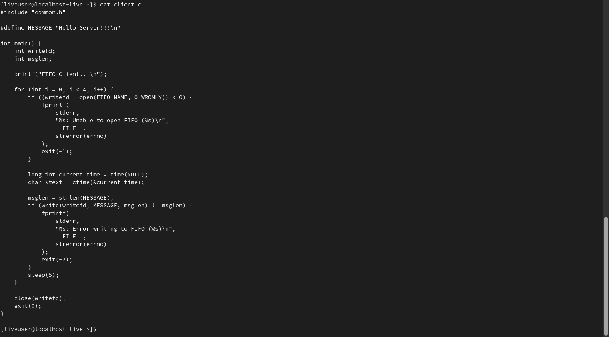
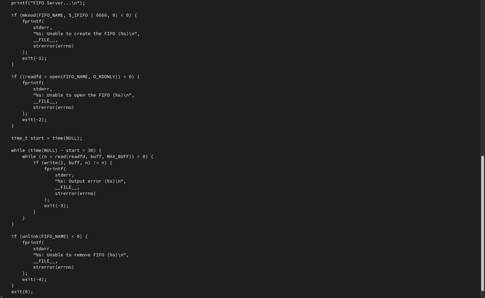
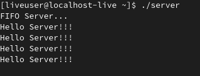
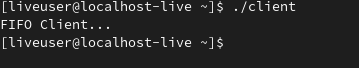
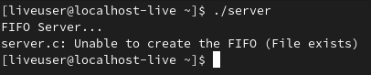

---
## Front matter
title: "Лабораторная работа №14"
subtitle: "Лабораторная работа № 14. Именованные каналы."
author: "Старовойтов Егор Сергеевич"

## Generic otions
lang: ru-RU
toc-title: "Содержание"

## Bibliography
bibliography: bib/cite.bib
csl: pandoc/csl/gost-r-7-0-5-2008-numeric.csl

## Pdf output format
toc: true # Table of contents
toc-depth: 2
lof: true # List of figures
lot: true # List of tables
fontsize: 12pt
linestretch: 1.5
papersize: a4
documentclass: scrreprt
## I18n polyglossia
polyglossia-lang:
  name: russian
  options:
	- spelling=modern
	- babelshorthands=true
polyglossia-otherlangs:
  name: english
## I18n babel
babel-lang: russian
babel-otherlangs: english
## Fonts
mainfont: PT Serif
romanfont: PT Serif
sansfont: PT Sans
monofont: PT Mono
mainfontoptions: Ligatures=TeX
romanfontoptions: Ligatures=TeX
sansfontoptions: Ligatures=TeX,Scale=MatchLowercase
monofontoptions: Scale=MatchLowercase,Scale=0.9
## Biblatex
biblatex: true
biblio-style: "gost-numeric"
biblatexoptions:
  - parentracker=true
  - backend=biber
  - hyperref=auto
  - language=auto
  - autolang=other*
  - citestyle=gost-numeric
## Pandoc-crossref LaTeX customization
figureTitle: "Рис."
tableTitle: "Таблица"
listingTitle: "Листинг"
lofTitle: "Список иллюстраций"
lotTitle: "Список таблиц"
lolTitle: "Листинги"
## Misc options
indent: true
header-includes:
  - \usepackage{indentfirst}
  - \usepackage{float} # keep figures where there are in the text
  - \floatplacement{figure}{H} # keep figures where there are in the text
---

# Цель работы
Приобретение практических навыков работы с именованными каналами.

# Задание
Изучите приведённые в тексте программы server.c и client.c. Взяв данные примеры
за образец, напишите аналогичные программы, внеся следующие изменения:
1. Работает не 1 клиент, а несколько (например, два).
2. Клиенты передают текущее время с некоторой периодичностью (например, раз в пять
секунд). Используйте функцию sleep() для приостановки работы клиента.
3. Сервер работает не бесконечно, а прекращает работу через некоторое время (например, 30 сек). Используйте функцию clock() для определения времени работы сервера.
Что будет в случае, если сервер завершит работу, не закрыв канал?

# Теоретическое введение
Одним из видов взаимодействия между процессами в операционных системах является обмен сообщениями. Под сообщением понимается последовательность байтов,
передаваемая от одного процесса другому.
В операционных системах типа UNIX есть 3 вида межпроцессорных взаимодействий:
общеюниксные (именованные каналы, сигналы), System V Interface Definition (SVID —
разделяемая память, очередь сообщений, семафоры) и BSD (сокеты).
Для передачи данных между неродственными процессами можно использовать механизм именованных каналов (named pipes). Данные передаются по принципу FIFO (First
In First Out) (первым записан — первым прочитан), поэтому они называются также FIFO
pipes или просто FIFO. Именованные каналы отличаются от неименованных наличием
идентификатора канала, который представлен как специальный файл (соответственно
имя именованного канала — это имя файла). Поскольку файл находится на локальной
файловой системе, данное IPC используется внутри одной системы.

# Ход работы
## Шаг 1
Я создал необходимые файлы с помощью touch.

## Шаг 2
Изменил исходный код файлов:
- В common.h добавил заголовочные файлы time.h и unistd.h.
- В client.c добавил цикл, регулирующий кол-во сообщений и команду sleep(5), для приостановки выполнения программы на 5 секунд.
- В server.c добавил цикл while для контроля времени работы сервера.

## Шаг 3
Запустил программы сервера и клиента.

Если сервер завершит работу, не закрыв канал, то при повторном запуске программы сервера возникнет ошибка при создании файла канала, так как он все ещще будет существовать с прошлого раза.

# Вывод
Я приобрел практические навыки работы с именованными каналами.

# Контрольные вопросы
## 1. В чем ключевое отличие именованных каналов от неименованных?
Именованные каналы отличаются от неименованных наличием
идентификатора канала, который представлен как специальный файл (соответственно
имя именованного канала — это имя файла). Поскольку файл находится на локальной
файловой системе, данное IPC используется внутри одной системы.

## 2. Возможно ли создание неименованного канала из командной строки?
Да, с помощью оператора |.

## 3. Возможно ли создание именованного канала из командной строки?
Да, с помощью команд mkfifo и mknod.

## 4. Опишите функцию языка С, создающую неименованный канал.
Неименованный канал создается вызовом pipe, который заносит в массив int [2] два дескриптора открытых файлов. fd[0] – открыт на чтение, fd[1] – на запись (вспомните STDIN == 0, STDOUT == 1). Канал уничтожается, когда будут закрыты все файловые дескрипторы ссылающиеся на него.

## 5. Опишите функцию языка С, создающую именованный канал.
например с помощью вызова unlink(2).
Рассмотрим работу именованного канала на примере системы клиент–сервер. Сервер
создаёт канал, читает из него текст, посылаемый клиентом, и выводит его на терминал.
Вызов функции mkfifo() создаёт файл канала (с именем, заданным макросом
FIFO_NAME):

## 6. Что будет в случае прочтения из fifo меньшего числа байтов, чем находится в канале?Большего числа байтов?
Вернется требуемое число байтов, а остаток будет ожидать следующего чтения.

## 7. Аналогично, что будет в случае записи в fifo меньшего числа байтов, чем позволяет буфер? Большего числа байтов?
Запись меньшего числа байтов возможна и является атомарной операцией. При записи большего числа байтов процесс блокируется до освобождения места в канале.

## 8. Могут ли два и более процессов читать или записывать в канал?
Да. Но одновременно можно только читать данные, запись в каналы осуществляется по очереди.

## 9. Опишите функцию write (тип возвращаемого значения, аргументы и логику работы).
write пишет count байтов из буфера buffer в файл handle. Запись начичнается с указателя, ассоциированного с handle. Запись происходит в режиме перезаписи или добавления, смотря как открыт файл handle. Функция write возвращает число записанных байтов.

## 10. Опишите функцию strerror.
Функция strerror преобразует аргумент (номер ошибки) в понятный человеку текст.