---
## Front matter
lang: ru-RU
title: Индивидуальный проект. Первый этап. Размещение на Github pages заготовки для персонального сайта.
author: |
	Egor S. Starovoyjtov\inst{1}
	
institute: |
	\inst{1}RUDN University, Moscow, Russian Federation
date: 30 April, 2022 Moscow, Russia

## Formatting
toc: false
slide_level: 2
theme: metropolis
header-includes: 
 - \metroset{progressbar=frametitle,sectionpage=progressbar,numbering=fraction}
 - '\makeatletter'
 - '\beamer@ignorenonframefalse'
 - '\makeatother'
aspectratio: 43
section-titles: true
---

# Индивидуальный проект. Первый этап. Размещение на Github pages заготовки для персонального сайта.

# Цель работы

Разместить на Github pages заготовки для персонального сайта.

# Задание

1. Установить необходимое программное обеспечение.
2. Скачать шаблон темы сайта.
3. Разместить его на хостинге git.
4. Установить параметр для URLs сайта.
5. Разместить заготовку сайта на Github pages.

# Выполнение лабораторной работы

## Шаг 1 - установка исполняемого файла Hugo

## Шаг 2 - создание репозитория на основе шаблона
Шаблон Hugo Academic Theme: 
- Демо-сайт: https://academic-demo.netlify.app/
- Репозиторий: https://github.com/wowchemy/starter-hugo-academic

На фотографии ниже представлен созданный на основе этого шаблона репозиторий blog:

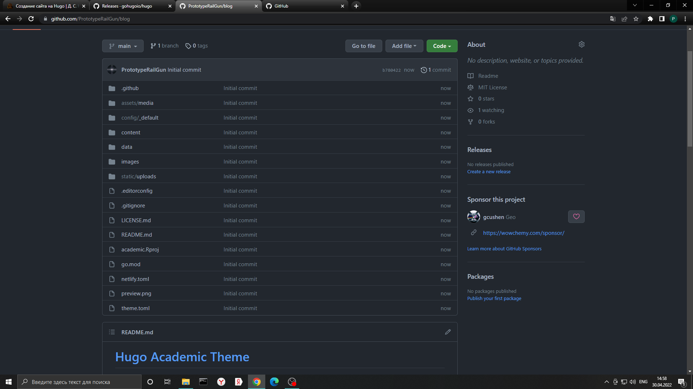

## Шаг 3 - запуск Hugo.
На этом этапе нужно перейти в папку с клонированным репозиторием blog, и находясь в ней запустить исполняемый файл hugo с аргументом server. При попытке это сделать возникла ошибка: 
"Error: failed to download modules: binary with name 'go' not found". Это связано с тем, что у меня на компьютере не было необходимой установки языка программирования Go.

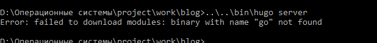

Устанавливаю язык программирования Go с помощью командной консоли Windows Power Shell и пакетного менеджера chocolatey:

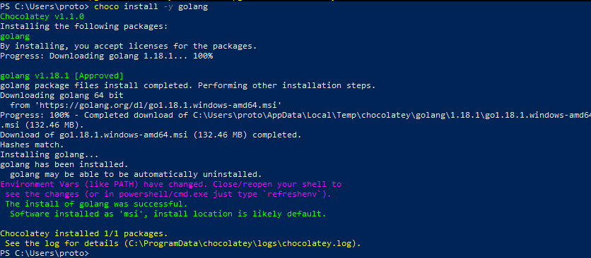

Далее я повторяю попытку выполнить ```hugo server```, на этот раз успешно.
На этом этапе сайт можно увидеть только на моем компьютере. Копирую ссылку "http://localhost:1313/" и перехожу по ней в браузере:

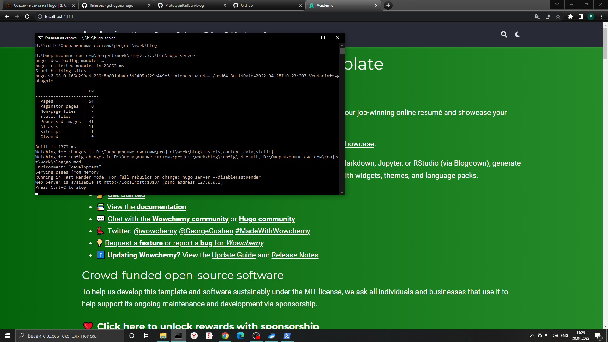

## Шаг 4 - Удаляем файл demo.md
Файл demo.md находится в папке content/home/ и представляет собой зеленую шапку сайта.
На фото ниже видно сайт уже без шапки и папку home без файла demo.md.

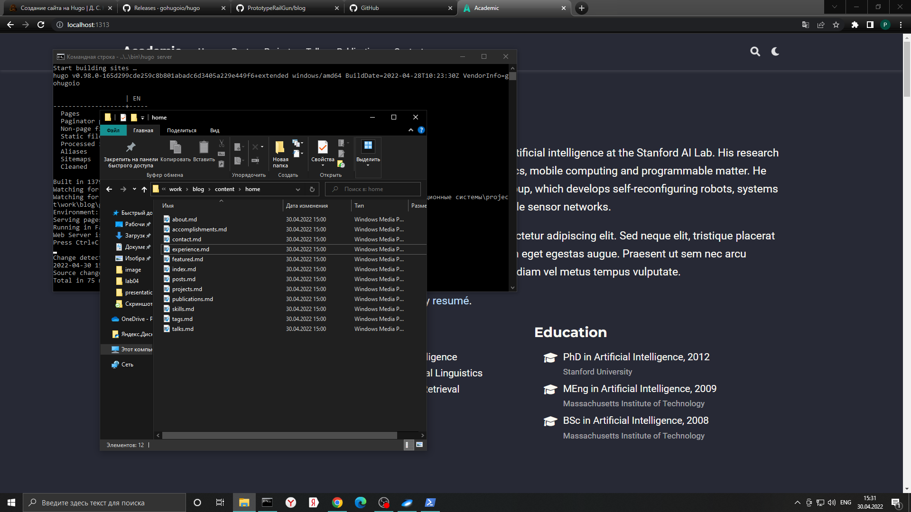

## Шаг 5 - Создаем репозиторий PrototypeRailGun.github.io
Завершаю hugo server и приступаю к созданию репозитория со специальным именем. "github.io" в имени репозитория означает, что этот репозиторий будет являтся хостингом моего будущего сайта. PrototypeRailGun - мой ник на гитхабе.

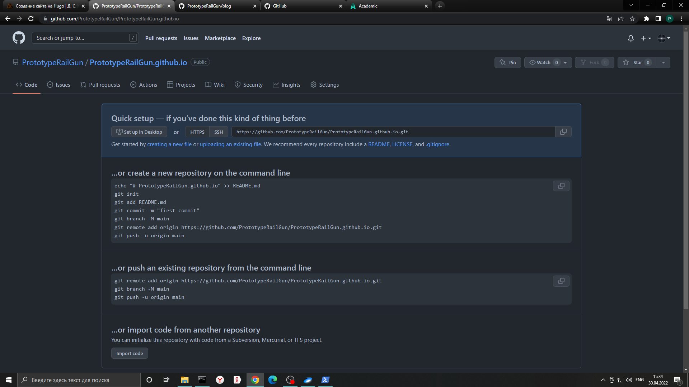

## Шаг 5 - Клонирование репозитория PrototypeRailGun.github.io
Клонирую репозиторий PrototypeRailGun.github.io на рабочий компьютер рядом с клоном репозитория blog.

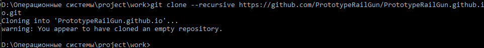

## Шаг 6 - Создание ветки main
main - основная ветка репозитория PrototypeRailGun.github.io.

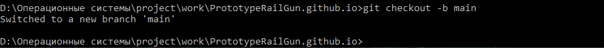

## Шаг 7 - создаем README.md файл

Создаем README.md файл в репозитории PrototypeRailGun.github.io и отправляем изменения на сервер.

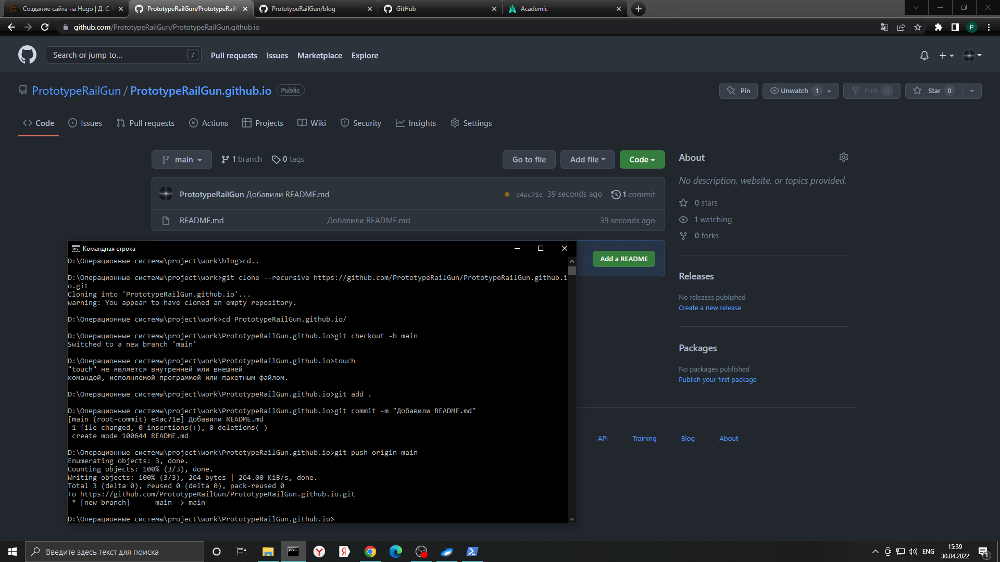

## Шаг 8 - Настраиваем рабочий процесс

Напрямую в PrototypeRailGun.github.io мы загружать файлы не будем. Выполним команду, которая подключит репозиторий PrototypeRailGun.github.io к папке public репозитория blog.
Первая попытка заканчивается ошибкой, так как в файле .gitignore сказано игнорировать public. Отменим это превратив строчку с public в комментарий.

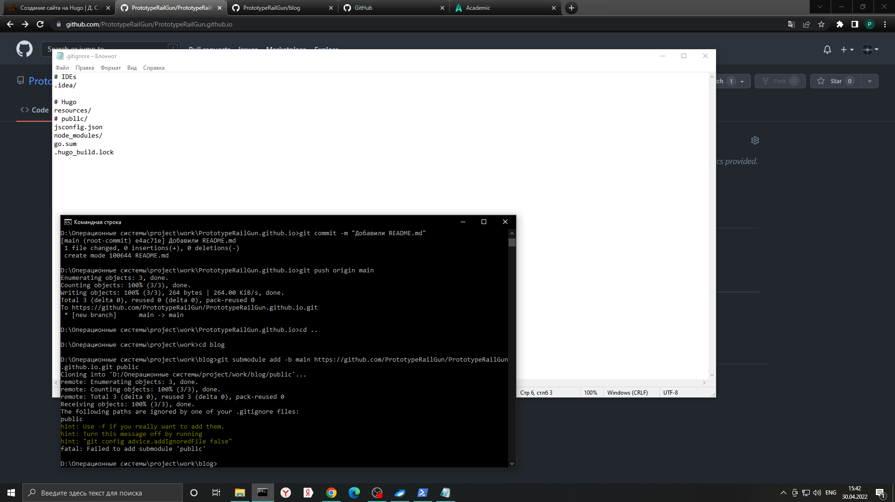

Сейчас в папке public лежит только файл README.md (не считая скрытого .git).

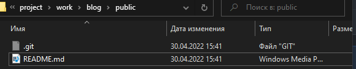

## Шаг 9 - Генерируем файлы сайта
Находясь в каталоге blog запускаем hugo и видим, как в папке public автоматически появились файлы сайта.

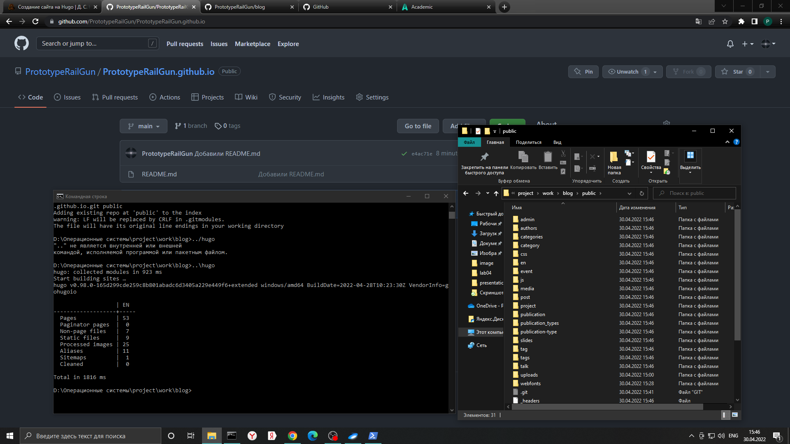

## Шаг 10 - Синхронизируем public с репозиторием
Выполняем команды git add, git commit, git push - и созданные на предыдущем шаге файлы теперь на github в репозитории PrototypeRailGun.github.io.

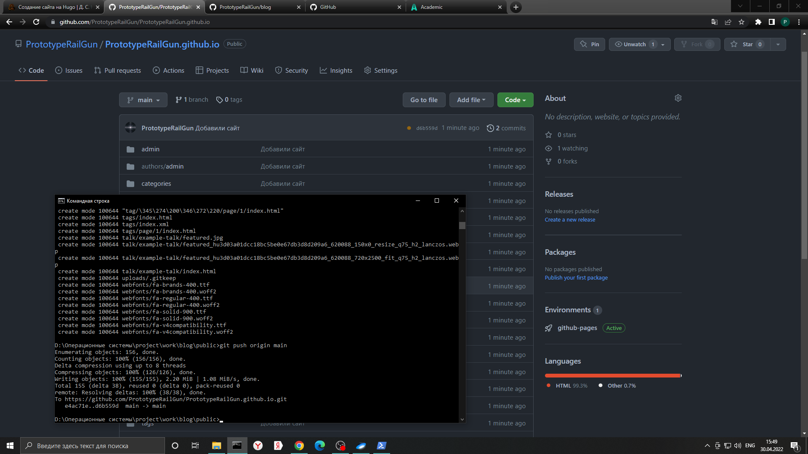

Находим наш сайт в интернете и видим все изменения.

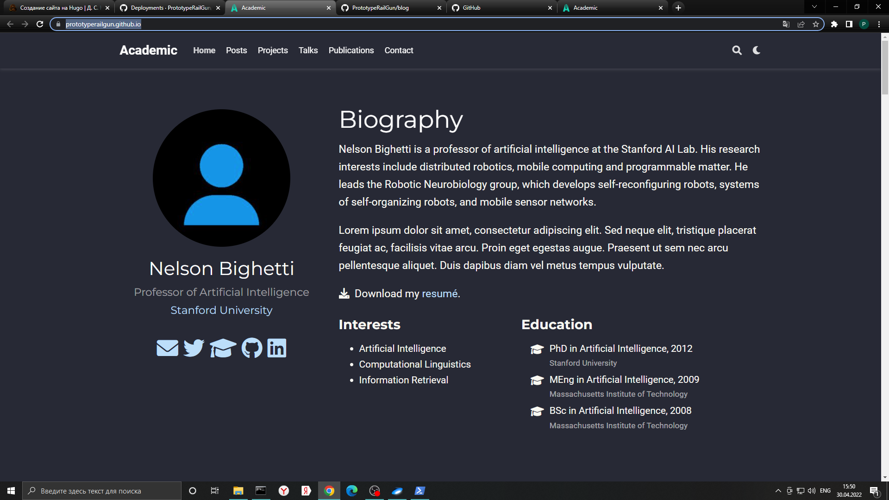

# Вывод

Установлено нужное программное обеспечения, заготовка сайта размещена на github pages. Задание первого этапа индивидуального проекта полностью выполнено.

