---
## Front matter
title: "Отчет по первому этапу индивидуального проекта"
subtitle: "Размещение на Github pages заготовки для персонального сайта"
author: "Старовойтов Егор Сергеевич"

## Generic otions
lang: ru-RU
toc-title: "Содержание"

## Bibliography
bibliography: bib/cite.bib
csl: pandoc/csl/gost-r-7-0-5-2008-numeric.csl

## Pdf output format
toc: true # Table of contents
toc-depth: 2
lof: true # List of figures
lot: true # List of tables
fontsize: 12pt
linestretch: 1.5
papersize: a4
documentclass: scrreprt
## I18n polyglossia
polyglossia-lang:
  name: russian
  options:
	- spelling=modern
	- babelshorthands=true
polyglossia-otherlangs:
  name: english
## I18n babel
babel-lang: russian
babel-otherlangs: english
## Fonts
mainfont: PT Serif
romanfont: PT Serif
sansfont: PT Sans
monofont: PT Mono
mainfontoptions: Ligatures=TeX
romanfontoptions: Ligatures=TeX
sansfontoptions: Ligatures=TeX,Scale=MatchLowercase
monofontoptions: Scale=MatchLowercase,Scale=0.9
## Biblatex
biblatex: true
biblio-style: "gost-numeric"
biblatexoptions:
  - parentracker=true
  - backend=biber
  - hyperref=auto
  - language=auto
  - autolang=other*
  - citestyle=gost-numeric
## Pandoc-crossref LaTeX customization
figureTitle: "Рис."
tableTitle: "Таблица"
listingTitle: "Листинг"
lofTitle: "Список иллюстраций"
lotTitle: "Список таблиц"
lolTitle: "Листинги"
## Misc options
indent: true
header-includes:
  - \usepackage{indentfirst}
  - \usepackage{float} # keep figures where there are in the text
  - \floatplacement{figure}{H} # keep figures where there are in the text
---

# Цель работы

Разместить на Github pages заготовки для персонального сайта.

# Задание

1. Установить необходимое программное обеспечение.
2. Скачать шаблон темы сайта.
3. Разместить его на хостинге git.
4. Установить параметр для URLs сайта.
5. Разместить заготовку сайта на Github pages.

# Теоретическое введение

## Hugo
Для реализации сайта используется генератор статических сайтов Hugo.

Hugo — один из самых популярных генераторов статических сайтов с открытым исходным кодом, написан на языке Go. 
Благодаря своей удивительной скорости и гибкости, Hugo делает создание веб-сайтов увлекательным.

### Основные преимущества Hugo

- Очень быстрый и гибкий
- Для него легко настроить хостинг
- Безопасный
- Хорошая структура исходников
- Возможность хранить содержимое в удобном формате (YAML, JSON или TOML)
- Поддержка тем. Есть готовый набор тем, более 200
- Легко SEO-оптимизировать
- i18n с коробки
- Хорошая поддержка таксономии
- Быстрый в освоении. Исчерпывающая документация

### Документация

Фреймворк имеет очень хорошую документацию. Она доступна только на английском языке. Информация очень хорошо структурирована, что позволяет освоить данную технологию, за несколько дней. Для лучшего восприятия, практически в каждой главе есть обучающее видео от разработчиков. Все это позволяет очень быстро приступить к созданию собственных сайтов.

### Структура

После установки фреймворка, сайт можно легко создать с помощью команды:
```hugo new site website-name```

Далее hugo сгенерирует следующую структуру проекта:
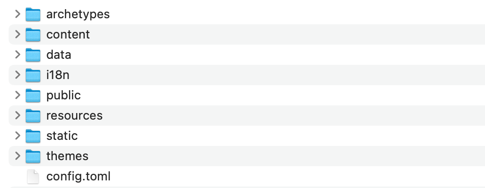

#### Content
Основной контент или содержимое сайта храниться в формате .md в папке content. В роле контента могут выступать ваши статьи, новости, продукты интернет магазина и прочее. 

#### Data

Каталог «data» используется для хранения файлов конфигурации, которые Hugo может использовать при создании вашего веб-сайта. Вы можете записать эти файлы в формате YAML, JSON или TOML.

#### Archetypes
Архетипы используют для создания содержимого сайта на основе заготовок. Это экономит время и обеспечивает единообразие для сайтов, использующих несколько типов контента. Вы также можете создавать свои собственные архетипы с предварительно настроенными полями основного материала.

#### I18n
Этот каталог предназначен для хранения конфигурации сайта на различных языках.

#### Resources
Hugo использует этот каталог для хранения кеша. Это ускоряет сборку сайта.

#### Static
Здесь храниться весь статический контент (CSS, JavaScript, и т.п).

#### Layouts
Хранит шаблоны в виде файлов .html, которые определяют, как просмотры вашего контента будут отображаться на статическом веб-сайте.

#### Themes
Для хранения различных тем.

#### Public 
Сгенерированные исходники веб-сайта. Именно эту директорию следует заливать на хостинг.

## Github pages
Для размещения статического веб-сайта можно воспользоваться сервисом GitHub Pages. Статический сайт состоит из HTML-страниц с неизменным содержимым. Такие сайты могут использоваться как визитки, портфолио, презентационные страницы.

Сервис Github Pages предоставляет следующие возможности для статических сайтов:

- Использование HTML, CSS, языка разметки Markdown;
- Встраивание изображений и другого медиа;
- Использование JavaScript.

Ограничения:

- Нельзя использовать на сайте PHP, Python и другие серверные языки;
- Серверный код и серверные скрипты выполняться не будут;
- Cookies не используются.

# Выполнение лабораторной работы

## Шаг 1 - установка исполняемого файла Hugo

## Шаг 2 - создание репозитория на основе шаблона
Шаблон Hugo Academic Theme: 
- Демо-сайт: https://academic-demo.netlify.app/
- Репозиторий: https://github.com/wowchemy/starter-hugo-academic

На фотографии ниже представлен созданный на основе этого шаблона репозиторий blog:

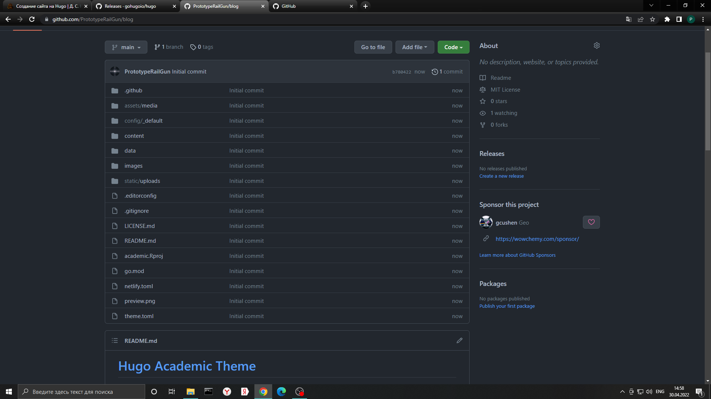

## Шаг 3 - запуск Hugo.
На этом этапе нужно перейти в папку с клонированным репозиторием blog, и находясь в ней запустить исполняемый файл hugo с аргументом server. При попытке это сделать возникла ошибка: 
"Error: failed to download modules: binary with name 'go' not found". Это связано с тем, что у меня на компьютере не было необходимой установки языка программирования Go.

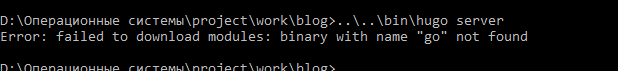

Устанавливаю язык программирования Go с помощью командной консоли Windows Power Shell и пакетного менеджера chocolatey:

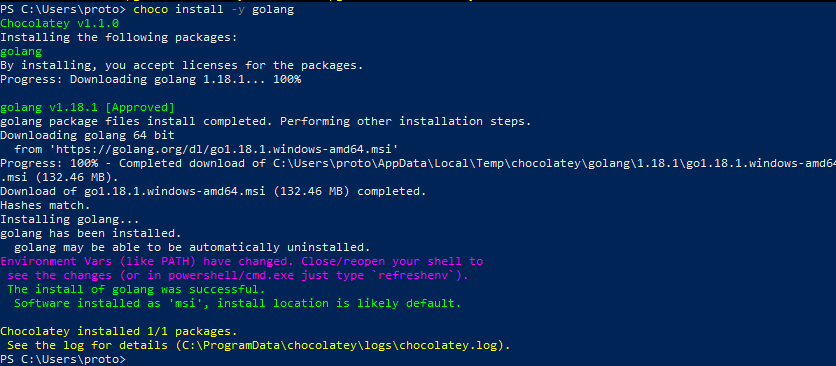

Далее я повторяю попытку выполнить ```hugo server```, на этот раз успешно.
На этом этапе сайт можно увидеть только на моем компьютере. Копирую ссылку "http://localhost:1313/" и перехожу по ней в браузере:

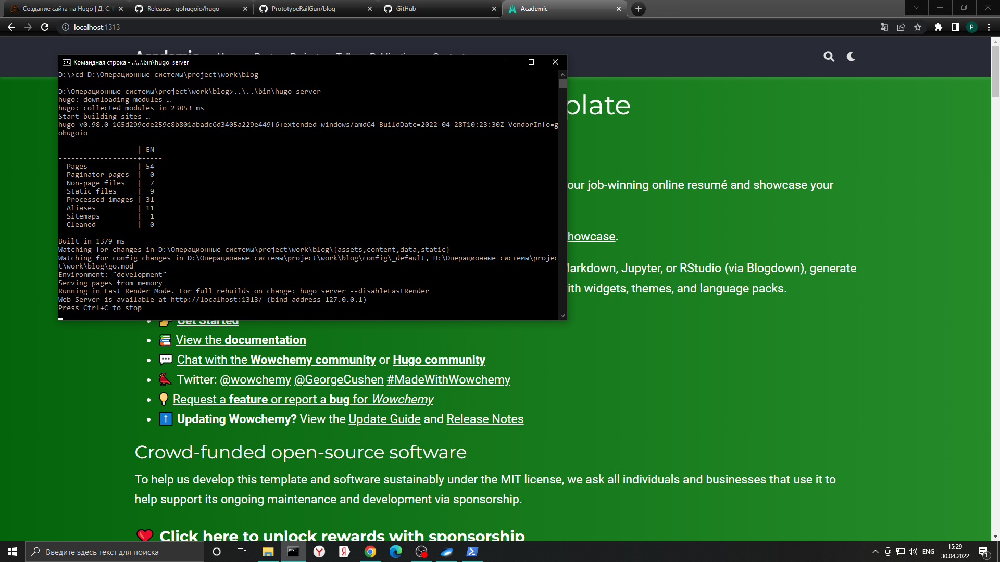

## Шаг 4 - Удаляем файл demo.md
Файл demo.md находится в папке content/home/ и представляет собой зеленую шапку сайта.
На фото ниже видно сайт уже без шапки и папку home без файла demo.md.

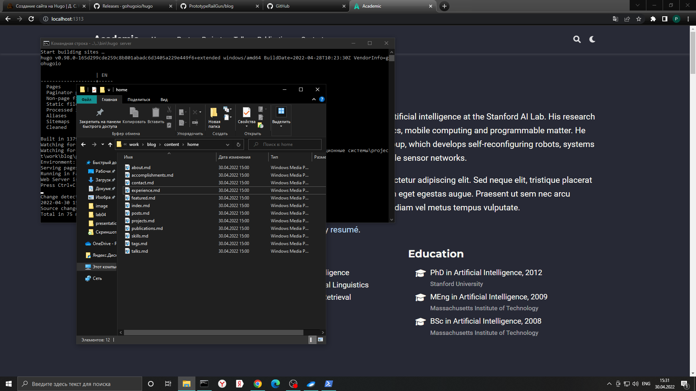

## Шаг 5 - Создаем репозиторий PrototypeRailGun.github.io
Завершаю hugo server и приступаю к созданию репозитория со специальным именем. "github.io" в имени репозитория означает, что этот репозиторий будет являтся хостингом моего будущего сайта. PrototypeRailGun - мой ник на гитхабе.

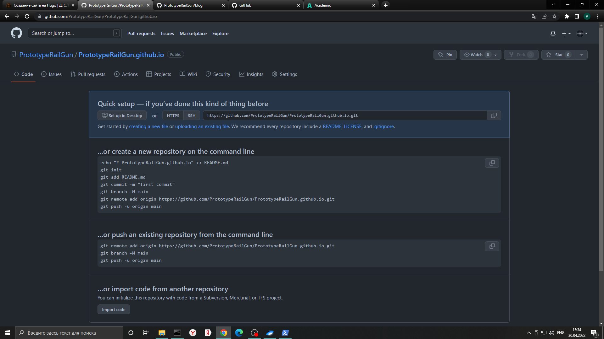

## Шаг 5 - Клонирование репозитория PrototypeRailGun.github.io
Клонирую репозиторий PrototypeRailGun.github.io на рабочий компьютер рядом с клоном репозитория blog.

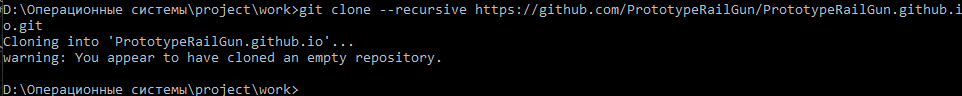

## Шаг 6 - Создание ветки main
main - основная ветка репозитория PrototypeRailGun.github.io.

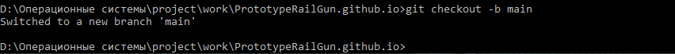

## Шаг 7 - создаем README.md файл

Создаем README.md файл в репозитории PrototypeRailGun.github.io и отправляем изменения на сервер.

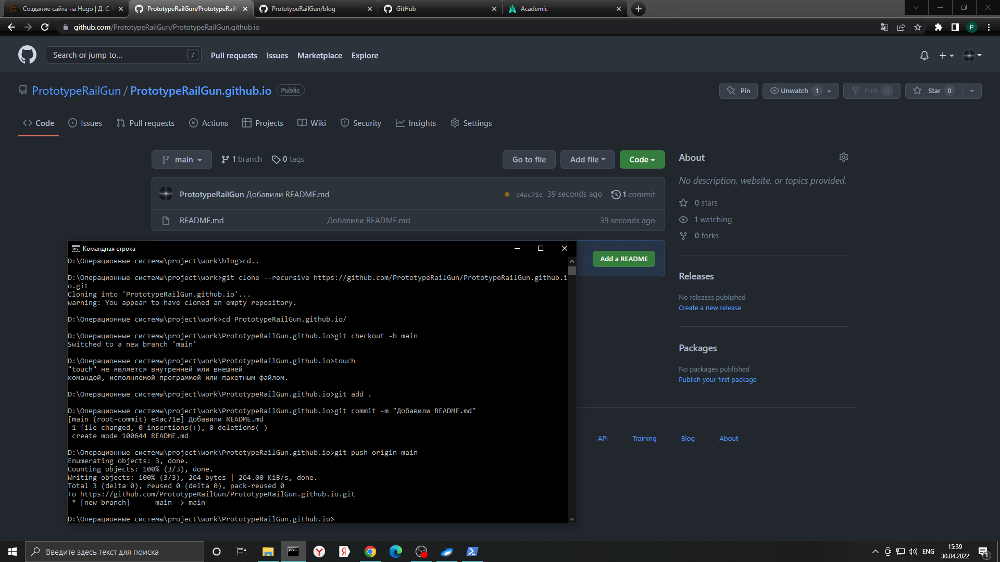

## Шаг 8 - Настраиваем рабочий процесс

Напрямую в PrototypeRailGun.github.io мы загружать файлы не будем. Выполним команду, которая подключит репозиторий PrototypeRailGun.github.io к папке public репозитория blog.
Первая попытка заканчивается ошибкой, так как в файле .gitignore сказано игнорировать public. Отменим это превратив строчку с public в комментарий.

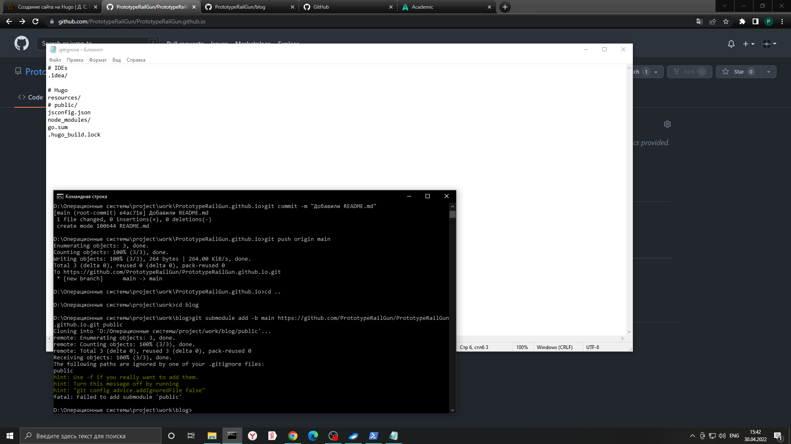

Сейчас в папке public лежит только файл README.md (не считая скрытого .git).

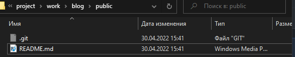

## Шаг 9 - Генерируем файлы сайта
Находясь в каталоге blog запускаем hugo и видим, как в папке public автоматически появились файлы сайта.

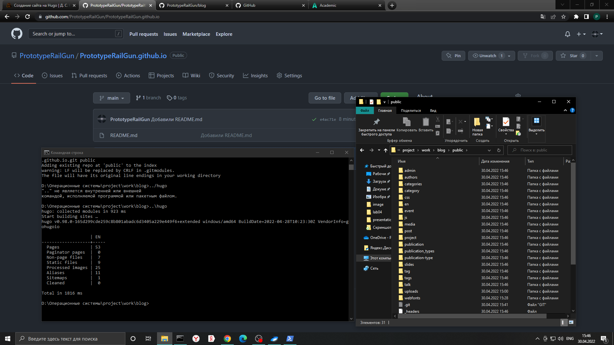

## Шаг 10 - Синхронизируем public с репозиторием
Выполняем команды git add, git commit, git push - и созданные на предыдущем шаге файлы теперь на github в репозитории PrototypeRailGun.github.io.

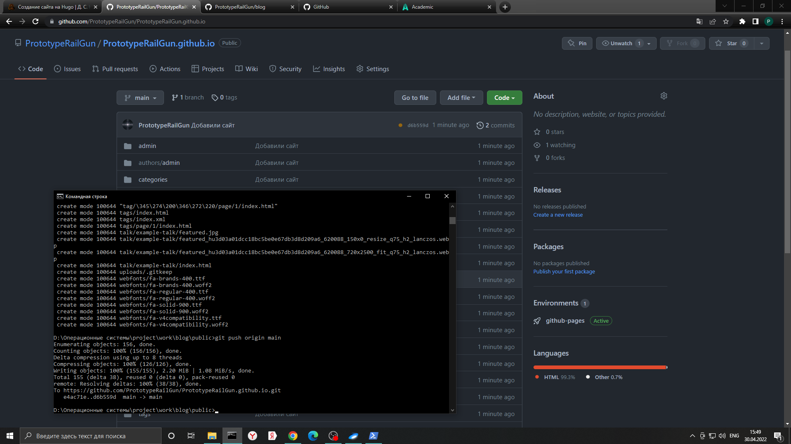

Находим наш сайт в интернете и видим все изменения.

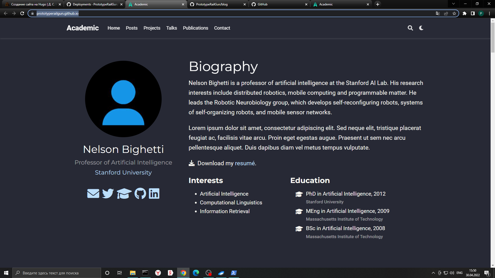

# Вывод

Установлено нужное программное обеспечения, заготовка сайта размещена на github pages. Задание первого этапа индивидуального проекта полностью выполнено.
