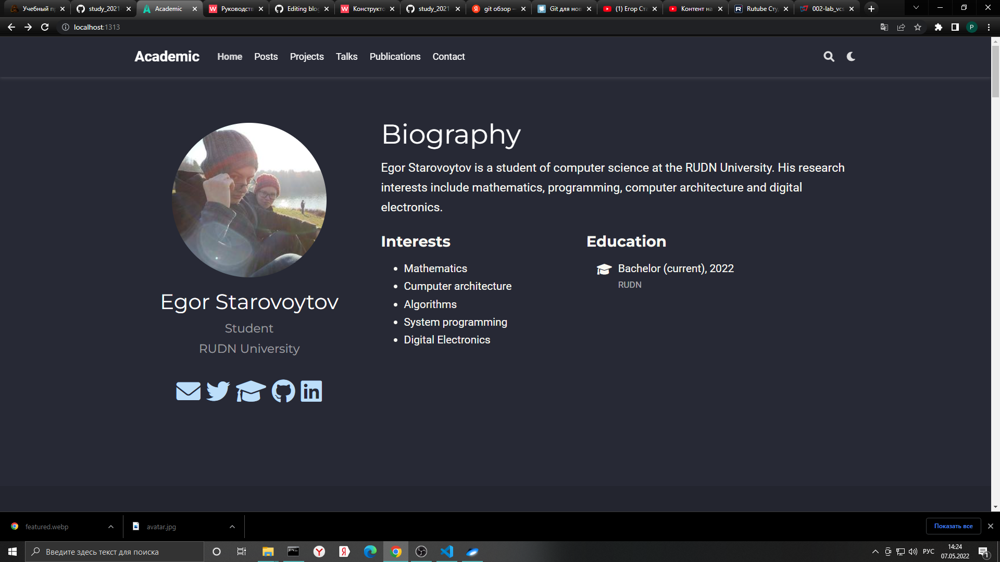
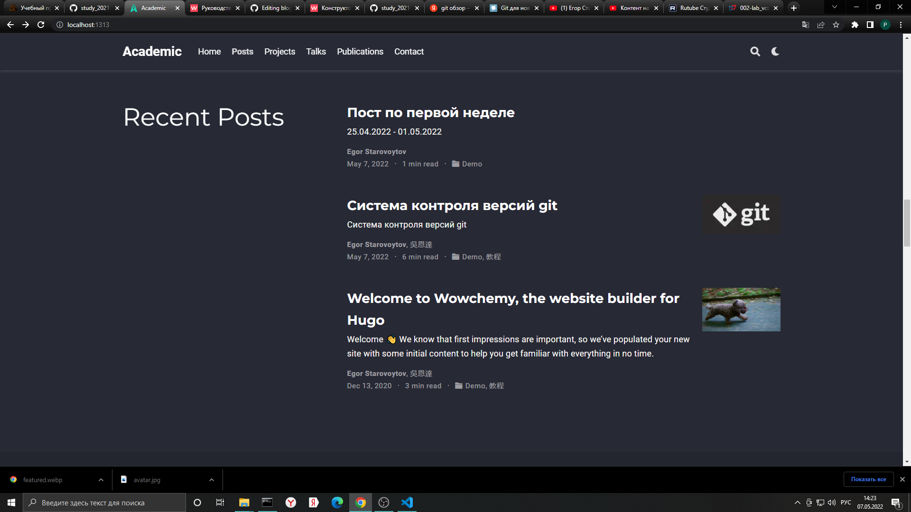

---
## Front matter
lang: ru-RU
title: Индивидуальный проект. Второй этап. Добавление к сайту данных о себе.
author: |
	Egor S. Starovoyjtov\inst{1}
	
institute: |
	\inst{1}RUDN University, Moscow, Russian Federation
date: 30 April, 2022 Moscow, Russia

## Formatting
toc: false
slide_level: 2
theme: metropolis
header-includes: 
 - \metroset{progressbar=frametitle,sectionpage=progressbar,numbering=fraction}
 - '\makeatletter'
 - '\beamer@ignorenonframefalse'
 - '\makeatother'
aspectratio: 43
section-titles: true
---

# Индивидуальный проект. Второй этап. Добавление к сайту данных о себе.

# Цель работы

Добавить к сайту данные о себе.

# Задание
Добавить к сайту данные о себе.

1. Список добавляемых данных:
    - Разместить фотографию владельца сайта.
    - Разместить краткое описание владельца сайта (Biography).
    - Добавить информацию об интересах (Interests).
    - Добавить информацию от образовании (Education).

2. Сделать пост по прошедшей неделе.

3. Добавить пост на тему по выбору:
    - Управление версиями. Git.
    - Непрерывная интеграция и непрерывное развертывание (CI/CD).

# Выполнение лабораторной работы

## Шаг 1 - добавление данных о себе

## Шаг 2 - создание постов
Я создал пост про git, взяв за основу вторую лаборатрную работу; создал пост по прошедшей неделе.

# Вывод
Добавлена информация про образование, интересы; добавлена краткая биография и фото владельца сайта. Также созданы посты про git и по прошедшей неделе. Задание выполнено в полном объеме.