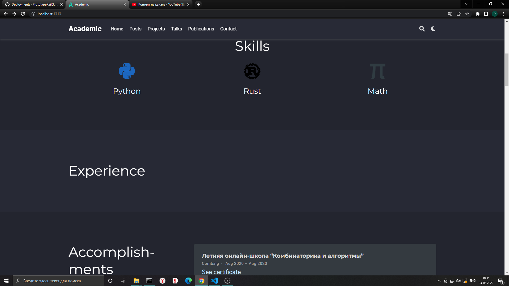
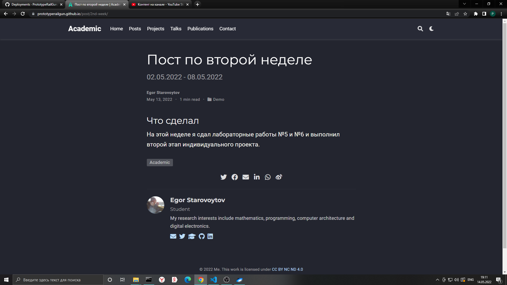
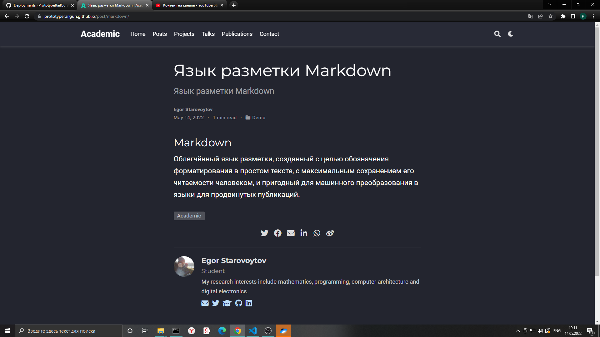

---
## Front matter
lang: ru-RU
title: Индивидуальный проект. Третий этап. Добавление к сайту достижений.
author: |
	Egor S. Starovoyjtov\inst{1}
	
institute: |
	\inst{1}RUDN University, Moscow, Russian Federation
date: 14 May, 2022 Moscow, Russia

## Formatting
toc: false
slide_level: 2
theme: metropolis
header-includes: 
 - \metroset{progressbar=frametitle,sectionpage=progressbar,numbering=fraction}
 - '\makeatletter'
 - '\beamer@ignorenonframefalse'
 - '\makeatother'
aspectratio: 43
section-titles: true
---

# Индивидуальный проект. Третий этап. Добавление к сайту достижений.

# Цель работы

Добавить к сайту данные о достижениях.

# Задание
Добавить к сайту достижения.

1. Список достижений.
    - Добавить информацию о навыках (Skills).
    - Добавить информацию об опыте (Experience).
    - Добавить информацию о достижениях (Accomplishments).

2. Сделать пост по прошедшей неделе.

3. Добавить пост на тему по выбору:
    - Легковесные языки разметки.
    - Языки разметки. LaTeX.
    - Язык разметки Markdown.

# Выполнение лабораторной работы

## Шаг 1 - информация о достижениях
В навыках я перечислил яп Python и Rust, а также математику. Иконки Rust и Math я нашел на стороннем сайте.
Графу с опытомя оставил пустой, так как нигде еще не работал. В достижениях указал летнюю онлайн школу комбинаторики и алгоритмов 2020 года.

## Шаг 2 - создание постов
Я создал пост про markdown, взяв за основу текст с википедии; создал пост по прошедшей неделе.

# Вывод
Добавлена информация про навыки и достижения.
