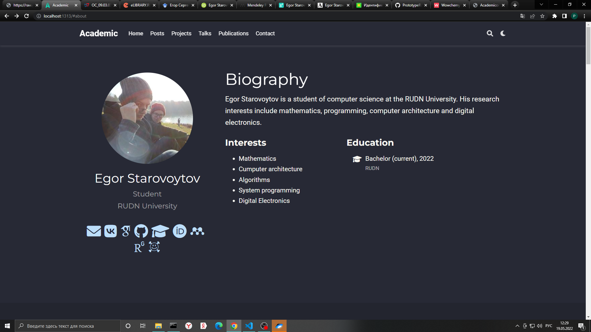
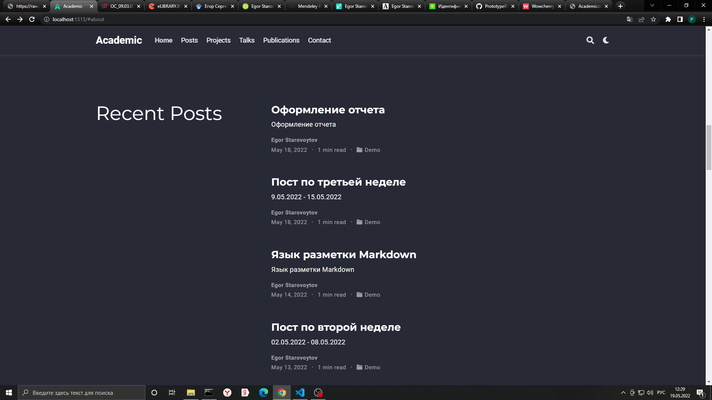

---
## Front matter
lang: ru-RU
title: Индивидуальный проект. Четвертый этап. Добавление к сайту ссылок на научные и библиометрические ресурсы.
author: |
	Egor S. Starovoyjtov\inst{1}
	
institute: |
	\inst{1}RUDN University, Moscow, Russian Federation
date: 19 May, 2022 Moscow, Russia

## Formatting
toc: false
slide_level: 2
theme: metropolis
header-includes: 
 - \metroset{progressbar=frametitle,sectionpage=progressbar,numbering=fraction}
 - '\makeatletter'
 - '\beamer@ignorenonframefalse'
 - '\makeatother'
aspectratio: 43
section-titles: true
---

# Индивидуальный проект. Четвертый этап. Добавление к сайту ссылок на научные и библиометрические ресурсы.

# Цель работы
Добавить к сайту ссылки на научные и библиометрические ресурсы.

# Задание
Добавить к сайту достижения.

1. Зарегистрироваться на соответствующих ресурсах и разместить на них ссылки на сайте:
- eLibrary : https://elibrary.ru/;
- Google Scholar : https://scholar.google.com/;
- ORCID : https://orcid.org/;
- Mendeley : https://www.mendeley.com/;
- ResearchGate : https://www.researchgate.net/;
- Academia.edu : https://www.academia.edu/;
- arXiv : https://arxiv.org/;
- github : https://github.com/.

2. Сделать пост по прошедшей неделе.

3. Добавить пост на тему по выбору:
- Оформление отчёта.
- Создание презентаций.
- Работа с библиографией.

# Выполнение работы

## Шаг 1 - ссылки на научные ресурсы

## Шаг 2 - создание постов
Я создал пост про оформление отчетов; создал пост по прошедшей неделе.

# Вывод
Добавлены ссылки на библиометрические ресуры, созданы пост про формление отчетов и пост по прошедшей неделе.