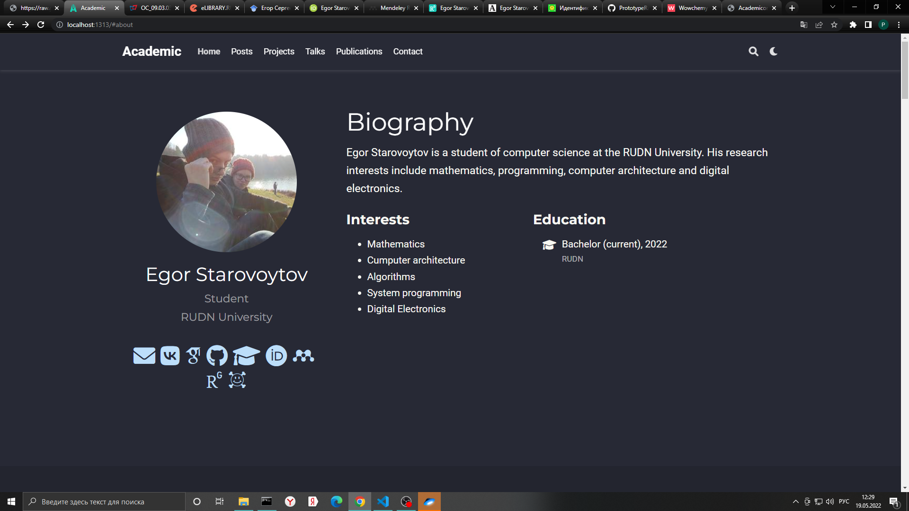
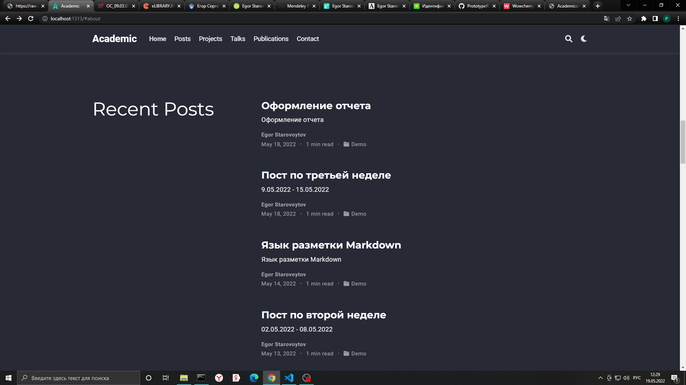

---
## Front matter
title: "Отчет по четвертому этапу индивидуального проекта"
subtitle: "Добавление к сайту ссылок на научные и библиометрические ресурсы"
author: "Старовойтов Егор Сергеевич"

## Generic otions
lang: ru-RU
toc-title: "Содержание"

## Bibliography
bibliography: bib/cite.bib
csl: pandoc/csl/gost-r-7-0-5-2008-numeric.csl

## Pdf output format
toc: true # Table of contents
toc-depth: 2
lof: true # List of figures
lot: true # List of tables
fontsize: 12pt
linestretch: 1.5
papersize: a4
documentclass: scrreprt
## I18n polyglossia
polyglossia-lang:
  name: russian
  options:
	- spelling=modern
	- babelshorthands=true
polyglossia-otherlangs:
  name: english
## I18n babel
babel-lang: russian
babel-otherlangs: english
## Fonts
mainfont: PT Serif
romanfont: PT Serif
sansfont: PT Sans
monofont: PT Mono
mainfontoptions: Ligatures=TeX
romanfontoptions: Ligatures=TeX
sansfontoptions: Ligatures=TeX,Scale=MatchLowercase
monofontoptions: Scale=MatchLowercase,Scale=0.9
## Biblatex
biblatex: true
biblio-style: "gost-numeric"
biblatexoptions:
  - parentracker=true
  - backend=biber
  - hyperref=auto
  - language=auto
  - autolang=other*
  - citestyle=gost-numeric
## Pandoc-crossref LaTeX customization
figureTitle: "Рис."
tableTitle: "Таблица"
listingTitle: "Листинг"
lofTitle: "Список иллюстраций"
lotTitle: "Список таблиц"
lolTitle: "Листинги"
## Misc options
indent: true
header-includes:
  - \usepackage{indentfirst}
  - \usepackage{float} # keep figures where there are in the text
  - \floatplacement{figure}{H} # keep figures where there are in the text
---

# Цель работы
Добавить к сайту ссылки на научные и библиометрические ресурсы.

# Задание
Добавить к сайту достижения.

1. Зарегистрироваться на соответствующих ресурсах и разместить на них ссылки на сайте:
- eLibrary : https://elibrary.ru/;
- Google Scholar : https://scholar.google.com/;
- ORCID : https://orcid.org/;
- Mendeley : https://www.mendeley.com/;
- ResearchGate : https://www.researchgate.net/;
- Academia.edu : https://www.academia.edu/;
- arXiv : https://arxiv.org/;
- github : https://github.com/.

2. Сделать пост по прошедшей неделе.

3. Добавить пост на тему по выбору:
- Оформление отчёта.
- Создание презентаций.
- Работа с библиографией.

# Теоретическое введение

## Hugo
Для реализации сайта используется генератор статических сайтов Hugo.

Hugo — один из самых популярных генераторов статических сайтов с открытым исходным кодом, написан на языке Go. 
Благодаря своей удивительной скорости и гибкости, Hugo делает создание веб-сайтов увлекательным.

### Основные преимущества Hugo

- Очень быстрый и гибкий
- Для него легко настроить хостинг
- Безопасный
- Хорошая структура исходников
- Возможность хранить содержимое в удобном формате (YAML, JSON или TOML)
- Поддержка тем. Есть готовый набор тем, более 200
- Легко SEO-оптимизировать
- i18n с коробки
- Хорошая поддержка таксономии
- Быстрый в освоении. Исчерпывающая документация

### Документация

Фреймворк имеет очень хорошую документацию. Она доступна только на английском языке. Информация очень хорошо структурирована, что позволяет освоить данную технологию, за несколько дней. Для лучшего восприятия, практически в каждой главе есть обучающее видео от разработчиков. Все это позволяет очень быстро приступить к созданию собственных сайтов.

### Структура

После установки фреймворка, сайт можно легко создать с помощью команды:
```hugo new site website-name```

Далее hugo сгенерирует следующую структуру проекта:


#### Content
Основной контент или содержимое сайта храниться в формате .md в папке content. В роле контента могут выступать ваши статьи, новости, продукты интернет магазина и прочее. 

#### Data

Каталог «data» используется для хранения файлов конфигурации, которые Hugo может использовать при создании вашего веб-сайта. Вы можете записать эти файлы в формате YAML, JSON или TOML.

#### Archetypes
Архетипы используют для создания содержимого сайта на основе заготовок. Это экономит время и обеспечивает единообразие для сайтов, использующих несколько типов контента. Вы также можете создавать свои собственные архетипы с предварительно настроенными полями основного материала.

#### I18n
Этот каталог предназначен для хранения конфигурации сайта на различных языках.

#### Resources
Hugo использует этот каталог для хранения кеша. Это ускоряет сборку сайта.

#### Static
Здесь храниться весь статический контент (CSS, JavaScript, и т.п).

#### Layouts
Хранит шаблоны в виде файлов .html, которые определяют, как просмотры вашего контента будут отображаться на статическом веб-сайте.

#### Themes
Для хранения различных тем.

#### Public 
Сгенерированные исходники веб-сайта. Именно эту директорию следует заливать на хостинг.

## Github pages
Для размещения статического веб-сайта можно воспользоваться сервисом GitHub Pages. Статический сайт состоит из HTML-страниц с неизменным содержимым. Такие сайты могут использоваться как визитки, портфолио, презентационные страницы.

Сервис Github Pages предоставляет следующие возможности для статических сайтов:

- Использование HTML, CSS, языка разметки Markdown;
- Встраивание изображений и другого медиа;
- Использование JavaScript.

Ограничения:

- Нельзя использовать на сайте PHP, Python и другие серверные языки;
- Серверный код и серверные скрипты выполняться не будут;
- Cookies не используются.

# Выполнение работы

## Шаг 1 - ссылки на научные ресурсы



## Шаг 2 - создание постов
Я создал пост про оформление отчетов; создал пост по прошедшей неделе.



# Вывод
Добавлены ссылки на библиометрические ресуры, созданы пост про формление отчетов и пост по прошедшей неделе.
