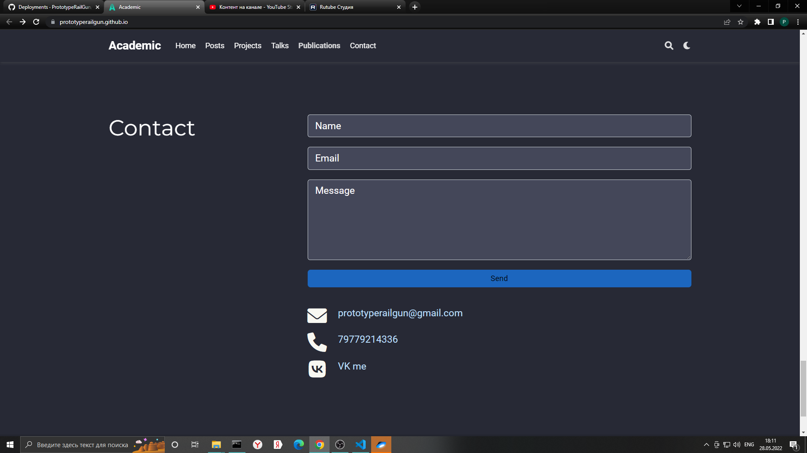
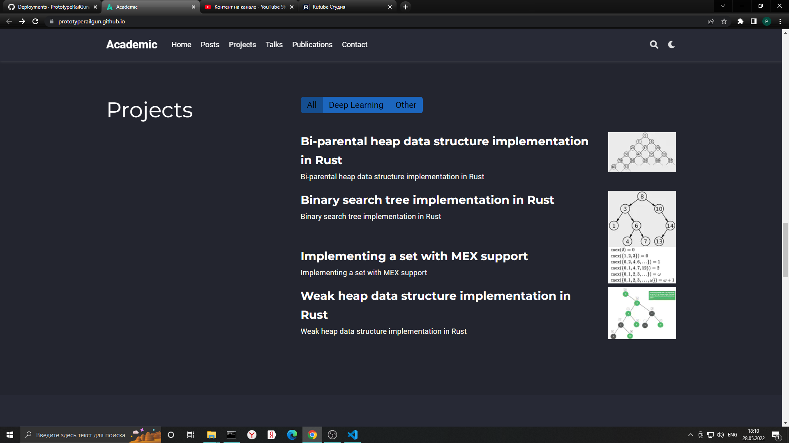
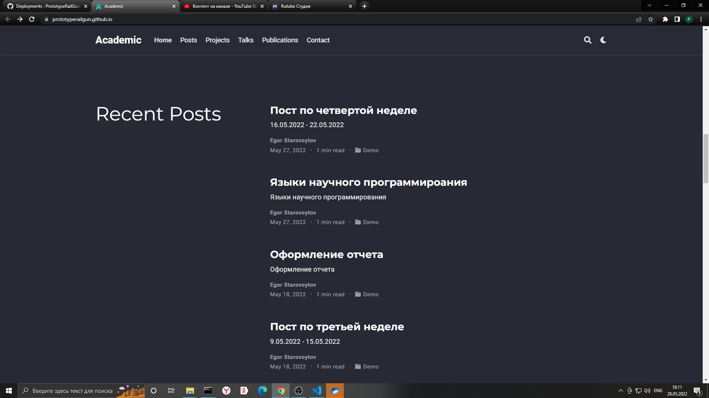

---
## Front matter
lang: ru-RU
title: Индивидуальный проект. Пятый этап. Добавление к сайту остальных элементов.
author: |
	Egor S. Starovoyjtov\inst{1}
	
institute: |
	\inst{1}RUDN University, Moscow, Russian Federation
date: 28 May, 2022 Moscow, Russia

## Formatting
toc: false
slide_level: 2
theme: metropolis
header-includes: 
 - \metroset{progressbar=frametitle,sectionpage=progressbar,numbering=fraction}
 - '\makeatletter'
 - '\beamer@ignorenonframefalse'
 - '\makeatother'
aspectratio: 43
section-titles: true
---

# Индивидуальный проект. Пятый этап. Добавление к сайту остальных элементов.

# Цель работы
Добавить с сайту все остальные элементы.

# Задание
Добавить с сайту все остальные элементы.

- Сделать записи для персональных проектов.
- Сделать пост по прошедшей неделе.
- Добавить пост на тему по выбору.
      - Языки научного программирования.

- Cookies не используются.

# Выполнение работы

## Шаг 1 - раздел контактов

## Шаг 2 - проекты

## Шаг 3 - посты

# Вывод
Добавлены проекты, изменен раздел "контакты", созданы пост про языки научного программирования и пост по прошедшей неделе.